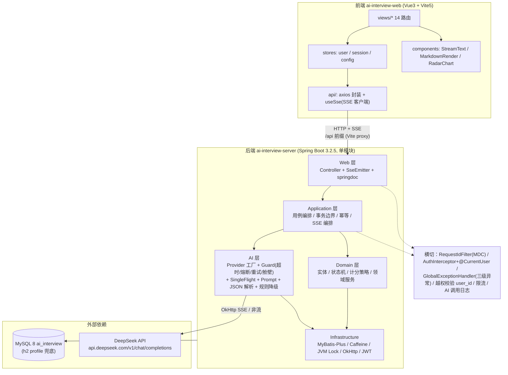
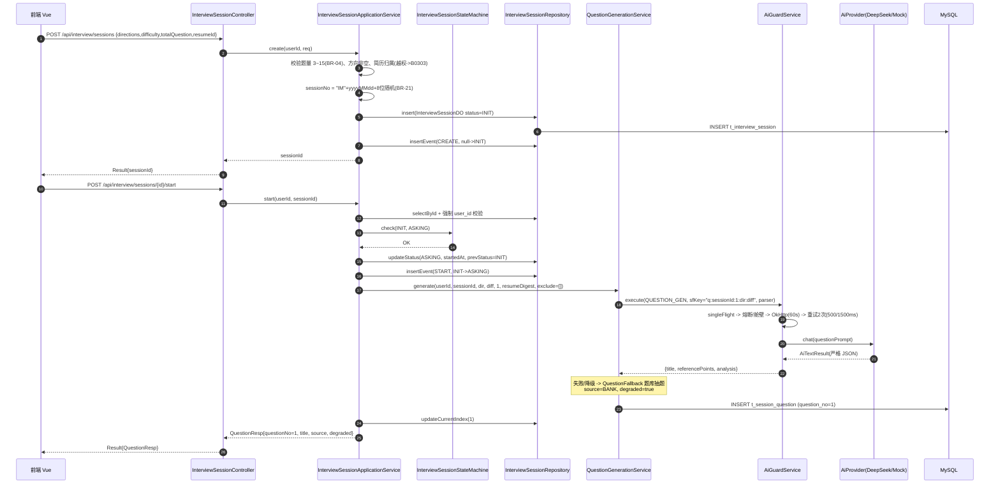
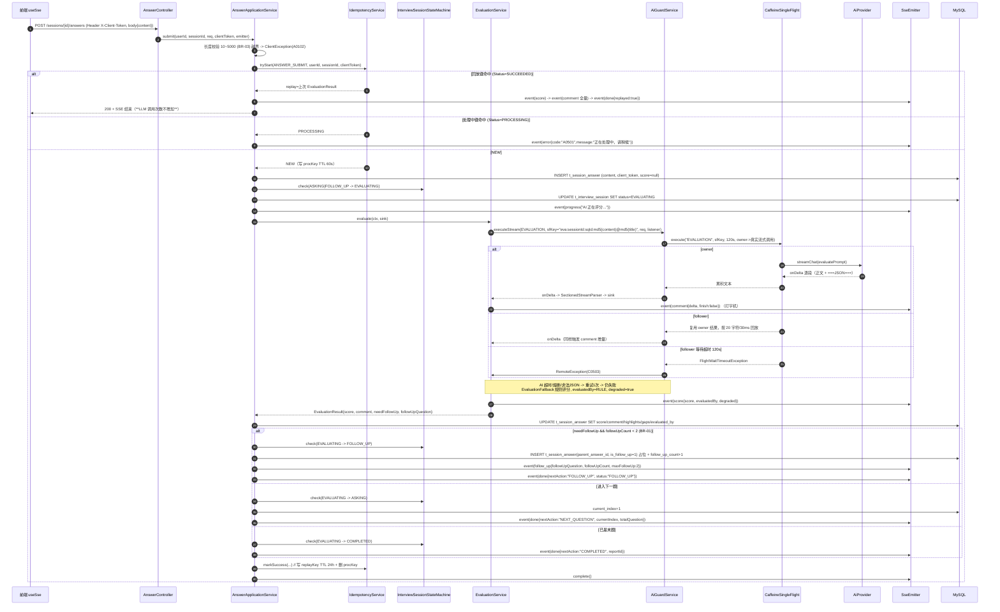
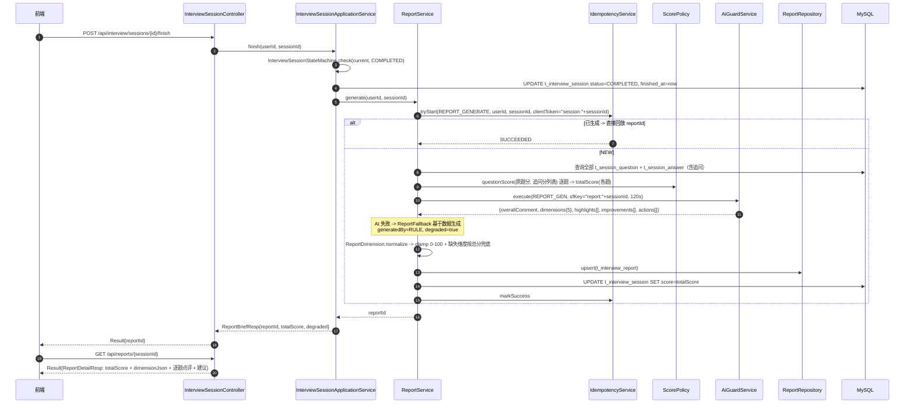

# AI 在线模拟面试平台 — 系统架构设计 & 任务分解

| 项 | 内容 |
| --- | --- |
| 文档版本 | v1.0 |
| 架构师 | 高见远（Bob / Architect） |
| 上游输入 | `docs/PRD.md`（许清楚 定稿）、`D:\agent-class\aimeeting`（参考项目实地勘察） |
| 目标读者 | 工程师（照此一次性落地代码）、PM（验收对照） |
| 代码落盘根 | `D:\code\aimeetting-promax`（后端 `ai-interview-server/`，前端 `ai-interview-web/`） |
| 基包 | `com.aimeeting.interview` |

---

## 0. 环境硬约束与设计前提

| 项 | 值 | 对设计的强制影响 |
| --- | --- | --- |
| JDK | 17.0.18 | 全部语法按 Java 17（record / sealed / switch pattern / 文本块） |
| Maven | 3.9.15，仅 `D:\develop\apache-maven-3.9.15\bin\mvn.cmd` 可用 | README 与所有脚本一律用 `mvn.cmd`；构建加 `-Dfile.encoding=UTF-8` |
| 平台编码 | GBK | `pom.xml` 设 `<project.build.sourceEncoding>UTF-8</project.build.sourceEncoding>` + `-Dfile.encoding=UTF-8`；`logback` 显式 UTF-8 |
| Node | v22.22.2 / npm 11.17.0 | Vite 5 OK |
| MySQL | localhost:3306，root/123456，v8.0.41，库 `ai_interview` | **默认 profile = `mysql`** |
| Redis / MongoDB | 不可用 | **所有缓存 / 锁 / Single-flight / 限流 / 登录失败计数必须接口抽象 + Caffeine/JVM 实现** |
| LLM | DeepSeek `https://api.deepseek.com`，OpenAI 协议兼容 | `OpenAiCompatProvider` 走 `/v1/chat/completions`；`deepseek-v4-flash`（默认）/ `deepseek-chat`（报告可选） |

**技术栈（锁定，不得更改）**

- 后端：Java 17 + Spring Boot 3.2.5 + Spring MVC + MyBatis-Plus 3.5.7 + `SseEmitter` + OkHttp 4.12.0 + okhttp-sse + jjwt 0.12.6 + Caffeine 3.1.8 + springdoc-openapi 2.5.0 + hutool 5.8.29 + lombok 1.18.34 + BCrypt(spring-security-crypto 6.2.x) + PDFBox 3.0.3
- 前端：Vue 3.5 + Vite 5 + TypeScript + Pinia 2 + Vue Router 4 + Element Plus 2.8.8 + Axios 1.7 + ECharts 5.5 + markdown-it 14
- 数据库：MySQL 8（默认）/ H2 2.2.224 `MODE=MySQL`（`h2` profile 兜底）

---

## 1. 总体架构

### 1.1 分层架构图



### 1.2 关键横切说明

| 横切关注点 | 实现位置 | 约定 |
| --- | --- | --- |
| requestId | `common/web/RequestIdFilter` | Filter 生成 `UUID(32)` → `MDC.put("requestId")` → 写入 `Result.requestId` → 响应头 `X-Request-Id` → 日志全链路 |
| 鉴权 | `auth/infrastructure/web/AuthInterceptor` + `common/web/CurrentUserMethodArgumentResolver` | 白名单放行；解析 JWT 后写入 **`HttpServletRequest` attribute**（**禁止 ThreadLocal**），由参数解析器注入 `@CurrentUser UserContext` |
| 异常处理 | `common/web/GlobalExceptionHandler` | `AbstractException` 三类 → 统一 `Result`；`HttpStatusResolver` 按错误码前缀映射 HTTP 状态 |
| 越权 | 各 `Repository` / `Service` | 所有 session/report/resume/answer 查询强制 `user_id = ?`（ADMIN 除外），不匹配 → `ServiceException(B0303)` → 403（不返 404） |
| 限流 | `common/cache/CacheService.increment` | 登录/注册/AI 提交按 `ip + userId` 计数（Caffeine） |
| AI 调用日志 | `ai/log/AiCallLogService` | 异步写入 `t_ai_call_log`，仅落摘要（request/response 各截断 512 字符 + MD5），不落完整 prompt |
| 状态审计 | `interview/domain/state` + `SessionEventService` | 每次状态变更落 `t_session_event` |
| 逻辑删除 | MyBatis-Plus `@TableLogic` | 全局 `deleted` 字段，查询自动过滤 |

---

## 2. 后端工程结构与包设计

### 2.1 工程形态

**单 Maven 模块**：`ai-interview-server`（`com.aimeeting.interview`）。

> 拆分理由：项目规模约 200 个 Java 文件、单进程单实例部署、无跨模块复用需求。拆多模块会带来 `mvn.cmd` 多模块构建耗时与 IDE 配置成本，收益为负。**用「DDD 分包 + 分层包内自洽」替代「Maven 多模块」**，既能体现工程能力，又零额外构建成本。

### 2.2 完整包结构树

```
D:\code\aimeetting-promax\
├── pom.xml                                    # 可选：聚合 pom（当前仅占位，后端自成一模块）
├── README.md
├── docker-compose.yml                          # 可选 MySQL 编排
├── docs/
│   ├── PRD.md
│   └── ARCHITECTURE.md                         # 本文档
├── ai-interview-web/                           # 前端（已初始化 package.json）
└── ai-interview-server/
    ├── pom.xml
    └── src/
        ├── main/
        │   ├── java/com/aimeeting/interview/
        │   │   ├── AiInterviewApplication.java
        │   │   │
        │   │   ├── common/                                  # ── 通用约定与横切（无业务）
        │   │   │   ├── convention/
        │   │   │   │   ├── result/       Result.java  Results.java  PageInfo.java  PageQuery.java
        │   │   │   │   ├── errorcode/    IErrorCode.java  BaseErrorCode.java
        │   │   │   │   ├── exception/    AbstractException.java  ClientException.java
        │   │   │   │   │                 ServiceException.java  RemoteException.java
        │   │   │   │   ├── annotation/   CurrentUser.java
        │   │   │   │   └── context/      UserContext.java
        │   │   │   ├── concurrent/singleflight/
        │   │   │   │                     SingleFlight.java  CaffeineSingleFlight.java
        │   │   │   │                     FlightWaitTimeoutException.java
        │   │   │   ├── idempotent/       IdempotencyService.java  IdempotentStage.java  TryStartResult.java
        │   │   │   ├── cache/            CacheService.java  CaffeineCacheService.java
        │   │   │   ├── lock/             LockService.java  JvmLockService.java
        │   │   │   ├── util/             JsonUtil.java  Md5Util.java  MdcUtil.java
        │   │   │   │                     SessionNoGenerator.java  IpUtil.java
        │   │   │   └── web/              GlobalExceptionHandler.java  RequestIdFilter.java
        │   │   │                         WebMvcConfig.java  CorsConfig.java  OpenApiConfig.java
        │   │   │                         CurrentUserMethodArgumentResolver.java  HttpStatusResolver.java
        │   │   │
        │   │   ├── config/                                  # ── 配置属性与 Bean 装配
        │   │   │                         AiProperties.java  InterviewProperties.java  JwtProperties.java
        │   │   │                         CacheConfig.java   AsyncConfig.java  MybatisPlusConfig.java
        │   │   │                         MetaObjectHandlerImpl.java  JacksonConfig.java
        │   │   │
        │   │   ├── auth/                                    # ── 认证与用户域
        │   │   │   ├── api/              AuthController.java  UserController.java
        │   │   │   ├── api/io/req/       RegisterReq.java  LoginReq.java  RefreshTokenReq.java
        │   │   │   │                     UpdateProfileReq.java  ChangePasswordReq.java
        │   │   │   ├── api/io/resp/      LoginResp.java  TokenResp.java  UserProfileResp.java  UserStatsResp.java
        │   │   │   ├── application/      AuthApplicationService.java  UserApplicationService.java
        │   │   │   ├── domain/           User.java  UserProfile.java  UserDomainService.java
        │   │   │   │                     LoginFailPolicy.java  PasswordPolicy.java
        │   │   │   ├── dao/entity/       UserDO.java  UserProfileDO.java
        │   │   │   ├── dao/mapper/       UserMapper.java  UserProfileMapper.java
        │   │   │   ├── dao/repository/   UserRepository.java
        │   │   │   ├── service/          AuthService.java  AuthServiceImpl.java
        │   │   │   │                     UserService.java  UserServiceImpl.java
        │   │   │   │                     JwtTokenProvider.java  TokenBlacklistService.java
        │   │   │   └── infrastructure/web/  AuthInterceptor.java
        │   │   │
        │   │   ├── question/                                # ── 题库域
        │   │   │   ├── api/              QuestionController.java
        │   │   │   ├── api/io/req/       QuestionQueryReq.java  QuestionSaveReq.java  RandomQuestionReq.java
        │   │   │   ├── api/io/resp/      QuestionResp.java  QuestionDetailResp.java  DirectionOptionResp.java
        │   │   │   ├── application/      QuestionApplicationService.java  QuestionSeedRunner.java
        │   │   │   ├── domain/           Question.java  Direction.java  Difficulty.java  QuestionSource.java
        │   │   │   ├── dao/entity/       QuestionDO.java
        │   │   │   ├── dao/mapper/       QuestionMapper.java
        │   │   │   ├── dao/repository/   QuestionRepository.java
        │   │   │   └── service/          QuestionService.java  QuestionServiceImpl.java
        │   │   │
        │   │   ├── ai/                                      # ── AI 能力层（独立可测）
        │   │   │   ├── api/              (无独立 Controller，由各域 application 调用)
        │   │   │   ├── provider/         AiProvider.java  OpenAiCompatProvider.java  MockAiProvider.java
        │   │   │   │                     AiProviderFactory.java
        │   │   │   ├── model/            AiRequest.java  AiTextResult.java  AiStreamListener.java
        │   │   │   │                     AiBizType.java  AiStage.java  AiErrorType.java  AiChatMessage.java
        │   │   │   ├── guard/            AiGuardService.java  CircuitBreaker.java  Bulkhead.java
        │   │   │   │                     RetryPolicy.java  AiErrorClassifier.java
        │   │   │   ├── concurrent/       AiSingleFlight.java            # 对 common SingleFlight 的语义门面
        │   │   │   ├── prompt/           PromptTemplateLoader.java  QuestionPromptBuilder.java
        │   │   │   │                     EvaluatePromptBuilder.java  FollowUpPromptBuilder.java
        │   │   │   │                     ResumePromptBuilder.java  ReportPromptBuilder.java  PromptNames.java
        │   │   │   ├── parser/           AiJsonParser.java  SectionedStreamParser.java  AiOutputValidator.java
        │   │   │   ├── fallback/         QuestionFallback.java  EvaluationFallback.java
        │   │   │   │                     ResumeFallback.java  ReportFallback.java  RuleEvaluator.java
        │   │   │   ├── log/              AiCallLogService.java
        │   │   │   ├── dao/entity/       AiCallLogDO.java
        │   │   │   └── dao/mapper/       AiCallLogMapper.java
        │   │   │
        │   │   ├── interview/                               # ── 面试会话 + 答题域（核心）
        │   │   │   ├── api/              InterviewSessionController.java  AnswerController.java
        │   │   │   ├── api/io/req/       CreateSessionReq.java  SessionPageQuery.java
        │   │   │   │                     SubmitAnswerReq.java  FollowUpAnswerReq.java
        │   │   │   ├── api/io/resp/      SessionBriefResp.java  SessionDetailResp.java  SessionStatusResp.java
        │   │   │   │                     QuestionResp.java  AnswerDetailResp.java  MessageItemResp.java
        │   │   │   ├── application/      InterviewSessionApplicationService.java
        │   │   │   │                     AnswerApplicationService.java  InterviewAssembler.java
        │   │   │   ├── domain/
        │   │   │   │   ├── state/        SessionStatus.java  InterviewSessionStateMachine.java
        │   │   │   │   ├── model/        InterviewSession.java  SessionQuestion.java  SessionAnswer.java
        │   │   │   │   │                 ScorePolicy.java  FollowUpLimitPolicy.java
        │   │   │   │   └── service/      InterviewSessionDomainService.java
        │   │   │   ├── dao/entity/       InterviewSessionDO.java  SessionQuestionDO.java  SessionAnswerDO.java
        │   │   │   │                     SessionEventDO.java
        │   │   │   ├── dao/mapper/       InterviewSessionMapper.java  SessionQuestionMapper.java
        │   │   │   │                     SessionAnswerMapper.java  SessionEventMapper.java
        │   │   │   ├── dao/repository/   InterviewSessionRepository.java  SessionQuestionRepository.java
        │   │   │   │                     SessionAnswerRepository.java
        │   │   │   └── service/          InterviewSessionService.java  InterviewSessionServiceImpl.java
        │   │   │                         AnswerService.java  AnswerServiceImpl.java
        │   │   │                         EvaluationService.java  EvaluationServiceImpl.java
        │   │   │                         QuestionGenerationService.java  SseEmitterManager.java
        │   │   │                         SseEnvelope.java  SseEventType.java  SessionEventService.java
        │   │   │
        │   │   ├── resume/                                  # ── 简历域
        │   │   │   ├── api/              ResumeController.java
        │   │   │   ├── api/io/req/       ResumeParseReq.java
        │   │   │   ├── api/io/resp/      ResumeResp.java  ResumeDetailResp.java  ResumeParseResult.java
        │   │   │   ├── application/      ResumeApplicationService.java
        │   │   │   ├── domain/           Resume.java  ParsedResume.java
        │   │   │   ├── dao/entity/       ResumeDO.java
        │   │   │   ├── dao/mapper/       ResumeMapper.java
        │   │   │   ├── dao/repository/   ResumeRepository.java
        │   │   │   ├── service/          ResumeService.java  ResumeServiceImpl.java  ResumeTextExtractor.java
        │   │   │   └── infrastructure/   PdfTextExtractor.java  PlainTextExtractor.java
        │   │   │
        │   │   ├── report/                                  # ── 报告域
        │   │   │   ├── api/              ReportController.java
        │   │   │   ├── api/io/req/       ReportPageQuery.java
        │   │   │   ├── api/io/resp/      ReportDetailResp.java  ReportBriefResp.java  DimensionScore.java
        │   │   │   ├── application/      ReportApplicationService.java  ReportMarkdownExporter.java
        │   │   │   ├── domain/           InterviewReport.java  ReportDimension.java
        │   │   │   ├── dao/entity/       InterviewReportDO.java
        │   │   │   ├── dao/mapper/       ReportMapper.java
        │   │   │   ├── dao/repository/   ReportRepository.java
        │   │   │   └── service/          ReportService.java  ReportServiceImpl.java
        │   │   │
        │   │   ├── admin/                                   # ── 管理端域（全部 ADMIN）
        │   │   │   ├── api/              AdminUserController.java  AdminStatisticsController.java
        │   │   │   │                     AdminAiController.java
        │   │   │   ├── api/io/resp/      AdminUserResp.java  OverviewStatsResp.java
        │   │   │   │                     SessionTrendResp.java  AiCallLogResp.java  AiHealthResp.java
        │   │   │   ├── application/      AdminApplicationService.java
        │   │   │   └── service/          AdminService.java  AdminServiceImpl.java
        │   │   │
        │   │   └── ops/                                     # ── 运维
        │   │       ├── api/              HealthController.java  ClientConfigController.java
        │   │       └── api/io/resp/      HealthResp.java  ClientConfigResp.java
        │   │
        │   └── resources/
        │       ├── application.yml
        │       ├── application-mysql.yml
        │       ├── application-h2.yml
        │       ├── logback-spring.xml
        │       ├── db/
        │       │   ├── schema-mysql.sql
        │       │   ├── schema-h2.sql
        │       │   └── data-questions-seed.json
        │       ├── prompt/
        │       │   ├── question.md
        │       │   ├── evaluate.md
        │       │   ├── follow-up.md
        │       │   ├── resume.md
        │       │   └── report.md
        │       └── META-INF/  (可选)
        └── test/java/com/aimeeting/interview/
            ├── auth/           AuthServiceTest.java  JwtTokenProviderTest.java  UserControllerTest.java
            ├── question/       QuestionServiceTest.java  QuestionSeedRunnerTest.java
            ├── ai/             MockAiProviderTest.java  AiJsonParserTest.java
            │                   CircuitBreakerTest.java  CaffeineSingleFlightTest.java
            │                   IdempotencyServiceTest.java  RuleEvaluatorTest.java
            ├── interview/      InterviewSessionStateMachineTest.java  ScorePolicyTest.java
            │                   AnswerFlowTest.java  InterviewSessionControllerTest.java
            ├── report/         ReportServiceTest.java
            └── resume/         ResumeServiceTest.java
```

### 2.3 分层职责与拆分理由

| 层 | 包后缀 | 职责 | 禁止 |
| --- | --- | --- | --- |
| `api` | `*.api` | 只做参数绑定、鉴权注解、调用 application、包 `Result`。**不写业务** | 禁止注入 Mapper、禁止写 SQL |
| `application` | `*.application` | 用例编排、事务边界（`@Transactional`）、幂等入口、SSE 编排、DO↔Resp 装配 | 禁止直接写 Mapper（走 repository/service） |
| `domain` | `*.domain` | 实体、值对象、领域服务、**状态机**、计分策略。纯 Java，无 Spring 依赖（可单测） | 禁止依赖 Spring / MyBatis |
| `dao` | `*.dao.entity/mapper/repository` | 持久化：DO + Mapper + Repository（封装 LambdaQueryWrapper 与 `user_id` 强制拼装） | 禁止写业务判断 |
| `service` | `*.service` | 领域能力的 Spring 实现（事务、缓存、AI 调用、SSE 发射） | — |

**为什么把 `ai/` 独立成顶层包而不是塞进 `interview/`**：AI 被 4 个域（interview / resume / report / question）复用，独立后 provider、guard、single-flight、prompt 全部可脱离业务单测，且"换 provider 只改配置"这条验收标准天然成立。

**为什么 `interview/domain/state/` 单独一包**：状态机是本项目的核心可讲点，独立包 + 纯静态 EnumMap 实现 → 可以被单测 100% 覆盖，也让"主状态持久化在 DB、细状态流转在内存"的分层一目了然。

---

## 3. 核心类设计

> 以下给出**类名 + 关键方法签名 + 职责**。工程师可直接照抄签名实现。

### 3.1 结果 / 异常 / 错误码体系

```java
// common/convention/result/Result.java
@Data @Accessors(chain = true)
public class Result<T> implements Serializable {
    public static final String SUCCESS_CODE = "0";
    private String code;        // "0" 成功
    private String message;
    private T data;
    private String requestId;
    public boolean isSuccess();
}

// common/convention/result/Results.java
public final class Results {
    public static Result<Void> success();
    public static <T> Result<T> success(T data);
    public static Result<Void> failure();
    public static Result<Void> failure(AbstractException e);
    public static Result<Void> failure(String errorCode, String errorMessage);
    public static <T> Result<T> failure(String errorCode, String errorMessage, Class<T> unused); // 便于泛型推导
}

// common/convention/result/PageInfo.java
@Data
public class PageInfo<T> implements Serializable {
    private List<T> list; private long total; private long pageNum; private long pageSize;
    public static <T> PageInfo<T> of(IPage<T> page);                       // MyBatis-Plus IPage 转换
    public static <T,R> PageInfo<R> of(IPage<T> page, Function<T,R> mapper);
}

// common/convention/result/PageQuery.java
@Data
public class PageQuery { private long pageNum = 1; private long pageSize = 10; }  // 子类追加筛选字段

// common/convention/errorcode/IErrorCode.java
public interface IErrorCode { String code(); String message(); }

// common/convention/errorcode/BaseErrorCode.java  (枚举，覆盖全部错误码)
public enum BaseErrorCode implements IErrorCode {
    // A 客户端
    CLIENT_ERROR("A0001","用户端错误"),
    PARAM_ERROR("A0100","参数错误"),
    PASSWORD_ERROR("A0101","用户名或密码错误"),
    PARAM_LENGTH_INVALID("A0102","参数长度不合法"),
    PARAM_VALID_FAIL("A0103","参数校验失败"),
    USER_EXIST("A0104","用户名或邮箱已存在"),
    TOKEN_MISSING("A0201","未登录或 Token 缺失"),
    TOKEN_EXPIRED("A0202","Token 已过期"),
    REFRESH_TOKEN_EXPIRED("A0203","登录状态已失效，请重新登录"),
    FORBIDDEN("A0301","无权限访问该资源"),
    NOT_RESUME_TEXT("A0401","内容看起来不是简历，请检查后重试"),
    FILE_TYPE_UNSUPPORTED("A0402","仅支持 TXT / MD / PDF 文件"),
    FILE_TOO_LARGE("A0403","文件大小不能超过 5MB"),
    RATE_LIMITED("A0501","操作过于频繁，请稍后再试"),
    ACCOUNT_LOCKED("A0502","连续登录失败次数过多，账号已锁定 5 分钟"),
    // B 系统
    SERVICE_ERROR("B0001","系统繁忙，请稍后再试"),
    DB_UNAVAILABLE("B0101","数据服务暂时不可用"),
    ACCOUNT_DISABLED("B0103","账号已被禁用"),
    ILLEGAL_STATUS_TRANSITION("B0301","当前会话状态不允许该操作"),
    SESSION_PAUSED("B0302","会话已暂停，请先恢复后再作答"),
    OWNERSHIP_DENIED("B0303","无权访问该资源"),
    // C 远程 AI
    REMOTE_ERROR("C0001","远程服务调用失败"),
    AI_UNAVAILABLE("C0501","AI 服务暂不可用，已切换备用方案"),
    AI_BUSY("C0502","AI 服务繁忙，请稍后再试"),
    AI_WAIT_TIMEOUT("C0503","AI 服务响应较慢，请稍后重试"),
    AI_TIMEOUT("C0504","AI 服务响应超时，已切换备用方案");
}

// common/convention/exception/AbstractException.java
@Getter
public abstract class AbstractException extends RuntimeException {
    public final String errorCode;
    public final String errorMessage;
    public AbstractException(String message, Throwable throwable, IErrorCode errorCode);
}
public class ClientException  extends AbstractException { public ClientException(IErrorCode c); public ClientException(String msg, IErrorCode c); }
public class ServiceException extends AbstractException { /* 同上签名 */ }
public class RemoteException  extends AbstractException { /* 同上签名 + public AiErrorType errorType(); */ }

// common/web/HttpStatusResolver.java
public final class HttpStatusResolver {
    public static HttpStatus resolve(String errorCode) {
        // A02* -> 401 ; A03*/B0303 -> 403 ; A0* -> 400
        // B0301 -> 409 ; B0302 -> 409 ; B0* -> 500
        // C0502 -> 429 ; C0503/C0504 -> 504 ; C0* -> 502 ; 默认 500
    }
}

// common/web/GlobalExceptionHandler.java
@RestControllerAdvice
public class GlobalExceptionHandler {
    @ExceptionHandler(AbstractException.class)  public ResponseEntity<Result<Void>> handle(AbstractException e);
    @ExceptionHandler(MethodArgumentNotValidException.class) ...   // -> A0103 + 字段错误明细
    @ExceptionHandler(ConstraintViolationException.class) ...
    @ExceptionHandler(MaxUploadSizeExceededException.class) ...    // -> A0403
    @ExceptionHandler(Exception.class)                             // -> B0001 + requestId + 记 error 日志
}
```

### 3.2 鉴权体系（禁止 ThreadLocal）

```java
// common/convention/context/UserContext.java
@Data @AllArgsConstructor @NoArgsConstructor
public class UserContext {
    private Long userId; private String username; private String role;
    public boolean isAdmin() { return "ADMIN".equals(role); }
    public static final String REQUEST_KEY = "AI_INTERVIEW_USER_CONTEXT";
}

// common/convention/annotation/CurrentUser.java
@Target(ElementType.PARAMETER) @Retention(RetentionPolicy.RUNTIME)
public @interface CurrentUser {}

// auth/service/JwtTokenProvider.java
@Component
public class JwtTokenProvider {
    public String generateAccessToken(Long userId, String username, String role);
    public String generateRefreshToken(Long userId);
    public JwtClaims parse(String token);                  // 失败抛 ClientException(A0201/A0202)
    public TokenType typeOf(String token);                 // ACCESS / REFRESH
    public long getAccessExpireSeconds();                  // 7200
    public long getRefreshExpireSeconds();                 // 604800
}
public record JwtClaims(Long userId, String username, String role, TokenType type) {}
public enum TokenType { ACCESS, REFRESH }

// auth/infrastructure/web/AuthInterceptor.java
@Component
public class AuthInterceptor implements HandlerInterceptor {
    // preHandle:
    //   1. OPTIONS 直接放行
    //   2. 命中白名单(配置 ai-interview.security.permit-paths) -> return true
    //   3. Authorization: Bearer <token> 缺失 -> ClientException(A0201)
    //   4. JwtTokenProvider.parse -> 过期 ClientException(A0202)
    //   5. TokenBlacklistService.isBlacklisted(jti) -> ClientException(A0201)
    //   6. UserDO 校验 status==DISABLED -> ServiceException(B0103)
    //   7. request.setAttribute(UserContext.REQUEST_KEY, ctx)     ← 关键：request attribute，非 ThreadLocal
}

// common/web/CurrentUserMethodArgumentResolver.java
@Component
public class CurrentUserMethodArgumentResolver implements HandlerMethodArgumentResolver {
    public boolean supportsParameter(MethodParameter p) { return p.hasParameterAnnotation(CurrentUser.class); }
    public Object resolveArgument(...) {
        // 从 NativeWebRequest.getAttribute(UserContext.REQUEST_KEY, REQUEST_SCOPE) 取
        // 按参数类型分派：UserContext / Long(取 userId) / String(取 username)
        // 缺失 -> ClientException(A0201)
    }
}

// auth/service/TokenBlacklistService.java
@Service
public class TokenBlacklistService {
    public void blacklist(String jti, long remainSeconds);   // Caffeine，key="jti:blacklist:{jti}"
    public boolean isBlacklisted(String jti);
}

// auth/domain/LoginFailPolicy.java  —— 纯领域，无 Spring
public final class LoginFailPolicy {
    public static final int MAX_FAIL = 5;
    public static final Duration LOCK_DURATION = Duration.ofMinutes(5);
    public static boolean shouldLock(int failCount);
    public static String cacheKey(String loginName);
}
// auth/domain/PasswordPolicy.java
public final class PasswordPolicy {
    public static final int MIN = 8, MAX = 20;
    public static void validate(String raw);     // 长度 + 必须同时含字母与数字，违者 ClientException(A0102)
    public static String encode(String raw);     // BCryptPasswordEncoder(10)
    public static boolean matches(String raw, String hash);
}
```

### 3.3 缓存 / 锁 / Single-flight / 幂等（全部接口抽象 + 本机实现）

```java
// common/cache/CacheService.java
public interface CacheService {
    <T> Optional<T> get(String key, Class<T> type);
    <T> Optional<T> get(String key, TypeReference<T> type);       // 复杂泛型（回放 Result）
    void put(String key, Object value, Duration ttl);
    boolean putIfAbsent(String key, String value, Duration ttl);  // 原子占位，幂等"处理中键"核心
    boolean remove(String key);
    long increment(String key, Duration ttl);                     // 登录失败计数 / 限流
    <T> T getOrLoad(String key, Duration ttl, Supplier<T> loader);
}
// common/cache/CaffeineCacheService.java   @Service，内部 Caffeine.newBuilder().maximumSize(10_000).expireAfterWrite(...)

// common/lock/LockService.java
public interface LockService {
    boolean tryLock(String key, Duration lease);
    void unlock(String key);
    <T> T withLock(String key, Duration wait, Duration lease, Supplier<T> supplier); // 等待失败抛 ServiceException(B0001)
}
// common/lock/JvmLockService.java  —— ConcurrentHashMap<String, ReentrantLock> + 过期清理

// common/concurrent/singleflight/SingleFlight.java
public interface SingleFlight {
    /**
     * 同一 group+key 只有一个 owner 真实执行 loader，其余 follower 阻塞等待复用结果。
     * @throws FlightWaitTimeoutException follower 等待超时（-> C0503）
     */
    <T> T execute(String group, String key, Duration waitTimeout, Callable<T> loader);
}
// common/concurrent/singleflight/CaffeineSingleFlight.java
@Service
public class CaffeineSingleFlight implements SingleFlight {
    private final ConcurrentMap<String, FlightEntry> flights = new ConcurrentHashMap<>();
    // flights.compute(...) 保证 "创建/复用" 原子化（参考项目同款写法）
    // owner: loader.call() -> future.complete(v) ; 异常 -> completeExceptionally + 立即 remove 该 entry
    // follower: future.get(waitTimeout) ; 超时 -> remove(key, entry) + 抛 FlightWaitTimeoutException
    // 清理: size > 256 时 removeIf(expireAt <= now)
    private record FlightEntry(CompletableFuture<Object> future, long expireAtMillis) {}
}
public class FlightWaitTimeoutException extends RuntimeException { public FlightWaitTimeoutException(String msg); }

// common/idempotent/IdempotencyService.java
public enum IdempotentStage { ANSWER_SUBMIT, REPORT_GENERATE, RESUME_PARSE, QUESTION_GENERATE }

@Service
public class IdempotencyService {
    /** 处理中键 TTL 60s；回放键 TTL 24h（BR-07） */
    public <T> TryStartResult<T> tryStart(IdempotentStage stage, Long userId, String bizId,
                                          String clientToken, TypeReference<T> replayType);
    public void markSuccess(IdempotentStage stage, Long userId, String bizId, String clientToken, Object result);
    public void clear(IdempotentStage stage, Long userId, String bizId, String clientToken);
    private String procKey(...)   { return "idem:proc:"   + stage + ":" + userId + ":" + bizId + ":" + clientToken; }
    private String replayKey(...) { return "idem:replay:" + stage + ":" + userId + ":" + bizId + ":" + clientToken; }
}
@Data
public class TryStartResult<T> {
    private Status status;      // NEW | PROCESSING | SUCCEEDED
    private T replay;           // SUCCEEDED 时非空
    public static <T> TryStartResult<T> newRequest();
    public static <T> TryStartResult<T> processing();
    public static <T> TryStartResult<T> succeeded(T replay);
    public enum Status { NEW, PROCESSING, SUCCEEDED }
}
```

> **DB 落库**：`t_idempotent_record` 由 `IdempotencyService` **异步**（`@Async`）写入一条审计记录（成功/失败），**读路径不查 DB**，保证单机性能与零 Redis 依赖。

### 3.4 AI 层

```java
// ai/model/AiBizType.java
public enum AiBizType { QUESTION, EVALUATE, FOLLOW_UP, RESUME, REPORT }

// ai/model/AiStage.java  —— 超时/单飞/熔断的分组维度（BR-08）
public enum AiStage {
    QUESTION_GEN(Duration.ofSeconds(60),  AiBizType.QUESTION),
    EVALUATION  (Duration.ofSeconds(90),  AiBizType.EVALUATE),
    FOLLOW_UP_GEN(Duration.ofSeconds(90), AiBizType.FOLLOW_UP),
    RESUME_PARSE(Duration.ofSeconds(90),  AiBizType.RESUME),
    REPORT_GEN  (Duration.ofSeconds(120), AiBizType.REPORT);
    public final Duration timeout; public final AiBizType bizType;
}

// ai/model/AiRequest.java
public record AiRequest(AiBizType bizType, String systemPrompt, String userPrompt,
                        Double temperature, Integer maxTokens, String model,
                        boolean jsonMode, String requestId) {
    public static Builder builder();
}
// ai/model/AiTextResult.java
public record AiTextResult(String content, Integer promptTokens, Integer completionTokens, long costMs, String model) {}
// ai/model/AiStreamListener.java
public interface AiStreamListener {
    void onDelta(String delta);
    void onComplete(AiTextResult result);
    void onError(Throwable t);
}

// ai/provider/AiProvider.java  —— 唯一契约，mock 与真实同签名
public interface AiProvider {
    String name();                                                      // "deepseek" | "mock"
    boolean available();
    AiTextResult chat(AiRequest request);                               // 阻塞调用
    void streamChat(AiRequest request, AiStreamListener listener);      // 流式调用
}
// ai/provider/OpenAiCompatProvider.java  —— OkHttp + okhttp-sse，POST {baseUrl}/v1/chat/completions
//   请求体: {"model":..,"messages":[{"role":"system"|"user","content":..}],"stream":bool,
//           "temperature":..,"max_tokens":.., "response_format":{"type":"json_object"}(仅 jsonMode)}
//   Header: Authorization: Bearer {api-key}, Content-Type: application/json, X-Request-Id
//   超时: connect 10s / write 30s / read = AiStage.timeout
// ai/provider/MockAiProvider.java        —— 规则引擎，按字符切片模拟流式（每 20 字符 sleep 30ms），永不抛异常
// ai/provider/AiProviderFactory.java
@Component
public class AiProviderFactory {
    public AiProvider getProvider();       // ai.provider=mock 或 api-key 为空 -> MockAiProvider；否则 OpenAiCompatProvider
    public boolean isMockMode();
    public String currentModel(AiBizType type);
}

// ai/guard/AiErrorType.java
public enum AiErrorType { TIMEOUT, UNAVAILABLE, RATE_LIMIT, INVALID_RESPONSE, PARAMS }
// ai/guard/AiErrorClassifier.java
public final class AiErrorClassifier {
    public static AiErrorType classify(Throwable t);
    public static boolean retryable(AiErrorType type);   // 仅 TIMEOUT / UNAVAILABLE 可重试（BR-09）
}
// ai/guard/CircuitBreaker.java   —— 滑动窗口 20，失败率 >=50% 开断，30s 后半开（BR-10）
public class CircuitBreaker {
    public CircuitBreaker(int windowSize, double failureRate, Duration openDuration);
    public boolean allowRequest();
    public void recordSuccess(); public void recordFailure();
    public State state();   // CLOSED | OPEN | HALF_OPEN
}
// ai/guard/Bulkhead.java         —— 全局 AI 并发信号量 20（BR-11）
@Component
public class Bulkhead { public boolean tryAcquire(); public void release(); public int available(); }

// ai/guard/AiGuardService.java   —— 所有 AI 调用的唯一入口
@Service
public class AiGuardService {
    /** 非流：单飞 -> 熔断 -> 舱壁 -> 超时 -> 重试(2次, 500->1500ms) -> 日志 -> 抛 RemoteException */
    public <T> T execute(AiStage stage, String singleFlightKey, Long userId, Function<AiTextResult, T> parser);
    /** 流式：单飞 owner 才真调；follower 复用 owner 的完整文本并按相同节奏回放给自己的 listener */
    public void executeStream(AiStage stage, String singleFlightKey, Long userId,
                              AiRequest request, AiStreamListener out);
    public boolean isCircuitOpen(AiStage stage);
    public AiHealthSnapshot health();     // 供 /api/admin/ai/health
}
```

**`AiGuardService.executeStream` 的 follower 回放实现（重要）**：owner 线程把累积的 `AiTextResult.content` 放入 `SingleFlight` 的 future；follower 拿到完整 content 后，用 `MockStreamReplay`（按 20 字符切片 + 30ms）喂给自己的 `out` listener，从而在**不重复调用 LLM** 的前提下让每个 follower 也获得打字机效果。

```java
// ai/parser/AiJsonParser.java
public final class AiJsonParser {
    /** 剥离 ```json 围栏 / 前后缀文字 -> 定位首个 '{' 与最后一个 '}' -> Jackson readTree
     *  @throws AiOutputException(INVALID_RESPONSE) */
    public static JsonNode parse(String raw);
    public static <T> T parse(String raw, Class<T> type);
    public static String stripFence(String raw);
}
// ai/parser/SectionedStreamParser.java   —— 评分专用：正文 + ===JSON=== 分隔
public final class SectionedStreamParser {
    public static final String DELIM = "===JSON===";
    /** 增量喂入 delta；返回本次可下发给前端的正文片段（未遇到分隔符时全量下发） */
    public String onDelta(String delta);
    /** 流结束后调用，返回分隔符之后的严格 JSON 部分 */
    public String jsonPart();
    public boolean hasDelimiter();
}
// ai/parser/AiOutputValidator.java
public final class AiOutputValidator {
    public static int scoreInRange(JsonNode node, String field);  // 0-100 整数，越界/非数字抛 AiOutputException
    public static String nonBlank(JsonNode node, String field);
    public static List<String> stringArray(JsonNode node, String field, int minSize);
}

// ai/fallback/*  —— 规则引擎降级（BR-13/BR-14）
public interface QuestionFallback   { GeneratedQuestion fallback(Direction d, Difficulty diff, Set<String> excludeMd5); }
public interface EvaluationFallback { EvaluationResult fallback(String question, List<String> referencePoints, String answer); }
public interface ResumeFallback     { ParsedResume fallback(String rawText); }
public interface ReportFallback     { ReportPayload fallback(List<QuestionScoreItem> items); }
// ai/fallback/RuleEvaluator.java   —— 关键词命中(60%) + 答案长度(20%) + 结构分(20%)，输出 0-100 整数 + 模板点评

// ai/log/AiCallLogService.java
@Service
public class AiCallLogService {
    @Async public void record(AiCallLogDO log);   // request/response 各截断 512 字符 + MD5 摘要
    public IPage<AiCallLogDO> page(long pageNum, long pageSize, String bizType, Boolean success);
    public AiHealthSnapshot healthSnapshot(Duration window);
}
```

### 3.5 面试域（核心）

```java
// interview/domain/state/SessionStatus.java
public enum SessionStatus {
    INIT, ASKING, EVALUATING, FOLLOW_UP, PAUSED, COMPLETED, ABORTED;
    public boolean isTerminal();      // COMPLETED / ABORTED
    public boolean isActive();
}

// interview/domain/state/InterviewSessionStateMachine.java   —— 纯静态，无 Spring，可 100% 单测
public final class InterviewSessionStateMachine {
    private static final Map<SessionStatus, Set<SessionStatus>> ALLOWED = new EnumMap<>(SessionStatus.class);
    static {
        put(INIT,       ASKING, ABORTED);
        put(ASKING,     EVALUATING, PAUSED, ABORTED, COMPLETED);
        put(EVALUATING, FOLLOW_UP, ASKING, COMPLETED, PAUSED);
        put(FOLLOW_UP,  EVALUATING, ASKING, COMPLETED, PAUSED);
        put(PAUSED,     INIT, ASKING, EVALUATING, FOLLOW_UP, ABORTED);  // 恢复到 prevStatus（动态校验）
        put(COMPLETED); put(ABORTED);
    }
    public static boolean canTransit(SessionStatus from, SessionStatus to);
    /** 非法跳转 -> throw new ServiceException(msg, BaseErrorCode.ILLEGAL_STATUS_TRANSITION)  => HTTP 409 */
    public static void check(SessionStatus from, SessionStatus to);
    public static Set<SessionStatus> nextStates(SessionStatus from);
}

// interview/domain/model/ScorePolicy.java   —— BR-02，纯函数
public final class ScorePolicy {
    public static final double ORIGINAL_WEIGHT = 0.70;
    public static final double FOLLOW_UP_WEIGHT = 0.30;
    /** 有追问：原题*0.7 + 追问均分*0.3；无追问：原题分。四舍五入取整 */
    public static int questionScore(int originalScore, List<Integer> followUpScores);
    /** 总分 = 各题加权平均，保留 1 位小数 */
    public static double totalScore(List<Integer> questionScores);
}
// interview/domain/model/FollowUpLimitPolicy.java   —— BR-01
public final class FollowUpLimitPolicy {
    public static final int DEFAULT_MAX = 2;
    public static boolean canFollowUp(int currentCount, int max);
}

// interview/service/InterviewSessionService.java
public interface InterviewSessionService {
    Long create(@CurrentUser Long userId, CreateSessionReq req);
    PageInfo<SessionBriefResp> page(Long userId, SessionPageQuery query);
    SessionDetailResp detail(Long userId, Long sessionId);                       // 越权 -> B0303
    QuestionResp start(Long userId, Long sessionId);                             // INIT -> ASKING + 生成首题（阻塞式）
    void streamNextQuestion(Long userId, Long sessionId, SseEmitter emitter);    // SSE: question/progress/done/error
    void pause(Long userId, Long sessionId);                                     // 记录 prevStatus
    void resume(Long userId, Long sessionId);                                    // PAUSED -> prevStatus
    Long finish(Long userId, Long sessionId);                                    // -> COMPLETED + 同步返回 reportId
    void remove(Long userId, Long sessionId);                                    // 逻辑删除
    SessionStatusResp status(Long userId, Long sessionId);                       // 轻量轮询
    List<MessageItemResp> messages(Long userId, Long sessionId);
}

// interview/service/AnswerService.java
public interface AnswerService {
    /** SSE：幂等(X-Client-Token) -> 落库 -> EVALUATING -> 流式评分 -> 追问判定 -> done */
    void submit(Long userId, Long sessionId, SubmitAnswerReq req, String clientToken, SseEmitter emitter);
    void submitFollowUp(Long userId, Long sessionId, FollowUpAnswerReq req, String clientToken, SseEmitter emitter);
    AnswerDetailResp detail(Long userId, Long answerId);
    void skip(Long userId, Long sessionId, Long sessionQuestionId);              // 记 0 分 + skipped=true
}

// interview/service/EvaluationService.java
public interface EvaluationService {
    /** sink 用于把 comment 增量推给 SSE；返回最终结构化结果 */
    EvaluationResult evaluate(Long userId, EvaluationContext ctx, AiStreamSink sink);
}
public record EvaluationContext(Long sessionId, Long sessionQuestionId, String questionTitle,
                                List<String> referencePoints, String answer, boolean isFollowUp) {}
@Data @Builder
public class EvaluationResult {
    private Integer score;              // 0-100 整数
    private String comment;             // Markdown 正文
    private List<String> highlights;
    private List<String> gaps;
    private Boolean needFollowUp;
    private String followUpQuestion;
    private EvaluatedBy evaluatedBy;    // AI | RULE
    private boolean degraded;           // true 表示走了降级
}

// interview/service/QuestionGenerationService.java
public interface QuestionGenerationService {
    /** 优先 AI（带 single-flight + 题库去重）；失败/降级 -> 题库随机抽题（source=BANK, degraded=true） */
    GeneratedQuestion generate(Long userId, Long sessionId, Direction direction, Difficulty difficulty,
                               int questionNo, String resumeDigest, Set<String> excludeTitleMd5);
}
@Data @Builder
public class GeneratedQuestion {
    private String title; private List<String> referencePoints; private String analysis;
    private Difficulty difficulty; private QuestionSource source;   // AI | BANK
    private boolean degraded;
}

// interview/service/SseEnvelope.java / SseEventType.java
public enum SseEventType { question, score, comment, follow_up, progress, done, error }
public final class SseEnvelope {
    public static Set<SseEmitter.Data> event(SseEventType type, AtomicLong seq, Object payload);
    public static Set<SseEmitter.Data> event(SseEventType type, AtomicLong seq, Object payload, boolean degraded);
}
// interview/service/SseEmitterManager.java
@Component
public class SseEmitterManager {
    public SseEmitter create(String requestId, Long sessionId);  // timeout 5min；onCompletion/onError/onTimeout 清理
    public void send(SseEmitter emitter, SseEventType type, AtomicLong seq, Object payload);
    public void complete(SseEmitter emitter, AtomicLong seq, Object donePayload);
    public void error(SseEmitter emitter, String code, String message);
}
```

### 3.6 简历 / 报告 / 题库 / 管理

```java
// resume/service/ResumeService.java
public interface ResumeService {
    Long parse(Long userId, ResumeParseReq req);          // 文本 -> AI 解析 -> 落库（幂等 clientToken）
    Long upload(Long userId, MultipartFile file);         // TXT/MD/PDF，<=5MB（BR-22 校验）
    PageInfo<ResumeResp> page(Long userId, PageQuery q);
    ResumeDetailResp detail(Long userId, Long id);        // 越权 -> B0303
    void remove(Long userId, Long id);
    void markDefault(Long userId, Long id);
    String digestForPrompt(Long userId, Long resumeId);   // 截断 800 字符，供出题 prompt 注入
}
// resume/infrastructure/ResumeTextExtractor.java
public interface ResumeTextExtractor { boolean supports(String contentType, String filename); String extract(MultipartFile file); }

// report/service/ReportService.java
public interface ReportService {
    Long generate(Long userId, Long sessionId);           // 幂等（IdempotentStage.REPORT_GENERATE）
    ReportDetailResp getBySession(Long userId, Long sessionId);
    ReportDetailResp getById(Long userId, Long reportId);
    PageInfo<ReportBriefResp> page(Long userId, ReportPageQuery q);
    void remove(Long userId, Long reportId);
    String exportMarkdown(Long userId, Long reportId);
}
// report/domain/ReportDimension.java   —— 五维
public enum ReportDimension {
    PROFESSIONAL("专业技能"), EXPRESSION("表达沟通"), LOGIC("逻辑思维"),
    PROJECT_DEPTH("项目深度"), POTENTIAL("潜力");
    public final String label;
    public static Map<String,Integer> normalize(Map<String,Integer> raw);  // 缺失维度按总分兜底，全部 clamp 0-100
}

// question/service/QuestionService.java
public interface QuestionService {
    PageInfo<QuestionResp> page(QuestionQueryReq q);
    QuestionDetailResp detail(Long id);
    Long save(QuestionSaveReq req, Long operatorId);       // ADMIN
    void update(Long id, QuestionSaveReq req);             // ADMIN
    void remove(Long id);                                  // ADMIN，逻辑删除
    List<QuestionDO> random(RandomQuestionReq req);        // 方向+难度+排除；不足时放宽难度
    List<DirectionOptionResp> directions();                // 公开，8 方向
    ImportResult importQuestions(List<QuestionSaveReq> list);  // ADMIN
}
// question/application/QuestionSeedRunner.java
@Component @Order(1)
public class QuestionSeedRunner implements ApplicationRunner {
    // 读 classpath:db/data-questions-seed.json；按 titleMd5 去重；count < 200 才导入；导入后打日志
}

// admin/service/AdminService.java
public interface AdminService {
    PageInfo<AdminUserResp> users(PageQuery q, String keyword);
    void updateUserStatus(Long id, Integer status);                 // 禁用/启用
    OverviewStatsResp overview();
    SessionTrendResp sessionTrend(int days);
    PageInfo<AiCallLogResp> aiCalls(PageQuery q, String bizType, Boolean success);
    AiHealthResp aiHealth();                                        // provider/model/mock/熔断/舱壁
}
```

### 3.7 核心类关系图

```mermaid
classDiagram
    class Result~T~ { +String code +String message +T data +String requestId }
    class IErrorCode { <<interface>> +code() +message() }
    class AbstractException { <<abstract>> +String errorCode +String errorMessage }
    class ClientException
    class ServiceException
    class RemoteException
    AbstractException <|-- ClientException
    AbstractException <|-- ServiceException
    AbstractException <|-- RemoteException
    AbstractException --> IErrorCode

    class AiProvider { <<interface>> +name() +available() +chat(AiRequest) +streamChat(AiRequest, AiStreamListener) }
    class OpenAiCompatProvider
    class MockAiProvider
    AiProvider <|.. OpenAiCompatProvider
    AiProvider <|.. MockAiProvider
    class AiProviderFactory { +getProvider() +isMockMode() }
    AiProviderFactory --> AiProvider

    class AiGuardService { +execute(stage,key,userId,parser) +executeStream(stage,key,userId,req,out) }
    class CircuitBreaker { +allowRequest() +recordSuccess() +recordFailure() }
    class Bulkhead { +tryAcquire() +release() }
    class SingleFlight { <<interface>> +execute(group,key,wait,loader) }
    class CaffeineSingleFlight
    SingleFlight <|.. CaffeineSingleFlight
    AiGuardService --> AiProvider
    AiGuardService --> CircuitBreaker
    AiGuardService --> Bulkhead
    AiGuardService --> SingleFlight

    class CacheService { <<interface>> +get() +put() +putIfAbsent() +increment() }
    class CaffeineCacheService
    CacheService <|.. CaffeineCacheService
    class LockService { <<interface>> +tryLock() +unlock() +withLock() }
    class JvmLockService
    LockService <|.. JvmLockService
    class IdempotencyService { +tryStart() +markSuccess() +clear() }
    IdempotencyService --> CacheService

    class InterviewSessionStateMachine { <<static>> +canTransit(from,to) +check(from,to) }
    class SessionStatus { <<enum>> }
    InterviewSessionStateMachine --> SessionStatus
    class ScorePolicy { <<static>> +questionScore() +totalScore() }
    class InterviewSessionService { +create() +start() +streamNextQuestion() +pause() +resume() +finish() }
    class AnswerService { +submit() +submitFollowUp() +skip() }
    class EvaluationService { +evaluate(ctx,sink) }
    class QuestionGenerationService { +generate() }
    class ReportService { +generate() +getBySession() +exportMarkdown() }
    AnswerService --> EvaluationService
    AnswerService --> IdempotencyService
    AnswerService --> InterviewSessionStateMachine
    EvaluationService --> AiGuardService
    QuestionGenerationService --> AiGuardService
    ReportService --> AiGuardService
    ReportService --> ScorePolicy
```



---

## 4. 数据库设计（12 张表）

> 实际 SQL 由工程师落盘到 `ai-interview-server/src/main/resources/db/schema-mysql.sql`（主）与 `db/schema-h2.sql`（兜底）。
> MySQL 库已存在：`ai_interview`（utf8mb4）。H2 profile 使用 `jdbc:h2:file:./data/aimeeting;MODE=MySQL;DATABASE_TO_LOWER=TRUE`。

### 4.1 公共列约定

每张业务表均含：
`id BIGINT AUTO_INCREMENT PRIMARY KEY`、`create_time DATETIME NOT NULL DEFAULT CURRENT_TIMESTAMP`、`update_time DATETIME NOT NULL DEFAULT CURRENT_TIMESTAMP ON UPDATE CURRENT_TIMESTAMP`、`deleted TINYINT(1) NOT NULL DEFAULT 0`。
时间统一 `DATETIME`（无时区，本地时间）；实体用 `LocalDateTime`，Jackson 全局 `yyyy-MM-dd HH:mm:ss`。

### 4.2 建表 SQL（MySQL 8；H2 版本去掉 `ENGINE/CHARSET/COMMENT` 与 `ON UPDATE`，`TEXT` 改 `CLOB`）

```sql
-- 1. 用户
CREATE TABLE t_user (
  id            BIGINT       NOT NULL AUTO_INCREMENT,
  username      VARCHAR(64)  NOT NULL COMMENT '用户名 4-20',
  password_hash VARCHAR(100) NOT NULL COMMENT 'BCrypt(10)',
  email         VARCHAR(128) NOT NULL,
  nickname      VARCHAR(64)  DEFAULT NULL,
  avatar        VARCHAR(512) DEFAULT NULL,
  role          VARCHAR(32)  NOT NULL DEFAULT 'USER' COMMENT 'USER|ADMIN',
  status        TINYINT      NOT NULL DEFAULT 1 COMMENT '1启用 0禁用',
  last_login_at DATETIME     DEFAULT NULL,
  create_time   DATETIME     NOT NULL DEFAULT CURRENT_TIMESTAMP,
  update_time   DATETIME     NOT NULL DEFAULT CURRENT_TIMESTAMP ON UPDATE CURRENT_TIMESTAMP,
  deleted       TINYINT(1)   NOT NULL DEFAULT 0,
  PRIMARY KEY (id),
  UNIQUE KEY uk_username (username),
  UNIQUE KEY uk_email (email),
  KEY idx_status (status)
) ENGINE=InnoDB DEFAULT CHARSET=utf8mb4 COMMENT='用户';

-- 2. 用户资料（1:1）
CREATE TABLE t_user_profile (
  id              BIGINT      NOT NULL AUTO_INCREMENT,
  user_id         BIGINT      NOT NULL,
  target_position VARCHAR(64) DEFAULT NULL COMMENT '目标岗位',
  work_years      INT         DEFAULT 0,
  intro           VARCHAR(1000) DEFAULT NULL,
  phone           VARCHAR(32) DEFAULT NULL,
  create_time     DATETIME    NOT NULL DEFAULT CURRENT_TIMESTAMP,
  update_time     DATETIME    NOT NULL DEFAULT CURRENT_TIMESTAMP ON UPDATE CURRENT_TIMESTAMP,
  deleted         TINYINT(1)  NOT NULL DEFAULT 0,
  PRIMARY KEY (id),
  UNIQUE KEY uk_user_id (user_id)
) ENGINE=InnoDB DEFAULT CHARSET=utf8mb4;

-- 3. 简历
CREATE TABLE t_resume (
  id           BIGINT       NOT NULL AUTO_INCREMENT,
  user_id      BIGINT       NOT NULL,
  title        VARCHAR(128) NOT NULL,
  raw_text     TEXT         COMMENT '原文',
  file_url     VARCHAR(512) DEFAULT NULL,
  parsed_json  TEXT         COMMENT 'AI 解析结果 JSON: skills/projects/education/years',
  score        INT          DEFAULT NULL COMMENT '0-100',
  advantage    TEXT         COMMENT '优势（JSON 数组）',
  suggestions  TEXT         COMMENT '建议（JSON 数组）',
  parsed_by    VARCHAR(16)  NOT NULL DEFAULT 'AI' COMMENT 'AI|RULE',
  is_default   TINYINT(1)   NOT NULL DEFAULT 0,
  create_time  DATETIME     NOT NULL DEFAULT CURRENT_TIMESTAMP,
  update_time  DATETIME     NOT NULL DEFAULT CURRENT_TIMESTAMP ON UPDATE CURRENT_TIMESTAMP,
  deleted      TINYINT(1)   NOT NULL DEFAULT 0,
  PRIMARY KEY (id),
  KEY idx_user (user_id, create_time)
) ENGINE=InnoDB DEFAULT CHARSET=utf8mb4;

-- 4. 题目
CREATE TABLE t_question (
  id               BIGINT       NOT NULL AUTO_INCREMENT,
  direction        VARCHAR(32)  NOT NULL COMMENT 'JAVA_BACKEND|FRONTEND|DATABASE|OS|NETWORK|ALGORITHM|SYSTEM_DESIGN|BEHAVIORAL',
  difficulty       VARCHAR(16)  NOT NULL COMMENT 'EASY|MEDIUM|HARD',
  title            VARCHAR(1000) NOT NULL,
  title_md5        CHAR(32)     NOT NULL COMMENT '题干 MD5，seed 幂等 + 会话内去重(BR-17)',
  reference_points TEXT         COMMENT '参考要点 JSON 数组',
  tags             VARCHAR(255) DEFAULT NULL,
  analysis         TEXT,
  source           VARCHAR(16)  NOT NULL DEFAULT 'SEED' COMMENT 'SEED|AI|ADMIN',
  status           TINYINT      NOT NULL DEFAULT 1 COMMENT '1启用 0停用',
  created_by       BIGINT       DEFAULT NULL,
  create_time      DATETIME     NOT NULL DEFAULT CURRENT_TIMESTAMP,
  update_time      DATETIME     NOT NULL DEFAULT CURRENT_TIMESTAMP ON UPDATE CURRENT_TIMESTAMP,
  deleted          TINYINT(1)   NOT NULL DEFAULT 0,
  PRIMARY KEY (id),
  UNIQUE KEY uk_title_md5 (title_md5),
  KEY idx_dir_diff_status (direction, difficulty, status),
  KEY idx_source (source)
) ENGINE=InnoDB DEFAULT CHARSET=utf8mb4;

-- 5. 面试会话（主状态持久化）
CREATE TABLE t_interview_session (
  id             BIGINT       NOT NULL AUTO_INCREMENT,
  session_no     VARCHAR(32)  NOT NULL COMMENT 'IM+yyyyMMdd+8位随机(BR-21)',
  user_id        BIGINT       NOT NULL,
  resume_id      BIGINT       DEFAULT NULL,
  directions     VARCHAR(255) NOT NULL COMMENT '逗号分隔，如 JAVA_BACKEND,DATABASE',
  difficulty     VARCHAR(16)  NOT NULL,
  total_question INT          NOT NULL DEFAULT 8,
  current_index  INT          NOT NULL DEFAULT 0 COMMENT '当前题号(1-based)，0 表示未开始',
  status         VARCHAR(20)  NOT NULL DEFAULT 'INIT',
  prev_status    VARCHAR(20)  DEFAULT NULL COMMENT 'PAUSED 前的状态',
  score          DECIMAL(5,2) DEFAULT NULL COMMENT '总分（报告生成后回填）',
  started_at     DATETIME     DEFAULT NULL,
  finished_at    DATETIME     DEFAULT NULL,
  create_time    DATETIME     NOT NULL DEFAULT CURRENT_TIMESTAMP,
  update_time    DATETIME     NOT NULL DEFAULT CURRENT_TIMESTAMP ON UPDATE CURRENT_TIMESTAMP,
  deleted        TINYINT(1)   NOT NULL DEFAULT 0,
  PRIMARY KEY (id),
  UNIQUE KEY uk_session_no (session_no),
  KEY idx_user_status_time (user_id, status, create_time),
  KEY idx_status_time (status, create_time)
) ENGINE=InnoDB DEFAULT CHARSET=utf8mb4;

-- 6. 会话题目（冗余题干，题库删改不影响历史）
CREATE TABLE t_session_question (
  id               BIGINT       NOT NULL AUTO_INCREMENT,
  session_id       BIGINT       NOT NULL,
  question_no      INT          NOT NULL,
  question_id      BIGINT       DEFAULT NULL COMMENT '来自题库则为题库 ID，AI 生成则为 NULL',
  title            VARCHAR(1000) NOT NULL,
  reference_points TEXT,
  source           VARCHAR(16)  NOT NULL COMMENT 'AI|BANK',
  difficulty       VARCHAR(16)  NOT NULL,
  skipped          TINYINT(1)   NOT NULL DEFAULT 0,
  create_time      DATETIME     NOT NULL DEFAULT CURRENT_TIMESTAMP,
  update_time      DATETIME     NOT NULL DEFAULT CURRENT_TIMESTAMP ON UPDATE CURRENT_TIMESTAMP,
  deleted          TINYINT(1)   NOT NULL DEFAULT 0,
  PRIMARY KEY (id),
  UNIQUE KEY uk_session_qno (session_id, question_no),
  KEY idx_session (session_id)
) ENGINE=InnoDB DEFAULT CHARSET=utf8mb4;

-- 7. 答题记录（追问以 parent_answer_id 串链）
CREATE TABLE t_session_answer (
  id                 BIGINT      NOT NULL AUTO_INCREMENT,
  session_id         BIGINT      NOT NULL,
  session_question_id BIGINT     NOT NULL,
  user_id            BIGINT      NOT NULL,
  content            TEXT        NOT NULL,
  is_follow_up       TINYINT(1)  NOT NULL DEFAULT 0,
  parent_answer_id   BIGINT      DEFAULT NULL COMMENT '追问答案指向原答案',
  score              INT         DEFAULT NULL COMMENT '0-100',
  comment            TEXT        COMMENT '点评（Markdown）',
  highlights         TEXT        COMMENT 'JSON 数组',
  gaps               TEXT        COMMENT 'JSON 数组',
  evaluated_by       VARCHAR(16) DEFAULT NULL COMMENT 'AI|RULE',
  follow_up_count    INT         NOT NULL DEFAULT 0 COMMENT '该题已追问次数',
  skipped            TINYINT(1)  NOT NULL DEFAULT 0,
  client_token       VARCHAR(64) DEFAULT NULL COMMENT '幂等客户端令牌',
  create_time        DATETIME    NOT NULL DEFAULT CURRENT_TIMESTAMP,
  update_time        DATETIME    NOT NULL DEFAULT CURRENT_TIMESTAMP ON UPDATE CURRENT_TIMESTAMP,
  deleted            TINYINT(1)  NOT NULL DEFAULT 0,
  PRIMARY KEY (id),
  KEY idx_session_question (session_id, session_question_id),
  KEY idx_parent (parent_answer_id),
  KEY idx_user (user_id),
  KEY idx_token (session_id, client_token)
) ENGINE=InnoDB DEFAULT CHARSET=utf8mb4;

-- 8. 面试报告
CREATE TABLE t_interview_report (
  id              BIGINT        NOT NULL AUTO_INCREMENT,
  session_id      BIGINT        NOT NULL,
  user_id         BIGINT        NOT NULL,
  total_score     DECIMAL(5,2)  NOT NULL DEFAULT 0,
  dimension_json  TEXT          COMMENT '{"PROFESSIONAL":80,"EXPRESSION":75,...}',
  highlights      TEXT          COMMENT 'JSON 数组',
  improvements    TEXT          COMMENT 'JSON 数组',
  actions         TEXT          COMMENT 'JSON 数组（后续行动）',
  overall_comment TEXT,
  generated_by    VARCHAR(16)   NOT NULL DEFAULT 'AI' COMMENT 'AI|RULE',
  create_time     DATETIME      NOT NULL DEFAULT CURRENT_TIMESTAMP,
  update_time     DATETIME      NOT NULL DEFAULT CURRENT_TIMESTAMP ON UPDATE CURRENT_TIMESTAMP,
  deleted         TINYINT(1)    NOT NULL DEFAULT 0,
  PRIMARY KEY (id),
  UNIQUE KEY uk_session (session_id),
  KEY idx_user_time (user_id, create_time)
) ENGINE=InnoDB DEFAULT CHARSET=utf8mb4;

-- 9. 幂等记录（审计用；读路径走 Caffeine）
CREATE TABLE t_idempotent_record (
  id          BIGINT       NOT NULL AUTO_INCREMENT,
  biz_key     VARCHAR(200) NOT NULL COMMENT 'idem:{proc|replay}:stage:userId:bizId:token',
  user_id     BIGINT       DEFAULT NULL,
  stage       VARCHAR(32)  NOT NULL,
  status      VARCHAR(16)  NOT NULL COMMENT 'PROCESSING|SUCCESS|FAILED',
  result_json TEXT,
  expire_at   DATETIME     DEFAULT NULL,
  create_time DATETIME     NOT NULL DEFAULT CURRENT_TIMESTAMP,
  update_time DATETIME     NOT NULL DEFAULT CURRENT_TIMESTAMP ON UPDATE CURRENT_TIMESTAMP,
  PRIMARY KEY (id),
  UNIQUE KEY uk_biz_key (biz_key),
  KEY idx_expire (expire_at)
) ENGINE=InnoDB DEFAULT CHARSET=utf8mb4;

-- 10. AI 调用日志（脱敏）
CREATE TABLE t_ai_call_log (
  id               BIGINT      NOT NULL AUTO_INCREMENT,
  user_id          BIGINT      DEFAULT NULL,
  biz_type         VARCHAR(32) NOT NULL COMMENT 'QUESTION|EVALUATE|FOLLOW_UP|RESUME|REPORT',
  provider         VARCHAR(32) NOT NULL,
  model            VARCHAR(64) DEFAULT NULL,
  request_digest   VARCHAR(512) DEFAULT NULL COMMENT '请求摘要(截断512)',
  response_digest  VARCHAR(512) DEFAULT NULL,
  prompt_tokens    INT         DEFAULT 0,
  completion_tokens INT        DEFAULT 0,
  cost_ms          BIGINT      DEFAULT 0,
  success          TINYINT(1)  NOT NULL DEFAULT 1,
  error_type       VARCHAR(32) DEFAULT NULL,
  error_msg        VARCHAR(512) DEFAULT NULL,
  request_id       VARCHAR(64) DEFAULT NULL,
  create_time      DATETIME    NOT NULL DEFAULT CURRENT_TIMESTAMP,
  PRIMARY KEY (id),
  KEY idx_biz_time (biz_type, create_time),
  KEY idx_user_time (user_id, create_time),
  KEY idx_success (success, create_time)
) ENGINE=InnoDB DEFAULT CHARSET=utf8mb4;

-- 11. 会话状态流水（审计）
CREATE TABLE t_session_event (
  id          BIGINT      NOT NULL AUTO_INCREMENT,
  session_id  BIGINT      NOT NULL,
  from_status VARCHAR(20) DEFAULT NULL,
  to_status   VARCHAR(20) NOT NULL,
  event       VARCHAR(64) NOT NULL COMMENT 'CREATE|START|SUBMIT|FOLLOW_UP|PAUSE|RESUME|FINISH|ABORT',
  operator    BIGINT      DEFAULT NULL,
  remark      VARCHAR(500) DEFAULT NULL,
  create_time DATETIME    NOT NULL DEFAULT CURRENT_TIMESTAMP,
  PRIMARY KEY (id),
  KEY idx_session_time (session_id, create_time)
) ENGINE=InnoDB DEFAULT CHARSET=utf8mb4;

-- 12. 字典
CREATE TABLE t_dict (
  id         BIGINT      NOT NULL AUTO_INCREMENT,
  type       VARCHAR(64) NOT NULL COMMENT 'direction|difficulty',
  code       VARCHAR(64) NOT NULL,
  label      VARCHAR(128) NOT NULL,
  sort       INT         NOT NULL DEFAULT 0,
  create_time DATETIME   NOT NULL DEFAULT CURRENT_TIMESTAMP,
  update_time DATETIME   NOT NULL DEFAULT CURRENT_TIMESTAMP ON UPDATE CURRENT_TIMESTAMP,
  deleted    TINYINT(1)  NOT NULL DEFAULT 0,
  PRIMARY KEY (id),
  UNIQUE KEY uk_type_code (type, code)
) ENGINE=InnoDB DEFAULT CHARSET=utf8mb4;
```

### 4.3 MyBatis-Plus 关键配置

```yaml
mybatis-plus:
  configuration:
    map-underscore-to-camel-case: true
    log-impl: org.apache.ibatis.logging.slf4j.Slf4jImpl   # 仅 dev
  global-config:
    db-config:
      id-type: auto
      logic-delete-field: deleted
      logic-delete-value: 1
      logic-not-delete-value: 0
```

- **严禁**在 XML 中使用 `${}`；全部走 `LambdaQueryWrapper` 或 `#{}`。
- 分页：`MybatisPlusConfig` 注册 `MybatisPlusInterceptor(PaginationInnerInterceptor(DbType.MYSQL))`；H2 profile 用 `DbType.H2`（写两个 `@Bean @ConditionalOnProperty`，或用 `DbType.getDbType(jdbcUrl)` 兜底）。
- 越权：`InterviewSessionRepository` 等方法签名统一 `xxx(Long userId, Long id, ...)`，wrapper 固定 `.eq(DO::getUserId, userId)`。

### 4.4 枚举定义（8 方向 / 3 难度）

```java
public enum Direction {
    JAVA_BACKEND("Java后端"), FRONTEND("前端"), DATABASE("数据库"), OS("操作系统"),
    NETWORK("计算机网络"), ALGORITHM("算法"), SYSTEM_DESIGN("系统设计"), BEHAVIORAL("行为面试");
    public final String label;
}
public enum Difficulty { EASY("简单"), MEDIUM("中等"), HARD("困难"); public final String label; }
```

---

## 5. 关键流程时序图

### 5.1 创建会话 → 开始 → 出首题



### 5.2 提交答案（幂等 + Single-flight + SSE 流式评分 + 追问）



### 5.3 结束会话 → 生成报告



---

## 6. SSE 协议约定

### 6.1 传输约定

| 项 | 约定 |
| --- | --- |
| Content-Type | `text/event-stream; charset=UTF-8` |
| 响应头 | `Cache-Control: no-cache`、`Connection: keep-alive`、`X-Accel-Buffering: no`（防 Nginx 缓冲）、`X-Request-Id` |
| 心跳 | 每 15s 发送 `: ping\n\n` 注释行，防代理超时 |
| 超时 | `SseEmitter(5 * 60 * 1000L)`；`onTimeout` 发 `error` 事件后 `complete()` |
| 事件格式 | `event: <type>\ndata: <json>\n\n`（**每个事件一个 `data:` 行，JSON 单行化**） |
| 有序性 | 每个事件带单调递增 `seq`（同一连接内 `AtomicLong`），前端丢弃 `seq <= lastSeq` 的乱序事件 |
| POST + SSE | 后端 `POST .../answers` 直接返回 `SseEmitter`；前端用 `fetch + ReadableStream` 解析（EventSource 不支持 POST） |
| GET + SSE | `GET .../answers/stream?lastSeq=0` 兼容 `EventSource`，用于断线重连补偿 |

### 6.2 事件信封（统一外层）

```jsonc
{
  "type": "comment",          // question | score | comment | follow_up | progress | done | error
  "seq": 12,                  // 连接内自增
  "requestId": "b3f1...",     // 与 HTTP 响应头 X-Request-Id 一致
  "sessionId": 123,
  "questionNo": 2,
  "degraded": false,          // true = 本次结果来自降级（BR-13）
  "timestamp": 1730000000000,
  "payload": { }              // 各类型不同，见下表
}
```

### 6.3 payload 定义

| type | 触发时机 | payload |
| --- | --- | --- |
| `progress` | 流式开始前/长等待 | `{"text":"AI 正在出题…"}` |
| `question` | 出题完成 | `{"questionNo":1,"sessionQuestionId":11,"title":"…","referencePoints":["…"],"difficulty":"MEDIUM","source":"AI","totalQuestion":8}` |
| `comment` | 评分正文增量 | `{"answerId":55,"delta":"…","finish":false}`；结束时再发一次 `{"delta":"","finish":true}` |
| `score` | 评分解析完成 | `{"answerId":55,"score":78,"evaluatedBy":"AI","highlights":["…"],"gaps":["…"]}` |
| `follow_up` | 判定需要追问 | `{"answerId":55,"parentAnswerId":55,"sessionQuestionId":11,"title":"…","followUpCount":1,"maxFollowUp":2}` |
| `done` | 流正常结束 | `{"nextAction":"NEXT_QUESTION","status":"ASKING","currentIndex":2,"totalQuestion":8,"answerId":55,"score":78,"reportId":null,"replayed":false}`<br/>`nextAction ∈ {NEXT_QUESTION, FOLLOW_UP, COMPLETED, WAIT}` |
| `error` | 业务/AI 异常 | `{"code":"C0502","message":"AI 服务繁忙，请稍后再试","retryable":true}` |

### 6.4 前端解析与中断

```
src/api/sse.ts  —— useSse(url, {method, headers, body, onEvent, onError, onDone})
  · 使用 fetch + response.body.getReader() + TextDecoder
  · 按 \n\n 切帧；解析 "event:" 与 "data:" 前缀；单行 JSON.parse
  · 维护 lastSeq，重连时带 lastSeq 走 GET 端点补偿
  · AbortController：用户点"停止生成" -> controller.abort() -> 前端标记 interrupted，仍展示已收到内容
  · 网络中断：onError 触发 ElMessage.warning("连接中断，正在重试…")，1s/2s/4s 指数退避重连最多 3 次，
    之后降级轮询 GET /api/interview/sessions/{id}/status 补偿状态（PRD #25）
  · degraded === true 时统一 ElMessage.info(降级文案)，并在 StreamingScore 组件右上角打「降级」Tag
```

**打字机组件**：`components/StreamText/index.vue`，接收 `text` 字符串增量追加（不做二次节流），已收到内容即可渲染；`MarkdownRender` 用 markdown-it 渲染并走白名单消毒（BR-22）。

---

## 7. AI Prompt 设计

### 7.1 通用约束（所有 prompt 共享）

所有 prompt 模板存放于 `resources/prompt/*.md`，由 `PromptTemplateLoader` 加载（Caffeine 缓存，支持热改）。变量占位用 `{{var}}`。

**严格 JSON 约束写法（三种手段叠加，缺一不可）**：

1. **System 指令强约束**（防解释性文字）：
   > 你是一个严格的 JSON 生成服务。你必须且只能输出一个合法 JSON 对象：
   > - 不要输出任何解释、寒暄、前后缀文字；
   > - 不要使用 Markdown 代码块围栏（```）；
   > - 不要输出 JSON 以外的任何字符（包括换行说明）；
   > - 所有字符串值使用双引号，不要使用尾随逗号；
   > - 中文内容使用 UTF-8，不要转义为 \uXXXX。
2. **API 层 `response_format`**：`AiRequest.jsonMode == true` 时，请求体附加 `"response_format": {"type":"json_object"}`（DeepSeek / OpenAI 兼容）。
3. **解析层兜底**：`AiJsonParser.stripFence()` 剥离围栏 → 定位首个 `{` 与最后 `}` → Jackson 解析。

**解析失败处理链**：`AiJsonParser.parse` 失败 → `AiOutputValidator` 校验失败（如 score 越界 / 非整数 / 字段缺失）→ **重试 1 次**（`AiGuardService` 内 `INVALID_RESPONSE` 触发一次带"上次输出不合法，请严格按格式输出"提示的重试）→ 仍失败 → 走对应 `Fallback`，标记 `degraded=true` + `xxxBy=RULE`。

### 7.2 出题 Prompt（`question.md`）

| 项 | 内容 |
| --- | --- |
| System | 你是一位有 10 年经验的 {{directionLabel}} 技术面试官。严格 JSON 输出。 |
| 输入变量 | `directionLabel`、`difficultyLabel`、`resumeDigest`（无简历则"无"）、`askedTitles`（同会话已出题干列表，最多 20 条）、`questionNo`、`totalQuestion`、`count`（固定 1） |
| User 正文 | 请为候选人出 **1 道** `{{difficultyLabel}}` 难度的 `{{directionLabel}}` 面试题。要求：① 必须是**开放性问题**，不能是纯背诵式概念题；② 与已出题目**不重复**（已出题目见下）；③ 若提供了简历摘要，题目需**结合简历中的技术栈或项目经历**；④ 参考答案要点 3~5 条，每条 ≤ 40 字。 |
| 输出 JSON | `{"title":"string 题干，80~300 字","referencePoints":["string×3~5"],"analysis":"string 考察意图，≤100 字","tags":["string×1~3"]}` |
| 校验 | `title` 非空、长度 10~1000；`referencePoints` ≥ 3；`titleMd5` 不在 `askedTitles` 的 MD5 集合内（重复则重试 1 次，仍重复走题库） |
| 降级 | `QuestionFallback`：按 direction+difficulty 从 `t_question` 随机抽（排除已出），不足则放宽难度；`source=BANK` |

### 7.3 评分 Prompt（`evaluate.md`）— 唯一使用「正文 + 分隔符」模式

| 项 | 内容 |
| --- | --- |
| System | 你是严格的技术面试官，正在为候选人的回答打分。 |
| 输入变量 | `questionTitle`、`referencePoints`（JSON 数组）、`answer`、`isFollowUp`、`difficultyLabel` |
| 输出格式 | **先**输出一段 120~260 字的 Markdown 点评（可用 `- ` 列表、`**加粗**`），**然后**另起一行输出分隔符 `===JSON===`，**再**输出严格 JSON： |
| 分隔符后 JSON | `{"score":整数0-100,"highlights":["string×1~3"],"gaps":["string×1~3"],"needFollowUp":true/false,"followUpQuestion":"string 或 空字符串"}` |
| 评分标准 | 90-100 完整且深入；75-89 正确但缺细节；60-74 基本正确但浅/有遗漏；40-59 部分正确且有明显错误；0-39 错误或未答。`needFollowUp=true` 的条件：答案**明显不完整**或**存在可深入的薄弱点**，且本题已追问次数 < 2。 |
| 流式解析 | `SectionedStreamParser`：遇到 `===JSON===` 前的全部内容原样作为 `comment.delta` 下发（真实打字机）；流结束后 `jsonPart()` → `AiJsonParser.parse` → `AiOutputValidator.scoreInRange` |
| 降级 | `RuleEvaluator`：关键词命中 60%（`referencePoints` 分词 ∩ 答案）+ 长度分 20%（≥200 字满分）+ 结构分 20%（含分段/条目/数字示例）；`evaluatedBy=RULE` |

### 7.4 追问 Prompt（`follow-up.md`）

| 项 | 内容 |
| --- | --- |
| System | 你是技术面试官，基于候选人刚才的回答提出 1 条**更深入**的追问。严格 JSON 输出。 |
| 输入变量 | `questionTitle`、`referencePoints`、`answer`、`previousComments`、`followUpCount`、`maxFollowUp` |
| 要求 | 追问必须与原题和候选人回答中的**具体薄弱点**直接相关；不要重复已问过的内容；不要是全新的无关题目；一句话表述，≤ 120 字。 |
| 输出 JSON | `{"title":"string 追问题干","referencePoints":["string×2~3"],"reason":"string 为什么追问，≤30 字"}` |
| 降级 | `QuestionFallback` 抽同方向同难度题作为追问；或直接 `needFollowUp=false` 进入下一题（推荐后者，更自然） |

### 7.5 简历解析 Prompt（`resume.md`）

| 项 | 内容 |
| --- | --- |
| System | 你是资深技术招聘官兼简历优化专家。严格 JSON 输出。 |
| 输入变量 | `rawText`（截断 8000 字符） |
| 前置校验 | 后端先做**规则预检**：文本长度 < 50 或不含任意 2 个简历关键词（`学历|教育|项目|实习|工作|技能|经验|邮箱|电话| university|project|skill`）→ 直接抛 `ClientException(A0401)`，**不调用 AI**（省 token） |
| 输出 JSON | `{"isResume":true,"skills":["string×3~15"],"projects":[{"name":"","tech":[""],"desc":""}×0~5],"education":[{"school":"","major":"","degree":""}×0~3],"workYears":数字,"score":0-100,"advantages":["string×2~4"],"suggestions":["string×≥3"]}` |
| 校验 | `isResume=false` → `ClientException(A0401)`；`score` 0-100 整数；`suggestions` ≥ 3 条 |
| 降级 | `ResumeFallback`：正则抽取邮箱/电话/年限 + 关键词表匹配技能 + 长度分；`parsedBy=RULE` |

### 7.6 报告 Prompt（`report.md`）

| 项 | 内容 |
| --- | --- |
| System | 你是资深技术面试官，正在为候选人撰写面试总结报告。严格 JSON 输出。 |
| 输入变量 | `directionLabels`、`difficultyLabel`、`items`（`[{questionNo,title,score,comment,isFollowUp,skipped}]` JSON，最多 30 条）、`totalScore`（后端已算好，让 AI 参考但不要改） |
| 输出 JSON | `{"overallComment":"string 150~300 字 Markdown","dimensions":{"PROFESSIONAL":0-100,"EXPRESSION":0-100,"LOGIC":0-100,"PROJECT_DEPTH":0-100,"POTENTIAL":0-100},"highlights":["string×≥2"],"improvements":["string×≥3"],"actions":["string×≥3 具体可执行的下一步练习建议"]}` |
| 校验 | 五维全部存在且 0-100（`ReportDimension.normalize` 兜底：缺失维度 = `totalScore`，越界 clamp）；`highlights ≥ 2`、`improvements ≥ 3`、`actions ≥ 3`（不足则降级） |
| 降级 | `ReportFallback`：五维 = `totalScore` 加小幅抖动（按该题是否追问/跳过调整 ±5）；`highlights` 取得分最高的 2 题题干；`improvements` 取得分最低的 3 题 + 模板；`generatedBy=RULE` |

### 7.7 Prompt 与模型参数

| 场景 | 模型 | temperature | max_tokens | 流式 | JSON 模式 |
| --- | --- | --- | --- | --- | --- |
| 出题 | `deepseek-v4-flash` | 0.8 | 800 | ✅ | ✅ |
| 评分 | `deepseek-v4-flash` | 0.4 | 1200 | ✅ | ❌（正文+分隔符） |
| 追问 | `deepseek-v4-flash` | 0.7 | 400 | ❌ | ✅ |
| 简历解析 | `deepseek-v4-flash` | 0.3 | 1500 | ❌ | ✅ |
| 报告 | `deepseek-chat` | 0.5 | 2000 | ❌ | ✅ |

> 模型通过 `ai.models.<bizType>` 配置，默认全部 `deepseek-v4-flash`，报告可切 `deepseek-chat`。

---

## 8. 降级与容错矩阵

| # | 故障场景 | 检测方式 | 降级行为 | 用户可见文案 | 标记字段 |
| --- | --- | --- | --- | --- | --- |
| 1 | 无 API Key / `ai.provider=mock` | 启动时 `AiProviderFactory` 判定 | 全程 `MockAiProvider`：规则出题 + 关键词评分 + 模板报告 | 首页顶部 Tag「当前为演示模式（mock）」 | `aiProvider=mock`，`/api/config/client.mockMode=true` |
| 2 | AI 出题超时 60s | `AiStage.QUESTION_GEN` timeout + OkHttp readTimeout | 重试 2 次（500/1500ms）→ `QuestionFallback` 题库抽题 | 「AI 出题服务繁忙，已为你切换到精选题库题目」 | `source=BANK`、`degraded=true` |
| 3 | AI 评分超时 90s | `AiStage.EVALUATION` timeout | 重试 2 次 → `RuleEvaluator` 规则评分 | 「AI 评分暂不可用，已按参考答案要点给出初步评分」 | `evaluatedBy=RULE`、`degraded=true` |
| 4 | AI 返回非法 JSON / score 越界 | `AiJsonParser` / `AiOutputValidator` | 重试 1 次（追加格式强调）→ 规则评分 | 同 #3 | `evaluatedBy=RULE`、`degraded=true` |
| 5 | 熔断打开（失败率 ≥50%/窗口20） | `CircuitBreaker.state()==OPEN` | **不等待超时**，直接降级（出题→题库，评分→规则，报告→数据聚合） | 同 #2/#3/#6 | `degraded=true` |
| 6 | 报告生成失败/超时 120s | `AiStage.REPORT_GEN` | `ReportFallback` 基于逐题数据生成 | 「AI 总结生成失败，已基于你的答题数据生成基础报告」 | `generatedBy=RULE`、`degraded=true` |
| 7 | 舱壁打满（并发 20） | `Bulkhead.tryAcquire()==false` | **不降级**，直接失败，前端可重试 | 「AI 服务繁忙，请稍后再试」 | 错误码 `C0502`（HTTP 429） |
| 8 | Single-flight follower 等待 >120s | `future.get(120s)` TimeoutException | 抛 `FlightWaitTimeoutException` → `RemoteException` | 「AI 服务响应较慢，请稍后重试」 | 错误码 `C0503`（HTTP 504） |
| 9 | 简历解析：非简历文本 | 规则预检 + AI `isResume=false` | 不落库，直接报错 | 「内容看起来不是简历，请检查后重试」 | `A0401`（HTTP 400） |
| 10 | 简历文件上传类型/大小非法 | `ResumeTextExtractor.supports` + size 检查 | 拒绝 | 「仅支持 TXT / MD / PDF 文件」/「文件大小不能超过 5MB」 | `A0402` / `A0403` |
| 11 | 题库为空（首次启动 seed 未导入） | `QuestionSeedRunner` 保证 ≥200 题；查询为空时 | 宽松抽题（忽略难度/方向） | 无感知 | `source=BANK` |
| 12 | 非法状态跳转 | `InterviewSessionStateMachine.check` | 抛 `ServiceException` | 「当前会话状态不允许该操作」 | `B0301`（HTTP **409**） |
| 13 | 暂停中提交答案 | `status==PAUSED` 前置判断 | 拒绝 | 「会话已暂停，请先恢复后再作答」 | `B0302`（HTTP 409） |
| 14 | 越权访问他人资源 | `user_id` 不匹配 | 拒绝（不返 404） | 「无权访问该资源」 | `B0303`（HTTP **403**） |
| 15 | 登录连续失败 5 次 | `CacheService.increment` ≥5 | 锁定 5 分钟 | 「连续登录失败次数过多，账号已锁定 5 分钟」 | `A0502` |
| 16 | 账号被禁用 | `AuthInterceptor` 第 6 步 | 拒绝 | 「账号已被禁用」 | `B0103` |
| 17 | Token 缺失/过期 | JWT 解析 | 拒绝 | 「未登录或 Token 缺失」/「Token 已过期」 | `A0201` / `A0202`（401） |
| 18 | DB 不可用 | `DataAccessException` 捕获 | 全局兜底 | 「数据服务暂时不可用」 | `B0101`（500） |
| 19 | SSE 断流 | 前端 `onerror` | 指数退避重连 3 次 → 轮询 `/status` 补偿 | 「连接中断，正在重试…」 | 前端状态 |
| 20 | 重复提交答案（同 clientToken） | 幂等双键 | 处理中→提示；已完成→**回放** | 「正在处理中，请稍候」/ 直接展示上次结果 | `done.replayed=true` |

<!-- PART3 -->
