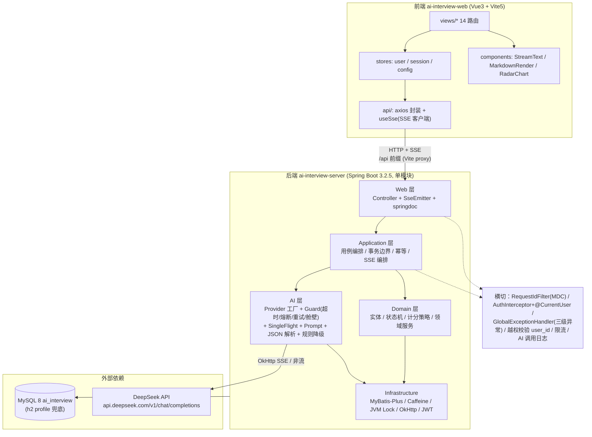
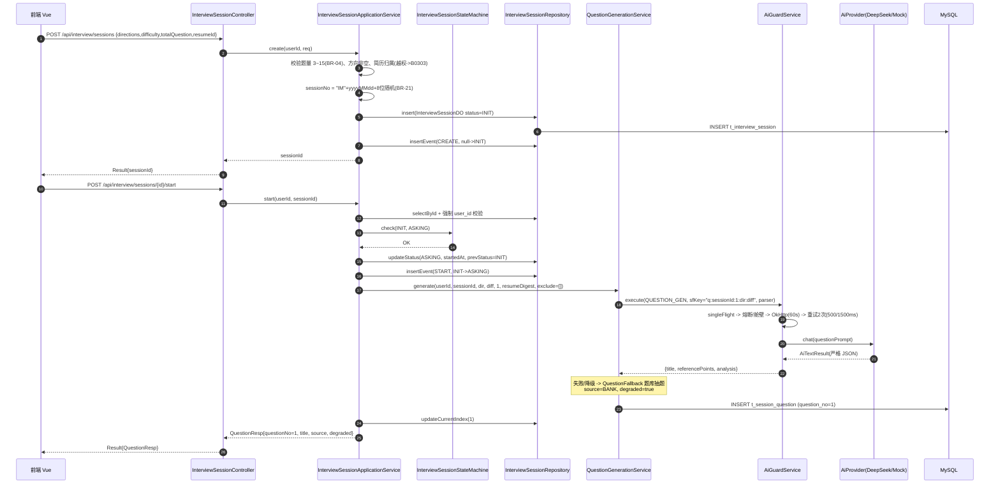
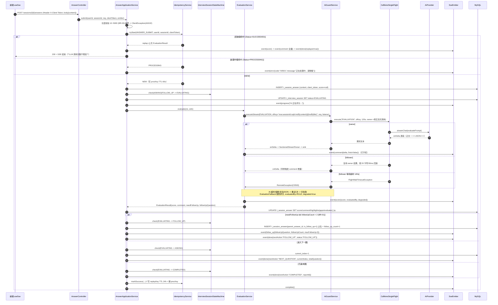
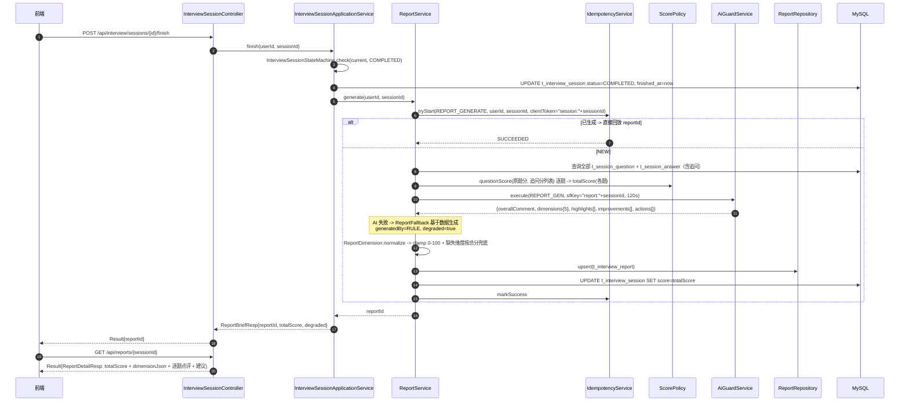
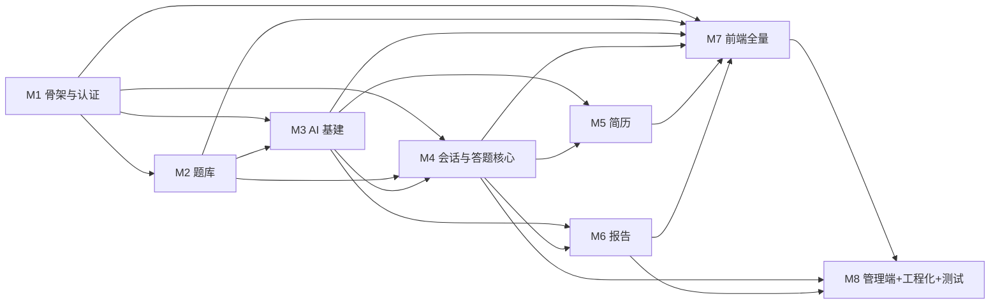
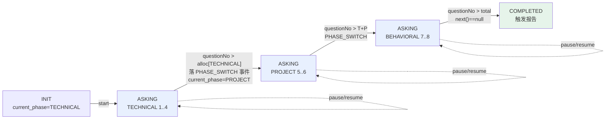
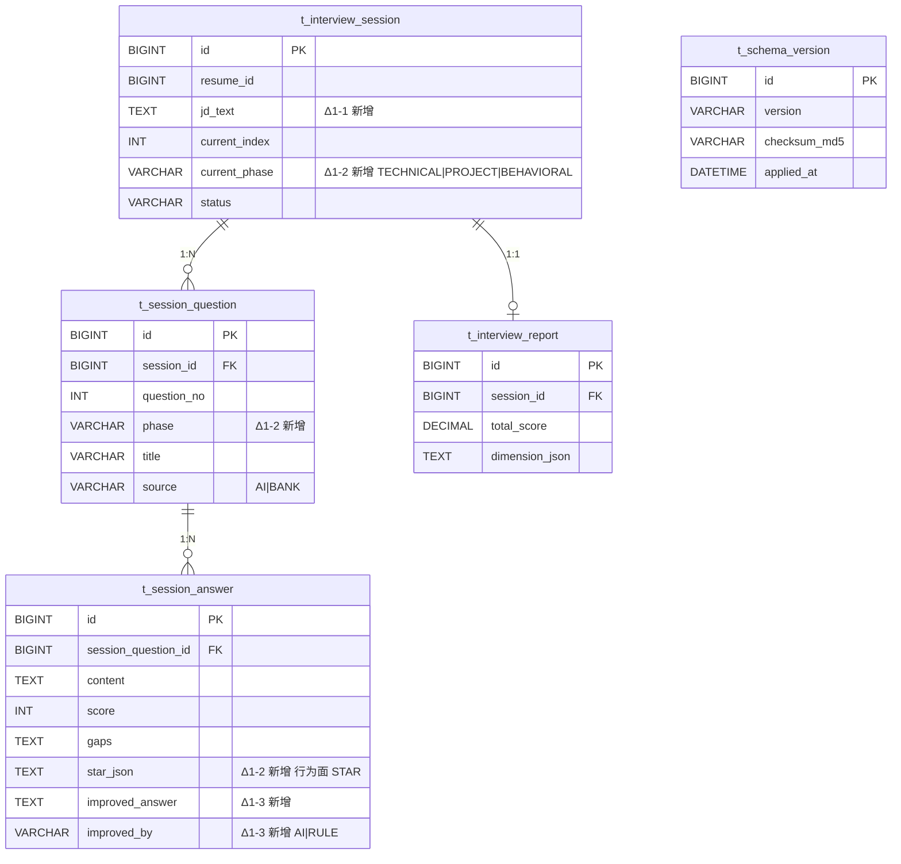

# AI 在线模拟面试平台 — 系统架构设计 & 任务分解

| 项 | 内容 |
| --- | --- |
| 文档版本 | v1.0 |
| 架构师 | 高见远（Bob / Architect） |
| 上游输入 | `docs/PRD.md`（许清楚 定稿）、`D:\agent-class\aimeeting`（参考项目实地勘察） |
| 目标读者 | 工程师（照此一次性落地代码）、PM（验收对照） |
| 代码落盘根 | `D:\code\aimeetting-promax`（后端 `ai-interview-server/`，前端 `ai-interview-web/`） |
| 基包 | `com.aimeeting.interview` |

---

## 0. 环境硬约束与设计前提

| 项 | 值 | 对设计的强制影响 |
| --- | --- | --- |
| JDK | 17.0.18 | 全部语法按 Java 17（record / sealed / switch pattern / 文本块） |
| Maven | 3.9.15，仅 `D:\develop\apache-maven-3.9.15\bin\mvn.cmd` 可用 | README 与所有脚本一律用 `mvn.cmd`；构建加 `-Dfile.encoding=UTF-8` |
| 平台编码 | GBK | `pom.xml` 设 `<project.build.sourceEncoding>UTF-8</project.build.sourceEncoding>` + `-Dfile.encoding=UTF-8`；`logback` 显式 UTF-8 |
| Node | v22.22.2 / npm 11.17.0 | Vite 5 OK |
| MySQL | localhost:3306，root/123456，v8.0.41，库 `ai_interview` | **默认 profile = `mysql`** |
| Redis / MongoDB | 不可用 | **所有缓存 / 锁 / Single-flight / 限流 / 登录失败计数必须接口抽象 + Caffeine/JVM 实现** |
| LLM | DeepSeek `https://api.deepseek.com`，OpenAI 协议兼容 | `OpenAiCompatProvider` 走 `/v1/chat/completions`；`deepseek-v4-flash`（默认）/ `deepseek-chat`（报告可选） |

**技术栈（锁定，不得更改）**

- 后端：Java 17 + Spring Boot 3.2.5 + Spring MVC + MyBatis-Plus 3.5.7 + `SseEmitter` + OkHttp 4.12.0 + okhttp-sse + jjwt 0.12.6 + Caffeine 3.1.8 + springdoc-openapi 2.5.0 + hutool 5.8.29 + lombok 1.18.34 + BCrypt(spring-security-crypto 6.2.x) + PDFBox 3.0.3
- 前端：Vue 3.5 + Vite 5 + TypeScript + Pinia 2 + Vue Router 4 + Element Plus 2.8.8 + Axios 1.7 + ECharts 5.5 + markdown-it 14
- 数据库：MySQL 8（默认）/ H2 2.2.224 `MODE=MySQL`（`h2` profile 兜底）

---

## 1. 总体架构

### 1.1 分层架构图



### 1.2 关键横切说明

| 横切关注点 | 实现位置 | 约定 |
| --- | --- | --- |
| requestId | `common/web/RequestIdFilter` | Filter 生成 `UUID(32)` → `MDC.put("requestId")` → 写入 `Result.requestId` → 响应头 `X-Request-Id` → 日志全链路 |
| 鉴权 | `auth/infrastructure/web/AuthInterceptor` + `common/web/CurrentUserMethodArgumentResolver` | 白名单放行；解析 JWT 后写入 **`HttpServletRequest` attribute**（**禁止 ThreadLocal**），由参数解析器注入 `@CurrentUser UserContext` |
| 异常处理 | `common/web/GlobalExceptionHandler` | `AbstractException` 三类 → 统一 `Result`；`HttpStatusResolver` 按错误码前缀映射 HTTP 状态 |
| 越权 | 各 `Repository` / `Service` | 所有 session/report/resume/answer 查询强制 `user_id = ?`（ADMIN 除外），不匹配 → `ServiceException(B0303)` → 403（不返 404） |
| 限流 | `common/cache/CacheService.increment` | 登录/注册/AI 提交按 `ip + userId` 计数（Caffeine） |
| AI 调用日志 | `ai/log/AiCallLogService` | 异步写入 `t_ai_call_log`，仅落摘要（request/response 各截断 512 字符 + MD5），不落完整 prompt |
| 状态审计 | `interview/domain/state` + `SessionEventService` | 每次状态变更落 `t_session_event` |
| 逻辑删除 | MyBatis-Plus `@TableLogic` | 全局 `deleted` 字段，查询自动过滤 |

---

## 2. 后端工程结构与包设计

### 2.1 工程形态

**单 Maven 模块**：`ai-interview-server`（`com.aimeeting.interview`）。

> 拆分理由：项目规模约 200 个 Java 文件、单进程单实例部署、无跨模块复用需求。拆多模块会带来 `mvn.cmd` 多模块构建耗时与 IDE 配置成本，收益为负。**用「DDD 分包 + 分层包内自洽」替代「Maven 多模块」**，既能体现工程能力，又零额外构建成本。

### 2.2 完整包结构树

```
D:\code\aimeetting-promax\
├── pom.xml                                    # 可选：聚合 pom（当前仅占位，后端自成一模块）
├── README.md
├── docker-compose.yml                          # 可选 MySQL 编排
├── docs/
│   ├── PRD.md
│   └── ARCHITECTURE.md                         # 本文档
├── ai-interview-web/                           # 前端（已初始化 package.json）
└── ai-interview-server/
    ├── pom.xml
    └── src/
        ├── main/
        │   ├── java/com/aimeeting/interview/
        │   │   ├── AiInterviewApplication.java
        │   │   │
        │   │   ├── common/                                  # ── 通用约定与横切（无业务）
        │   │   │   ├── convention/
        │   │   │   │   ├── result/       Result.java  Results.java  PageInfo.java  PageQuery.java
        │   │   │   │   ├── errorcode/    IErrorCode.java  BaseErrorCode.java
        │   │   │   │   ├── exception/    AbstractException.java  ClientException.java
        │   │   │   │   │                 ServiceException.java  RemoteException.java
        │   │   │   │   ├── annotation/   CurrentUser.java
        │   │   │   │   └── context/      UserContext.java
        │   │   │   ├── concurrent/singleflight/
        │   │   │   │                     SingleFlight.java  CaffeineSingleFlight.java
        │   │   │   │                     FlightWaitTimeoutException.java
        │   │   │   ├── idempotent/       IdempotencyService.java  IdempotentStage.java  TryStartResult.java
        │   │   │   ├── cache/            CacheService.java  CaffeineCacheService.java
        │   │   │   ├── lock/             LockService.java  JvmLockService.java
        │   │   │   ├── util/             JsonUtil.java  Md5Util.java  MdcUtil.java
        │   │   │   │                     SessionNoGenerator.java  IpUtil.java
        │   │   │   └── web/              GlobalExceptionHandler.java  RequestIdFilter.java
        │   │   │                         WebMvcConfig.java  CorsConfig.java  OpenApiConfig.java
        │   │   │                         CurrentUserMethodArgumentResolver.java  HttpStatusResolver.java
        │   │   │
        │   │   ├── config/                                  # ── 配置属性与 Bean 装配
        │   │   │                         AiProperties.java  InterviewProperties.java  JwtProperties.java
        │   │   │                         CacheConfig.java   AsyncConfig.java  MybatisPlusConfig.java
        │   │   │                         MetaObjectHandlerImpl.java  JacksonConfig.java
        │   │   │
        │   │   ├── auth/                                    # ── 认证与用户域
        │   │   │   ├── api/              AuthController.java  UserController.java
        │   │   │   ├── api/io/req/       RegisterReq.java  LoginReq.java  RefreshTokenReq.java
        │   │   │   │                     UpdateProfileReq.java  ChangePasswordReq.java
        │   │   │   ├── api/io/resp/      LoginResp.java  TokenResp.java  UserProfileResp.java  UserStatsResp.java
        │   │   │   ├── application/      AuthApplicationService.java  UserApplicationService.java
        │   │   │   ├── domain/           User.java  UserProfile.java  UserDomainService.java
        │   │   │   │                     LoginFailPolicy.java  PasswordPolicy.java
        │   │   │   ├── dao/entity/       UserDO.java  UserProfileDO.java
        │   │   │   ├── dao/mapper/       UserMapper.java  UserProfileMapper.java
        │   │   │   ├── dao/repository/   UserRepository.java
        │   │   │   ├── service/          AuthService.java  AuthServiceImpl.java
        │   │   │   │                     UserService.java  UserServiceImpl.java
        │   │   │   │                     JwtTokenProvider.java  TokenBlacklistService.java
        │   │   │   └── infrastructure/web/  AuthInterceptor.java
        │   │   │
        │   │   ├── question/                                # ── 题库域
        │   │   │   ├── api/              QuestionController.java
        │   │   │   ├── api/io/req/       QuestionQueryReq.java  QuestionSaveReq.java  RandomQuestionReq.java
        │   │   │   ├── api/io/resp/      QuestionResp.java  QuestionDetailResp.java  DirectionOptionResp.java
        │   │   │   ├── application/      QuestionApplicationService.java  QuestionSeedRunner.java
        │   │   │   ├── domain/           Question.java  Direction.java  Difficulty.java  QuestionSource.java
        │   │   │   ├── dao/entity/       QuestionDO.java
        │   │   │   ├── dao/mapper/       QuestionMapper.java
        │   │   │   ├── dao/repository/   QuestionRepository.java
        │   │   │   └── service/          QuestionService.java  QuestionServiceImpl.java
        │   │   │
        │   │   ├── ai/                                      # ── AI 能力层（独立可测）
        │   │   │   ├── api/              (无独立 Controller，由各域 application 调用)
        │   │   │   ├── provider/         AiProvider.java  OpenAiCompatProvider.java  MockAiProvider.java
        │   │   │   │                     AiProviderFactory.java
        │   │   │   ├── model/            AiRequest.java  AiTextResult.java  AiStreamListener.java
        │   │   │   │                     AiBizType.java  AiStage.java  AiErrorType.java  AiChatMessage.java
        │   │   │   ├── guard/            AiGuardService.java  CircuitBreaker.java  Bulkhead.java
        │   │   │   │                     RetryPolicy.java  AiErrorClassifier.java
        │   │   │   ├── concurrent/       AiSingleFlight.java            # 对 common SingleFlight 的语义门面
        │   │   │   ├── prompt/           PromptTemplateLoader.java  QuestionPromptBuilder.java
        │   │   │   │                     EvaluatePromptBuilder.java  FollowUpPromptBuilder.java
        │   │   │   │                     ResumePromptBuilder.java  ReportPromptBuilder.java  PromptNames.java
        │   │   │   ├── parser/           AiJsonParser.java  SectionedStreamParser.java  AiOutputValidator.java
        │   │   │   ├── fallback/         QuestionFallback.java  EvaluationFallback.java
        │   │   │   │                     ResumeFallback.java  ReportFallback.java  RuleEvaluator.java
        │   │   │   ├── log/              AiCallLogService.java
        │   │   │   ├── dao/entity/       AiCallLogDO.java
        │   │   │   └── dao/mapper/       AiCallLogMapper.java
        │   │   │
        │   │   ├── interview/                               # ── 面试会话 + 答题域（核心）
        │   │   │   ├── api/              InterviewSessionController.java  AnswerController.java
        │   │   │   ├── api/io/req/       CreateSessionReq.java  SessionPageQuery.java
        │   │   │   │                     SubmitAnswerReq.java  FollowUpAnswerReq.java
        │   │   │   ├── api/io/resp/      SessionBriefResp.java  SessionDetailResp.java  SessionStatusResp.java
        │   │   │   │                     QuestionResp.java  AnswerDetailResp.java  MessageItemResp.java
        │   │   │   ├── application/      InterviewSessionApplicationService.java
        │   │   │   │                     AnswerApplicationService.java  InterviewAssembler.java
        │   │   │   ├── domain/
        │   │   │   │   ├── state/        SessionStatus.java  InterviewSessionStateMachine.java
        │   │   │   │   ├── model/        InterviewSession.java  SessionQuestion.java  SessionAnswer.java
        │   │   │   │   │                 ScorePolicy.java  FollowUpLimitPolicy.java
        │   │   │   │   └── service/      InterviewSessionDomainService.java
        │   │   │   ├── dao/entity/       InterviewSessionDO.java  SessionQuestionDO.java  SessionAnswerDO.java
        │   │   │   │                     SessionEventDO.java
        │   │   │   ├── dao/mapper/       InterviewSessionMapper.java  SessionQuestionMapper.java
        │   │   │   │                     SessionAnswerMapper.java  SessionEventMapper.java
        │   │   │   ├── dao/repository/   InterviewSessionRepository.java  SessionQuestionRepository.java
        │   │   │   │                     SessionAnswerRepository.java
        │   │   │   └── service/          InterviewSessionService.java  InterviewSessionServiceImpl.java
        │   │   │                         AnswerService.java  AnswerServiceImpl.java
        │   │   │                         EvaluationService.java  EvaluationServiceImpl.java
        │   │   │                         QuestionGenerationService.java  SseEmitterManager.java
        │   │   │                         SseEnvelope.java  SseEventType.java  SessionEventService.java
        │   │   │
        │   │   ├── resume/                                  # ── 简历域
        │   │   │   ├── api/              ResumeController.java
        │   │   │   ├── api/io/req/       ResumeParseReq.java
        │   │   │   ├── api/io/resp/      ResumeResp.java  ResumeDetailResp.java  ResumeParseResult.java
        │   │   │   ├── application/      ResumeApplicationService.java
        │   │   │   ├── domain/           Resume.java  ParsedResume.java
        │   │   │   ├── dao/entity/       ResumeDO.java
        │   │   │   ├── dao/mapper/       ResumeMapper.java
        │   │   │   ├── dao/repository/   ResumeRepository.java
        │   │   │   ├── service/          ResumeService.java  ResumeServiceImpl.java  ResumeTextExtractor.java
        │   │   │   └── infrastructure/   PdfTextExtractor.java  PlainTextExtractor.java
        │   │   │
        │   │   ├── report/                                  # ── 报告域
        │   │   │   ├── api/              ReportController.java
        │   │   │   ├── api/io/req/       ReportPageQuery.java
        │   │   │   ├── api/io/resp/      ReportDetailResp.java  ReportBriefResp.java  DimensionScore.java
        │   │   │   ├── application/      ReportApplicationService.java  ReportMarkdownExporter.java
        │   │   │   ├── domain/           InterviewReport.java  ReportDimension.java
        │   │   │   ├── dao/entity/       InterviewReportDO.java
        │   │   │   ├── dao/mapper/       ReportMapper.java
        │   │   │   ├── dao/repository/   ReportRepository.java
        │   │   │   └── service/          ReportService.java  ReportServiceImpl.java
        │   │   │
        │   │   ├── admin/                                   # ── 管理端域（全部 ADMIN）
        │   │   │   ├── api/              AdminUserController.java  AdminStatisticsController.java
        │   │   │   │                     AdminAiController.java
        │   │   │   ├── api/io/resp/      AdminUserResp.java  OverviewStatsResp.java
        │   │   │   │                     SessionTrendResp.java  AiCallLogResp.java  AiHealthResp.java
        │   │   │   ├── application/      AdminApplicationService.java
        │   │   │   └── service/          AdminService.java  AdminServiceImpl.java
        │   │   │
        │   │   └── ops/                                     # ── 运维
        │   │       ├── api/              HealthController.java  ClientConfigController.java
        │   │       └── api/io/resp/      HealthResp.java  ClientConfigResp.java
        │   │
        │   └── resources/
        │       ├── application.yml
        │       ├── application-mysql.yml
        │       ├── application-h2.yml
        │       ├── logback-spring.xml
        │       ├── db/
        │       │   ├── schema-mysql.sql
        │       │   ├── schema-h2.sql
        │       │   └── data-questions-seed.json
        │       ├── prompt/
        │       │   ├── question.md
        │       │   ├── evaluate.md
        │       │   ├── follow-up.md
        │       │   ├── resume.md
        │       │   └── report.md
        │       └── META-INF/  (可选)
        └── test/java/com/aimeeting/interview/
            ├── auth/           AuthServiceTest.java  JwtTokenProviderTest.java  UserControllerTest.java
            ├── question/       QuestionServiceTest.java  QuestionSeedRunnerTest.java
            ├── ai/             MockAiProviderTest.java  AiJsonParserTest.java
            │                   CircuitBreakerTest.java  CaffeineSingleFlightTest.java
            │                   IdempotencyServiceTest.java  RuleEvaluatorTest.java
            ├── interview/      InterviewSessionStateMachineTest.java  ScorePolicyTest.java
            │                   AnswerFlowTest.java  InterviewSessionControllerTest.java
            ├── report/         ReportServiceTest.java
            └── resume/         ResumeServiceTest.java
```

### 2.3 分层职责与拆分理由

| 层 | 包后缀 | 职责 | 禁止 |
| --- | --- | --- | --- |
| `api` | `*.api` | 只做参数绑定、鉴权注解、调用 application、包 `Result`。**不写业务** | 禁止注入 Mapper、禁止写 SQL |
| `application` | `*.application` | 用例编排、事务边界（`@Transactional`）、幂等入口、SSE 编排、DO↔Resp 装配 | 禁止直接写 Mapper（走 repository/service） |
| `domain` | `*.domain` | 实体、值对象、领域服务、**状态机**、计分策略。纯 Java，无 Spring 依赖（可单测） | 禁止依赖 Spring / MyBatis |
| `dao` | `*.dao.entity/mapper/repository` | 持久化：DO + Mapper + Repository（封装 LambdaQueryWrapper 与 `user_id` 强制拼装） | 禁止写业务判断 |
| `service` | `*.service` | 领域能力的 Spring 实现（事务、缓存、AI 调用、SSE 发射） | — |

**为什么把 `ai/` 独立成顶层包而不是塞进 `interview/`**：AI 被 4 个域（interview / resume / report / question）复用，独立后 provider、guard、single-flight、prompt 全部可脱离业务单测，且"换 provider 只改配置"这条验收标准天然成立。

**为什么 `interview/domain/state/` 单独一包**：状态机是本项目的核心可讲点，独立包 + 纯静态 EnumMap 实现 → 可以被单测 100% 覆盖，也让"主状态持久化在 DB、细状态流转在内存"的分层一目了然。

---

## 3. 核心类设计

> 以下给出**类名 + 关键方法签名 + 职责**。工程师可直接照抄签名实现。

### 3.1 结果 / 异常 / 错误码体系

```java
// common/convention/result/Result.java
@Data @Accessors(chain = true)
public class Result<T> implements Serializable {
    public static final String SUCCESS_CODE = "0";
    private String code;        // "0" 成功
    private String message;
    private T data;
    private String requestId;
    public boolean isSuccess();
}

// common/convention/result/Results.java
public final class Results {
    public static Result<Void> success();
    public static <T> Result<T> success(T data);
    public static Result<Void> failure();
    public static Result<Void> failure(AbstractException e);
    public static Result<Void> failure(String errorCode, String errorMessage);
    public static <T> Result<T> failure(String errorCode, String errorMessage, Class<T> unused); // 便于泛型推导
}

// common/convention/result/PageInfo.java
@Data
public class PageInfo<T> implements Serializable {
    private List<T> list; private long total; private long pageNum; private long pageSize;
    public static <T> PageInfo<T> of(IPage<T> page);                       // MyBatis-Plus IPage 转换
    public static <T,R> PageInfo<R> of(IPage<T> page, Function<T,R> mapper);
}

// common/convention/result/PageQuery.java
@Data
public class PageQuery { private long pageNum = 1; private long pageSize = 10; }  // 子类追加筛选字段

// common/convention/errorcode/IErrorCode.java
public interface IErrorCode { String code(); String message(); }

// common/convention/errorcode/BaseErrorCode.java  (枚举，覆盖全部错误码)
public enum BaseErrorCode implements IErrorCode {
    // A 客户端
    CLIENT_ERROR("A0001","用户端错误"),
    PARAM_ERROR("A0100","参数错误"),
    PASSWORD_ERROR("A0101","用户名或密码错误"),
    PARAM_LENGTH_INVALID("A0102","参数长度不合法"),
    PARAM_VALID_FAIL("A0103","参数校验失败"),
    USER_EXIST("A0104","用户名或邮箱已存在"),
    TOKEN_MISSING("A0201","未登录或 Token 缺失"),
    TOKEN_EXPIRED("A0202","Token 已过期"),
    REFRESH_TOKEN_EXPIRED("A0203","登录状态已失效，请重新登录"),
    FORBIDDEN("A0301","无权限访问该资源"),
    NOT_RESUME_TEXT("A0401","内容看起来不是简历，请检查后重试"),
    FILE_TYPE_UNSUPPORTED("A0402","仅支持 TXT / MD / PDF 文件"),
    FILE_TOO_LARGE("A0403","文件大小不能超过 5MB"),
    RATE_LIMITED("A0501","操作过于频繁，请稍后再试"),
    ACCOUNT_LOCKED("A0502","连续登录失败次数过多，账号已锁定 5 分钟"),
    // B 系统
    SERVICE_ERROR("B0001","系统繁忙，请稍后再试"),
    DB_UNAVAILABLE("B0101","数据服务暂时不可用"),
    ACCOUNT_DISABLED("B0103","账号已被禁用"),
    ILLEGAL_STATUS_TRANSITION("B0301","当前会话状态不允许该操作"),
    SESSION_PAUSED("B0302","会话已暂停，请先恢复后再作答"),
    OWNERSHIP_DENIED("B0303","无权访问该资源"),
    // C 远程 AI
    REMOTE_ERROR("C0001","远程服务调用失败"),
    AI_UNAVAILABLE("C0501","AI 服务暂不可用，已切换备用方案"),
    AI_BUSY("C0502","AI 服务繁忙，请稍后再试"),
    AI_WAIT_TIMEOUT("C0503","AI 服务响应较慢，请稍后重试"),
    AI_TIMEOUT("C0504","AI 服务响应超时，已切换备用方案");
}

// common/convention/exception/AbstractException.java
@Getter
public abstract class AbstractException extends RuntimeException {
    public final String errorCode;
    public final String errorMessage;
    public AbstractException(String message, Throwable throwable, IErrorCode errorCode);
}
public class ClientException  extends AbstractException { public ClientException(IErrorCode c); public ClientException(String msg, IErrorCode c); }
public class ServiceException extends AbstractException { /* 同上签名 */ }
public class RemoteException  extends AbstractException { /* 同上签名 + public AiErrorType errorType(); */ }

// common/web/HttpStatusResolver.java
public final class HttpStatusResolver {
    public static HttpStatus resolve(String errorCode) {
        // A02* -> 401 ; A03*/B0303 -> 403 ; A0* -> 400
        // B0301 -> 409 ; B0302 -> 409 ; B0* -> 500
        // C0502 -> 429 ; C0503/C0504 -> 504 ; C0* -> 502 ; 默认 500
    }
}

// common/web/GlobalExceptionHandler.java
@RestControllerAdvice
public class GlobalExceptionHandler {
    @ExceptionHandler(AbstractException.class)  public ResponseEntity<Result<Void>> handle(AbstractException e);
    @ExceptionHandler(MethodArgumentNotValidException.class) ...   // -> A0103 + 字段错误明细
    @ExceptionHandler(ConstraintViolationException.class) ...
    @ExceptionHandler(MaxUploadSizeExceededException.class) ...    // -> A0403
    @ExceptionHandler(Exception.class)                             // -> B0001 + requestId + 记 error 日志
}
```

### 3.2 鉴权体系（禁止 ThreadLocal）

```java
// common/convention/context/UserContext.java
@Data @AllArgsConstructor @NoArgsConstructor
public class UserContext {
    private Long userId; private String username; private String role;
    public boolean isAdmin() { return "ADMIN".equals(role); }
    public static final String REQUEST_KEY = "AI_INTERVIEW_USER_CONTEXT";
}

// common/convention/annotation/CurrentUser.java
@Target(ElementType.PARAMETER) @Retention(RetentionPolicy.RUNTIME)
public @interface CurrentUser {}

// auth/service/JwtTokenProvider.java
@Component
public class JwtTokenProvider {
    public String generateAccessToken(Long userId, String username, String role);
    public String generateRefreshToken(Long userId);
    public JwtClaims parse(String token);                  // 失败抛 ClientException(A0201/A0202)
    public TokenType typeOf(String token);                 // ACCESS / REFRESH
    public long getAccessExpireSeconds();                  // 7200
    public long getRefreshExpireSeconds();                 // 604800
}
public record JwtClaims(Long userId, String username, String role, TokenType type) {}
public enum TokenType { ACCESS, REFRESH }

// auth/infrastructure/web/AuthInterceptor.java
@Component
public class AuthInterceptor implements HandlerInterceptor {
    // preHandle:
    //   1. OPTIONS 直接放行
    //   2. 命中白名单(配置 ai-interview.security.permit-paths) -> return true
    //   3. Authorization: Bearer <token> 缺失 -> ClientException(A0201)
    //   4. JwtTokenProvider.parse -> 过期 ClientException(A0202)
    //   5. TokenBlacklistService.isBlacklisted(jti) -> ClientException(A0201)
    //   6. UserDO 校验 status==DISABLED -> ServiceException(B0103)
    //   7. request.setAttribute(UserContext.REQUEST_KEY, ctx)     ← 关键：request attribute，非 ThreadLocal
}

// common/web/CurrentUserMethodArgumentResolver.java
@Component
public class CurrentUserMethodArgumentResolver implements HandlerMethodArgumentResolver {
    public boolean supportsParameter(MethodParameter p) { return p.hasParameterAnnotation(CurrentUser.class); }
    public Object resolveArgument(...) {
        // 从 NativeWebRequest.getAttribute(UserContext.REQUEST_KEY, REQUEST_SCOPE) 取
        // 按参数类型分派：UserContext / Long(取 userId) / String(取 username)
        // 缺失 -> ClientException(A0201)
    }
}

// auth/service/TokenBlacklistService.java
@Service
public class TokenBlacklistService {
    public void blacklist(String jti, long remainSeconds);   // Caffeine，key="jti:blacklist:{jti}"
    public boolean isBlacklisted(String jti);
}

// auth/domain/LoginFailPolicy.java  —— 纯领域，无 Spring
public final class LoginFailPolicy {
    public static final int MAX_FAIL = 5;
    public static final Duration LOCK_DURATION = Duration.ofMinutes(5);
    public static boolean shouldLock(int failCount);
    public static String cacheKey(String loginName);
}
// auth/domain/PasswordPolicy.java
public final class PasswordPolicy {
    public static final int MIN = 8, MAX = 20;
    public static void validate(String raw);     // 长度 + 必须同时含字母与数字，违者 ClientException(A0102)
    public static String encode(String raw);     // BCryptPasswordEncoder(10)
    public static boolean matches(String raw, String hash);
}
```

### 3.3 缓存 / 锁 / Single-flight / 幂等（全部接口抽象 + 本机实现）

```java
// common/cache/CacheService.java
public interface CacheService {
    <T> Optional<T> get(String key, Class<T> type);
    <T> Optional<T> get(String key, TypeReference<T> type);       // 复杂泛型（回放 Result）
    void put(String key, Object value, Duration ttl);
    boolean putIfAbsent(String key, String value, Duration ttl);  // 原子占位，幂等"处理中键"核心
    boolean remove(String key);
    long increment(String key, Duration ttl);                     // 登录失败计数 / 限流
    <T> T getOrLoad(String key, Duration ttl, Supplier<T> loader);
}
// common/cache/CaffeineCacheService.java   @Service，内部 Caffeine.newBuilder().maximumSize(10_000).expireAfterWrite(...)

// common/lock/LockService.java
public interface LockService {
    boolean tryLock(String key, Duration lease);
    void unlock(String key);
    <T> T withLock(String key, Duration wait, Duration lease, Supplier<T> supplier); // 等待失败抛 ServiceException(B0001)
}
// common/lock/JvmLockService.java  —— ConcurrentHashMap<String, ReentrantLock> + 过期清理

// common/concurrent/singleflight/SingleFlight.java
public interface SingleFlight {
    /**
     * 同一 group+key 只有一个 owner 真实执行 loader，其余 follower 阻塞等待复用结果。
     * @throws FlightWaitTimeoutException follower 等待超时（-> C0503）
     */
    <T> T execute(String group, String key, Duration waitTimeout, Callable<T> loader);
}
// common/concurrent/singleflight/CaffeineSingleFlight.java
@Service
public class CaffeineSingleFlight implements SingleFlight {
    private final ConcurrentMap<String, FlightEntry> flights = new ConcurrentHashMap<>();
    // flights.compute(...) 保证 "创建/复用" 原子化（参考项目同款写法）
    // owner: loader.call() -> future.complete(v) ; 异常 -> completeExceptionally + 立即 remove 该 entry
    // follower: future.get(waitTimeout) ; 超时 -> remove(key, entry) + 抛 FlightWaitTimeoutException
    // 清理: size > 256 时 removeIf(expireAt <= now)
    private record FlightEntry(CompletableFuture<Object> future, long expireAtMillis) {}
}
public class FlightWaitTimeoutException extends RuntimeException { public FlightWaitTimeoutException(String msg); }

// common/idempotent/IdempotencyService.java
public enum IdempotentStage { ANSWER_SUBMIT, REPORT_GENERATE, RESUME_PARSE, QUESTION_GENERATE }

@Service
public class IdempotencyService {
    /** 处理中键 TTL 60s；回放键 TTL 24h（BR-07） */
    public <T> TryStartResult<T> tryStart(IdempotentStage stage, Long userId, String bizId,
                                          String clientToken, TypeReference<T> replayType);
    public void markSuccess(IdempotentStage stage, Long userId, String bizId, String clientToken, Object result);
    public void clear(IdempotentStage stage, Long userId, String bizId, String clientToken);
    private String procKey(...)   { return "idem:proc:"   + stage + ":" + userId + ":" + bizId + ":" + clientToken; }
    private String replayKey(...) { return "idem:replay:" + stage + ":" + userId + ":" + bizId + ":" + clientToken; }
}
@Data
public class TryStartResult<T> {
    private Status status;      // NEW | PROCESSING | SUCCEEDED
    private T replay;           // SUCCEEDED 时非空
    public static <T> TryStartResult<T> newRequest();
    public static <T> TryStartResult<T> processing();
    public static <T> TryStartResult<T> succeeded(T replay);
    public enum Status { NEW, PROCESSING, SUCCEEDED }
}
```

> **DB 落库（统一口径，覆盖此前 "proc/replay 双行" 与 "只写一条成功审计" 两种不一致表述）**：
> - **权威状态机在 Caffeine**：`procKey`（TTL 60s）+ `replayKey`（TTL 24h）双键全部只在 Caffeine 内流转，`tryStart/markSuccess/clear` **读路径完全不查 DB**。
> - **`t_idempotent_record` 只做审计与崩溃诊断，且一次请求只对应一行**：`biz_key` 固定取 **procKey 格式**（`idem:proc:{stage}:{userId}:{bizId}:{token}`），**replay 键不落库**。
> - 生命周期：`tryStart` 返回 `NEW` 时异步 upsert 一行 `PROCESSING`（`expire_at=now+60s`）→ `markSuccess` 把**同一行**更新为 `SUCCESS` + `result_json`（截断 2000 字符）+ `expire_at=now+24h` → `clear`/异常更新为 `FAILED`。
> - 清理：定时任务删除 `expire_at < now - 7d` 的行。
> - 唯一键冲突处理：upsert 用 `INSERT ... ON DUPLICATE KEY UPDATE`，不做 `SELECT` 前置判断。

### 3.4 AI 层

```java
// ai/model/AiBizType.java
public enum AiBizType { QUESTION, EVALUATE, FOLLOW_UP, RESUME, REPORT }

// ai/model/AiStage.java  —— 超时/单飞/熔断的分组维度（BR-08）
public enum AiStage {
    QUESTION_GEN(Duration.ofSeconds(60),  AiBizType.QUESTION),
    EVALUATION  (Duration.ofSeconds(90),  AiBizType.EVALUATE),
    FOLLOW_UP_GEN(Duration.ofSeconds(90), AiBizType.FOLLOW_UP),
    RESUME_PARSE(Duration.ofSeconds(90),  AiBizType.RESUME),
    REPORT_GEN  (Duration.ofSeconds(120), AiBizType.REPORT);
    public final Duration timeout; public final AiBizType bizType;
}

// ai/model/AiRequest.java
public record AiRequest(AiBizType bizType, String systemPrompt, String userPrompt,
                        Double temperature, Integer maxTokens, String model,
                        boolean jsonMode, String requestId) {
    public static Builder builder();
}
// ai/model/AiTextResult.java
public record AiTextResult(String content, Integer promptTokens, Integer completionTokens, long costMs, String model) {}
// ai/model/AiStreamListener.java
public interface AiStreamListener {
    void onDelta(String delta);
    void onComplete(AiTextResult result);
    void onError(Throwable t);
}

// ai/provider/AiProvider.java  —— 唯一契约，mock 与真实同签名
public interface AiProvider {
    String name();                                                      // "deepseek" | "mock"
    boolean available();
    AiTextResult chat(AiRequest request);                               // 阻塞调用
    void streamChat(AiRequest request, AiStreamListener listener);      // 流式调用
}
// ai/provider/OpenAiCompatProvider.java  —— OkHttp + okhttp-sse，POST {baseUrl}/v1/chat/completions
//   请求体: {"model":..,"messages":[{"role":"system"|"user","content":..}],"stream":bool,
//           "temperature":..,"max_tokens":.., "response_format":{"type":"json_object"}(仅 jsonMode)}
//   Header: Authorization: Bearer {api-key}, Content-Type: application/json, X-Request-Id
//   超时: connect 10s / write 30s / read = AiStage.timeout
// ai/provider/MockAiProvider.java        —— 规则引擎，按字符切片模拟流式（每 20 字符 sleep 30ms），永不抛异常
// ai/provider/AiProviderFactory.java
@Component
public class AiProviderFactory {
    public AiProvider getProvider();       // ai.provider=mock 或 api-key 为空 -> MockAiProvider；否则 OpenAiCompatProvider
    public boolean isMockMode();
    public String currentModel(AiBizType type);
}

// ai/guard/AiErrorType.java
public enum AiErrorType { TIMEOUT, UNAVAILABLE, RATE_LIMIT, INVALID_RESPONSE, PARAMS }
// ai/guard/AiErrorClassifier.java
public final class AiErrorClassifier {
    public static AiErrorType classify(Throwable t);
    public static boolean retryable(AiErrorType type);   // 仅 TIMEOUT / UNAVAILABLE 可重试（BR-09）
}
// ai/guard/CircuitBreaker.java   —— 滑动窗口 20，失败率 >=50% 开断，30s 后半开（BR-10）
public class CircuitBreaker {
    public CircuitBreaker(int windowSize, double failureRate, Duration openDuration);
    public boolean allowRequest();
    public void recordSuccess(); public void recordFailure();
    public State state();   // CLOSED | OPEN | HALF_OPEN
}
// ai/guard/Bulkhead.java         —— 全局 AI 并发信号量 20（BR-11）
@Component
public class Bulkhead { public boolean tryAcquire(); public void release(); public int available(); }

// ai/guard/AiGuardService.java   —— 所有 AI 调用的唯一入口
@Service
public class AiGuardService {
    /** 非流：单飞 -> 熔断 -> 舱壁 -> 超时 -> 重试(2次, 500->1500ms) -> 日志 -> 抛 RemoteException */
    public <T> T execute(AiStage stage, String singleFlightKey, Long userId, Function<AiTextResult, T> parser);
    /** 流式：单飞 owner 才真调；follower 复用 owner 的完整文本并按相同节奏回放给自己的 listener */
    public void executeStream(AiStage stage, String singleFlightKey, Long userId,
                              AiRequest request, AiStreamListener out);
    public boolean isCircuitOpen(AiStage stage);
    public AiHealthSnapshot health();     // 供 /api/admin/ai/health
}
```

**`AiGuardService.executeStream` 的 follower 回放实现（重要）**：owner 线程把累积的 `AiTextResult.content` 放入 `SingleFlight` 的 future；follower 拿到完整 content 后，用 `MockStreamReplay`（按 20 字符切片 + 30ms）喂给自己的 `out` listener，从而在**不重复调用 LLM** 的前提下让每个 follower 也获得打字机效果。

```java
// ai/parser/AiJsonParser.java
public final class AiJsonParser {
    /** 剥离 ```json 围栏 / 前后缀文字 -> 定位首个 '{' 与最后一个 '}' -> Jackson readTree
     *  @throws AiOutputException(INVALID_RESPONSE) */
    public static JsonNode parse(String raw);
    public static <T> T parse(String raw, Class<T> type);
    public static String stripFence(String raw);
}
// ai/parser/SectionedStreamParser.java   —— 评分专用：正文 + ===JSON=== 分隔
public final class SectionedStreamParser {
    public static final String DELIM = "===JSON===";
    /** 增量喂入 delta；返回本次可下发给前端的正文片段（未遇到分隔符时全量下发） */
    public String onDelta(String delta);
    /** 流结束后调用，返回分隔符之后的严格 JSON 部分 */
    public String jsonPart();
    public boolean hasDelimiter();
}
// ai/parser/AiOutputValidator.java
public final class AiOutputValidator {
    public static int scoreInRange(JsonNode node, String field);  // 0-100 整数，越界/非数字抛 AiOutputException
    public static String nonBlank(JsonNode node, String field);
    public static List<String> stringArray(JsonNode node, String field, int minSize);
}

// ai/fallback/*  —— 规则引擎降级（BR-13/BR-14）
public interface QuestionFallback   { GeneratedQuestion fallback(Direction d, Difficulty diff, Set<String> excludeMd5); }
public interface EvaluationFallback { EvaluationResult fallback(String question, List<String> referencePoints, String answer); }
public interface ResumeFallback     { ParsedResume fallback(String rawText); }
public interface ReportFallback     { ReportPayload fallback(List<QuestionScoreItem> items); }
// ai/fallback/RuleEvaluator.java   —— 关键词命中(60%) + 答案长度(20%) + 结构分(20%)，输出 0-100 整数 + 模板点评

// ai/log/AiCallLogService.java
@Service
public class AiCallLogService {
    @Async public void record(AiCallLogDO log);   // request/response 各截断 512 字符 + MD5 摘要
    public IPage<AiCallLogDO> page(long pageNum, long pageSize, String bizType, Boolean success);
    public AiHealthSnapshot healthSnapshot(Duration window);
}
```

### 3.5 面试域（核心）

```java
// interview/domain/state/SessionStatus.java
public enum SessionStatus {
    INIT, ASKING, EVALUATING, FOLLOW_UP, PAUSED, COMPLETED, ABORTED;
    public boolean isTerminal();      // COMPLETED / ABORTED
    public boolean isActive();
}

// interview/domain/state/InterviewSessionStateMachine.java   —— 纯静态，无 Spring，可 100% 单测
public final class InterviewSessionStateMachine {
    private static final Map<SessionStatus, Set<SessionStatus>> ALLOWED = new EnumMap<>(SessionStatus.class);
    static {
        put(INIT,       ASKING, ABORTED);
        put(ASKING,     EVALUATING, PAUSED, ABORTED, COMPLETED);
        put(EVALUATING, FOLLOW_UP, ASKING, COMPLETED, PAUSED);
        put(FOLLOW_UP,  EVALUATING, ASKING, COMPLETED, PAUSED);
        put(PAUSED,     INIT, ASKING, EVALUATING, FOLLOW_UP, ABORTED);  // 恢复到 prevStatus（动态校验）
        put(COMPLETED); put(ABORTED);
    }
    public static boolean canTransit(SessionStatus from, SessionStatus to);
    /** 非法跳转 -> throw new ServiceException(msg, BaseErrorCode.ILLEGAL_STATUS_TRANSITION)  => HTTP 409 */
    public static void check(SessionStatus from, SessionStatus to);
    public static Set<SessionStatus> nextStates(SessionStatus from);
}

// interview/domain/model/ScorePolicy.java   —— BR-02，纯函数
public final class ScorePolicy {
    public static final double ORIGINAL_WEIGHT = 0.70;
    public static final double FOLLOW_UP_WEIGHT = 0.30;
    /** 有追问：原题*0.7 + 追问均分*0.3；无追问：原题分。四舍五入取整 */
    public static int questionScore(int originalScore, List<Integer> followUpScores);
    /** 总分 = 各题加权平均，保留 1 位小数 */
    public static double totalScore(List<Integer> questionScores);
}
// interview/domain/model/FollowUpLimitPolicy.java   —— BR-01
public final class FollowUpLimitPolicy {
    public static final int DEFAULT_MAX = 2;
    public static boolean canFollowUp(int currentCount, int max);
}

// interview/service/InterviewSessionService.java
public interface InterviewSessionService {
    Long create(@CurrentUser Long userId, CreateSessionReq req);
    PageInfo<SessionBriefResp> page(Long userId, SessionPageQuery query);
    SessionDetailResp detail(Long userId, Long sessionId);                       // 越权 -> B0303
    QuestionResp start(Long userId, Long sessionId);                             // INIT -> ASKING + 生成首题（阻塞式）
    void streamNextQuestion(Long userId, Long sessionId, SseEmitter emitter);    // SSE: question/progress/done/error
    void pause(Long userId, Long sessionId);                                     // 记录 prevStatus
    void resume(Long userId, Long sessionId);                                    // PAUSED -> prevStatus
    Long finish(Long userId, Long sessionId);                                    // -> COMPLETED + 同步返回 reportId
    void remove(Long userId, Long sessionId);                                    // 逻辑删除
    SessionStatusResp status(Long userId, Long sessionId);                       // 轻量轮询
    List<MessageItemResp> messages(Long userId, Long sessionId);
}

// interview/service/AnswerService.java
public interface AnswerService {
    /** SSE：幂等(X-Client-Token) -> 落库 -> EVALUATING -> 流式评分 -> 追问判定 -> done */
    void submit(Long userId, Long sessionId, SubmitAnswerReq req, String clientToken, SseEmitter emitter);
    void submitFollowUp(Long userId, Long sessionId, FollowUpAnswerReq req, String clientToken, SseEmitter emitter);
    AnswerDetailResp detail(Long userId, Long answerId);
    void skip(Long userId, Long sessionId, Long sessionQuestionId);              // 记 0 分 + skipped=true
}

// interview/service/EvaluationService.java
public interface EvaluationService {
    /** sink 用于把 comment 增量推给 SSE；返回最终结构化结果 */
    EvaluationResult evaluate(Long userId, EvaluationContext ctx, AiStreamSink sink);
}
public record EvaluationContext(Long sessionId, Long sessionQuestionId, String questionTitle,
                                List<String> referencePoints, String answer, boolean isFollowUp) {}
@Data @Builder
public class EvaluationResult {
    private Integer score;              // 0-100 整数
    private String comment;             // Markdown 正文
    private List<String> highlights;
    private List<String> gaps;
    private Boolean needFollowUp;
    private String followUpQuestion;
    private EvaluatedBy evaluatedBy;    // AI | RULE
    private boolean degraded;           // true 表示走了降级
}

// interview/service/QuestionGenerationService.java
public interface QuestionGenerationService {
    /** 优先 AI（带 single-flight + 题库去重）；失败/降级 -> 题库随机抽题（source=BANK, degraded=true） */
    GeneratedQuestion generate(Long userId, Long sessionId, Direction direction, Difficulty difficulty,
                               int questionNo, String resumeDigest, Set<String> excludeTitleMd5);
}
@Data @Builder
public class GeneratedQuestion {
    private String title; private List<String> referencePoints; private String analysis;
    private Difficulty difficulty; private QuestionSource source;   // AI | BANK
    private boolean degraded;
}

// interview/service/SseEnvelope.java / SseEventType.java
public enum SseEventType { question, score, comment, follow_up, progress, done, error }
public final class SseEnvelope {
    public static Set<SseEmitter.Data> event(SseEventType type, AtomicLong seq, Object payload);
    public static Set<SseEmitter.Data> event(SseEventType type, AtomicLong seq, Object payload, boolean degraded);
}
// interview/service/SseEmitterManager.java
@Component
public class SseEmitterManager {
    public SseEmitter create(String requestId, Long sessionId);  // timeout 5min；onCompletion/onError/onTimeout 清理
    public void send(SseEmitter emitter, SseEventType type, AtomicLong seq, Object payload);
    public void complete(SseEmitter emitter, AtomicLong seq, Object donePayload);
    public void error(SseEmitter emitter, String code, String message);
}
```

### 3.6 简历 / 报告 / 题库 / 管理

```java
// resume/service/ResumeService.java
public interface ResumeService {
    Long parse(Long userId, ResumeParseReq req);          // 文本 -> AI 解析 -> 落库（幂等 clientToken）
    Long upload(Long userId, MultipartFile file);         // TXT/MD/PDF，<=5MB（BR-22 校验）
    PageInfo<ResumeResp> page(Long userId, PageQuery q);
    ResumeDetailResp detail(Long userId, Long id);        // 越权 -> B0303
    void remove(Long userId, Long id);
    void markDefault(Long userId, Long id);
    String digestForPrompt(Long userId, Long resumeId);   // 截断 800 字符，供出题 prompt 注入
}
// resume/infrastructure/ResumeTextExtractor.java
public interface ResumeTextExtractor { boolean supports(String contentType, String filename); String extract(MultipartFile file); }

// report/service/ReportService.java
public interface ReportService {
    Long generate(Long userId, Long sessionId);           // 幂等（IdempotentStage.REPORT_GENERATE）
    ReportDetailResp getBySession(Long userId, Long sessionId);
    ReportDetailResp getById(Long userId, Long reportId);
    PageInfo<ReportBriefResp> page(Long userId, ReportPageQuery q);
    void remove(Long userId, Long reportId);
    String exportMarkdown(Long userId, Long reportId);
}
// report/domain/ReportDimension.java   —— 五维
public enum ReportDimension {
    PROFESSIONAL("专业技能"), EXPRESSION("表达沟通"), LOGIC("逻辑思维"),
    PROJECT_DEPTH("项目深度"), POTENTIAL("潜力");
    public final String label;
    public static Map<String,Integer> normalize(Map<String,Integer> raw);  // 缺失维度按总分兜底，全部 clamp 0-100
}

// question/service/QuestionService.java
public interface QuestionService {
    PageInfo<QuestionResp> page(QuestionQueryReq q);
    QuestionDetailResp detail(Long id);
    Long save(QuestionSaveReq req, Long operatorId);       // ADMIN
    void update(Long id, QuestionSaveReq req);             // ADMIN
    void remove(Long id);                                  // ADMIN，逻辑删除
    List<QuestionDO> random(RandomQuestionReq req);        // 方向+难度+排除；不足时放宽难度
    List<DirectionOptionResp> directions();                // 公开，8 方向
    ImportResult importQuestions(List<QuestionSaveReq> list);  // ADMIN
}
// question/application/QuestionSeedRunner.java
@Component @Order(1)
public class QuestionSeedRunner implements ApplicationRunner {
    // 读 classpath:db/data-questions-seed.json；按 titleMd5 去重；count < 200 才导入；导入后打日志
}

// admin/service/AdminService.java
public interface AdminService {
    PageInfo<AdminUserResp> users(PageQuery q, String keyword);
    void updateUserStatus(Long id, Integer status);                 // 禁用/启用
    OverviewStatsResp overview();
    SessionTrendResp sessionTrend(int days);
    PageInfo<AiCallLogResp> aiCalls(PageQuery q, String bizType, Boolean success);
    AiHealthResp aiHealth();                                        // provider/model/mock/熔断/舱壁
}
```

### 3.7 核心类关系图

```mermaid
classDiagram
    class Result~T~ { +String code +String message +T data +String requestId }
    class IErrorCode { <<interface>> +code() +message() }
    class AbstractException { <<abstract>> +String errorCode +String errorMessage }
    class ClientException
    class ServiceException
    class RemoteException
    AbstractException <|-- ClientException
    AbstractException <|-- ServiceException
    AbstractException <|-- RemoteException
    AbstractException --> IErrorCode

    class AiProvider { <<interface>> +name() +available() +chat(AiRequest) +streamChat(AiRequest, AiStreamListener) }
    class OpenAiCompatProvider
    class MockAiProvider
    AiProvider <|.. OpenAiCompatProvider
    AiProvider <|.. MockAiProvider
    class AiProviderFactory { +getProvider() +isMockMode() }
    AiProviderFactory --> AiProvider

    class AiGuardService { +execute(stage,key,userId,parser) +executeStream(stage,key,userId,req,out) }
    class CircuitBreaker { +allowRequest() +recordSuccess() +recordFailure() }
    class Bulkhead { +tryAcquire() +release() }
    class SingleFlight { <<interface>> +execute(group,key,wait,loader) }
    class CaffeineSingleFlight
    SingleFlight <|.. CaffeineSingleFlight
    AiGuardService --> AiProvider
    AiGuardService --> CircuitBreaker
    AiGuardService --> Bulkhead
    AiGuardService --> SingleFlight

    class CacheService { <<interface>> +get() +put() +putIfAbsent() +increment() }
    class CaffeineCacheService
    CacheService <|.. CaffeineCacheService
    class LockService { <<interface>> +tryLock() +unlock() +withLock() }
    class JvmLockService
    LockService <|.. JvmLockService
    class IdempotencyService { +tryStart() +markSuccess() +clear() }
    IdempotencyService --> CacheService

    class InterviewSessionStateMachine { <<static>> +canTransit(from,to) +check(from,to) }
    class SessionStatus { <<enum>> }
    InterviewSessionStateMachine --> SessionStatus
    class ScorePolicy { <<static>> +questionScore() +totalScore() }
    class InterviewSessionService { +create() +start() +streamNextQuestion() +pause() +resume() +finish() }
    class AnswerService { +submit() +submitFollowUp() +skip() }
    class EvaluationService { +evaluate(ctx,sink) }
    class QuestionGenerationService { +generate() }
    class ReportService { +generate() +getBySession() +exportMarkdown() }
    AnswerService --> EvaluationService
    AnswerService --> IdempotencyService
    AnswerService --> InterviewSessionStateMachine
    EvaluationService --> AiGuardService
    QuestionGenerationService --> AiGuardService
    ReportService --> AiGuardService
    ReportService --> ScorePolicy
```



---

## 4. 数据库设计（12 张表）

> 实际 SQL 由工程师落盘到 `ai-interview-server/src/main/resources/db/schema-mysql.sql`（主）与 `db/schema-h2.sql`（兜底）。
> MySQL 库已存在：`ai_interview`（utf8mb4）。H2 profile 使用 `jdbc:h2:file:./data/aimeeting;MODE=MySQL;DATABASE_TO_LOWER=TRUE`。

### 4.1 公共列约定

每张业务表均含：
`id BIGINT AUTO_INCREMENT PRIMARY KEY`、`create_time DATETIME NOT NULL DEFAULT CURRENT_TIMESTAMP`、`update_time DATETIME NOT NULL DEFAULT CURRENT_TIMESTAMP ON UPDATE CURRENT_TIMESTAMP`、`deleted TINYINT(1) NOT NULL DEFAULT 0`。
时间统一 `DATETIME`（无时区，本地时间）；实体用 `LocalDateTime`，Jackson 全局 `yyyy-MM-dd HH:mm:ss`。

### 4.2 建表 SQL（MySQL 8；H2 版本去掉 `ENGINE/CHARSET/COMMENT` 与 `ON UPDATE`，`TEXT` 改 `CLOB`）

```sql
-- 1. 用户
CREATE TABLE t_user (
  id            BIGINT       NOT NULL AUTO_INCREMENT,
  username      VARCHAR(64)  NOT NULL COMMENT '用户名 4-20',
  password_hash VARCHAR(100) NOT NULL COMMENT 'BCrypt(10)',
  email         VARCHAR(128) NOT NULL,
  nickname      VARCHAR(64)  DEFAULT NULL,
  avatar        VARCHAR(512) DEFAULT NULL,
  role          VARCHAR(32)  NOT NULL DEFAULT 'USER' COMMENT 'USER|ADMIN',
  status        TINYINT      NOT NULL DEFAULT 1 COMMENT '1启用 0禁用',
  last_login_at DATETIME     DEFAULT NULL,
  create_time   DATETIME     NOT NULL DEFAULT CURRENT_TIMESTAMP,
  update_time   DATETIME     NOT NULL DEFAULT CURRENT_TIMESTAMP ON UPDATE CURRENT_TIMESTAMP,
  deleted       TINYINT(1)   NOT NULL DEFAULT 0,
  PRIMARY KEY (id),
  UNIQUE KEY uk_username (username),
  UNIQUE KEY uk_email (email),
  KEY idx_status (status)
) ENGINE=InnoDB DEFAULT CHARSET=utf8mb4 COMMENT='用户';

-- 2. 用户资料（1:1）
CREATE TABLE t_user_profile (
  id              BIGINT      NOT NULL AUTO_INCREMENT,
  user_id         BIGINT      NOT NULL,
  target_position VARCHAR(64) DEFAULT NULL COMMENT '目标岗位',
  work_years      INT         DEFAULT 0,
  intro           VARCHAR(1000) DEFAULT NULL,
  phone           VARCHAR(32) DEFAULT NULL,
  create_time     DATETIME    NOT NULL DEFAULT CURRENT_TIMESTAMP,
  update_time     DATETIME    NOT NULL DEFAULT CURRENT_TIMESTAMP ON UPDATE CURRENT_TIMESTAMP,
  deleted         TINYINT(1)  NOT NULL DEFAULT 0,
  PRIMARY KEY (id),
  UNIQUE KEY uk_user_id (user_id)
) ENGINE=InnoDB DEFAULT CHARSET=utf8mb4;

-- 3. 简历
CREATE TABLE t_resume (
  id           BIGINT       NOT NULL AUTO_INCREMENT,
  user_id      BIGINT       NOT NULL,
  title        VARCHAR(128) NOT NULL,
  raw_text     TEXT         COMMENT '原文',
  file_url     VARCHAR(512) DEFAULT NULL,
  parsed_json  TEXT         COMMENT 'AI 解析结果 JSON: skills/projects/education/years',
  score        INT          DEFAULT NULL COMMENT '0-100',
  advantage    TEXT         COMMENT '优势（JSON 数组）',
  suggestions  TEXT         COMMENT '建议（JSON 数组）',
  parsed_by    VARCHAR(16)  NOT NULL DEFAULT 'AI' COMMENT 'AI|RULE',
  is_default   TINYINT(1)   NOT NULL DEFAULT 0,
  create_time  DATETIME     NOT NULL DEFAULT CURRENT_TIMESTAMP,
  update_time  DATETIME     NOT NULL DEFAULT CURRENT_TIMESTAMP ON UPDATE CURRENT_TIMESTAMP,
  deleted      TINYINT(1)   NOT NULL DEFAULT 0,
  PRIMARY KEY (id),
  KEY idx_user (user_id, create_time)
) ENGINE=InnoDB DEFAULT CHARSET=utf8mb4;

-- 4. 题目
CREATE TABLE t_question (
  id               BIGINT       NOT NULL AUTO_INCREMENT,
  direction        VARCHAR(32)  NOT NULL COMMENT 'JAVA_BACKEND|FRONTEND|DATABASE|OS|NETWORK|ALGORITHM|SYSTEM_DESIGN|BEHAVIORAL',
  difficulty       VARCHAR(16)  NOT NULL COMMENT 'EASY|MEDIUM|HARD',
  title            VARCHAR(1000) NOT NULL,
  title_md5        CHAR(32)     NOT NULL COMMENT '题干 MD5，seed 幂等 + 会话内去重(BR-17)',
  reference_points TEXT         COMMENT '参考要点 JSON 数组',
  tags             VARCHAR(255) DEFAULT NULL,
  analysis         TEXT,
  source           VARCHAR(16)  NOT NULL DEFAULT 'SEED' COMMENT 'SEED|AI|ADMIN',
  status           TINYINT      NOT NULL DEFAULT 1 COMMENT '1启用 0停用',
  created_by       BIGINT       DEFAULT NULL,
  create_time      DATETIME     NOT NULL DEFAULT CURRENT_TIMESTAMP,
  update_time      DATETIME     NOT NULL DEFAULT CURRENT_TIMESTAMP ON UPDATE CURRENT_TIMESTAMP,
  deleted          TINYINT(1)   NOT NULL DEFAULT 0,
  PRIMARY KEY (id),
  UNIQUE KEY uk_title_md5 (title_md5),
  KEY idx_dir_diff_status (direction, difficulty, status),
  KEY idx_source (source)
) ENGINE=InnoDB DEFAULT CHARSET=utf8mb4;

-- 5. 面试会话（主状态持久化）
CREATE TABLE t_interview_session (
  id             BIGINT       NOT NULL AUTO_INCREMENT,
  session_no     VARCHAR(32)  NOT NULL COMMENT 'IM+yyyyMMdd+8位随机(BR-21)',
  user_id        BIGINT       NOT NULL,
  resume_id      BIGINT       DEFAULT NULL,
  directions     VARCHAR(255) NOT NULL COMMENT '逗号分隔，如 JAVA_BACKEND,DATABASE',
  difficulty     VARCHAR(16)  NOT NULL,
  total_question INT          NOT NULL DEFAULT 8,
  current_index  INT          NOT NULL DEFAULT 0 COMMENT '当前题号(1-based)，0 表示未开始',
  status         VARCHAR(20)  NOT NULL DEFAULT 'INIT',
  prev_status    VARCHAR(20)  DEFAULT NULL COMMENT 'PAUSED 前的状态',
  score          DECIMAL(5,2) DEFAULT NULL COMMENT '总分（报告生成后回填）',
  started_at     DATETIME     DEFAULT NULL,
  finished_at    DATETIME     DEFAULT NULL,
  create_time    DATETIME     NOT NULL DEFAULT CURRENT_TIMESTAMP,
  update_time    DATETIME     NOT NULL DEFAULT CURRENT_TIMESTAMP ON UPDATE CURRENT_TIMESTAMP,
  deleted        TINYINT(1)   NOT NULL DEFAULT 0,
  PRIMARY KEY (id),
  UNIQUE KEY uk_session_no (session_no),
  KEY idx_user_status_time (user_id, status, create_time),
  KEY idx_status_time (status, create_time)
) ENGINE=InnoDB DEFAULT CHARSET=utf8mb4;

-- 6. 会话题目（冗余题干，题库删改不影响历史）
CREATE TABLE t_session_question (
  id               BIGINT       NOT NULL AUTO_INCREMENT,
  session_id       BIGINT       NOT NULL,
  question_no      INT          NOT NULL,
  question_id      BIGINT       DEFAULT NULL COMMENT '来自题库则为题库 ID，AI 生成则为 NULL',
  title            VARCHAR(1000) NOT NULL,
  reference_points TEXT,
  source           VARCHAR(16)  NOT NULL COMMENT 'AI|BANK',
  difficulty       VARCHAR(16)  NOT NULL,
  skipped          TINYINT(1)   NOT NULL DEFAULT 0,
  create_time      DATETIME     NOT NULL DEFAULT CURRENT_TIMESTAMP,
  update_time      DATETIME     NOT NULL DEFAULT CURRENT_TIMESTAMP ON UPDATE CURRENT_TIMESTAMP,
  deleted          TINYINT(1)   NOT NULL DEFAULT 0,
  PRIMARY KEY (id),
  UNIQUE KEY uk_session_qno (session_id, question_no),
  KEY idx_session (session_id)
) ENGINE=InnoDB DEFAULT CHARSET=utf8mb4;

-- 7. 答题记录（追问以 parent_answer_id 串链）
CREATE TABLE t_session_answer (
  id                 BIGINT      NOT NULL AUTO_INCREMENT,
  session_id         BIGINT      NOT NULL,
  session_question_id BIGINT     NOT NULL,
  user_id            BIGINT      NOT NULL,
  content            TEXT        NOT NULL,
  is_follow_up       TINYINT(1)  NOT NULL DEFAULT 0,
  parent_answer_id   BIGINT      DEFAULT NULL COMMENT '追问答案指向原答案',
  score              INT         DEFAULT NULL COMMENT '0-100',
  comment            TEXT        COMMENT '点评（Markdown）',
  highlights         TEXT        COMMENT 'JSON 数组',
  gaps               TEXT        COMMENT 'JSON 数组',
  evaluated_by       VARCHAR(16) DEFAULT NULL COMMENT 'AI|RULE',
  follow_up_count    INT         NOT NULL DEFAULT 0 COMMENT '该题已追问次数',
  skipped            TINYINT(1)  NOT NULL DEFAULT 0,
  client_token       VARCHAR(64) DEFAULT NULL COMMENT '幂等客户端令牌',
  create_time        DATETIME    NOT NULL DEFAULT CURRENT_TIMESTAMP,
  update_time        DATETIME    NOT NULL DEFAULT CURRENT_TIMESTAMP ON UPDATE CURRENT_TIMESTAMP,
  deleted            TINYINT(1)  NOT NULL DEFAULT 0,
  PRIMARY KEY (id),
  KEY idx_session_question (session_id, session_question_id),
  KEY idx_parent (parent_answer_id),
  KEY idx_user (user_id),
  KEY idx_token (session_id, client_token)
) ENGINE=InnoDB DEFAULT CHARSET=utf8mb4;

-- 8. 面试报告
CREATE TABLE t_interview_report (
  id              BIGINT        NOT NULL AUTO_INCREMENT,
  session_id      BIGINT        NOT NULL,
  user_id         BIGINT        NOT NULL,
  total_score     DECIMAL(5,2)  NOT NULL DEFAULT 0,
  dimension_json  TEXT          COMMENT '{"PROFESSIONAL":80,"EXPRESSION":75,...}',
  highlights      TEXT          COMMENT 'JSON 数组',
  improvements    TEXT          COMMENT 'JSON 数组',
  actions         TEXT          COMMENT 'JSON 数组（后续行动）',
  overall_comment TEXT,
  generated_by    VARCHAR(16)   NOT NULL DEFAULT 'AI' COMMENT 'AI|RULE',
  create_time     DATETIME      NOT NULL DEFAULT CURRENT_TIMESTAMP,
  update_time     DATETIME      NOT NULL DEFAULT CURRENT_TIMESTAMP ON UPDATE CURRENT_TIMESTAMP,
  deleted         TINYINT(1)    NOT NULL DEFAULT 0,
  PRIMARY KEY (id),
  UNIQUE KEY uk_session (session_id),
  KEY idx_user_time (user_id, create_time)
) ENGINE=InnoDB DEFAULT CHARSET=utf8mb4;

-- 9. 幂等记录（审计用；权威状态在 Caffeine，读路径不查 DB）
--    ★ 一次请求 = 一行；biz_key 固定用 procKey 格式，replay 键只存在于 Caffeine（不落库，避免行数翻倍与 UNIQUE 冲突）
CREATE TABLE t_idempotent_record (
  id          BIGINT       NOT NULL AUTO_INCREMENT,
  biz_key     VARCHAR(200) NOT NULL COMMENT 'idem:proc:{stage}:{userId}:{bizId}:{clientToken}',
  user_id     BIGINT       DEFAULT NULL,
  stage       VARCHAR(32)  NOT NULL,
  status      VARCHAR(16)  NOT NULL COMMENT 'PROCESSING|SUCCESS|FAILED',
  result_json TEXT         COMMENT '回放结果 JSON，截断 2000 字符，不落完整 LLM 输出',
  expire_at   DATETIME     DEFAULT NULL COMMENT 'PROCESSING 时 = now+60s；SUCCESS 时 = now+24h',
  create_time DATETIME     NOT NULL DEFAULT CURRENT_TIMESTAMP,
  update_time DATETIME     NOT NULL DEFAULT CURRENT_TIMESTAMP ON UPDATE CURRENT_TIMESTAMP,
  PRIMARY KEY (id),
  UNIQUE KEY uk_biz_key (biz_key),
  KEY idx_expire (expire_at)
) ENGINE=InnoDB DEFAULT CHARSET=utf8mb4;

-- 10. AI 调用日志（脱敏）
CREATE TABLE t_ai_call_log (
  id               BIGINT      NOT NULL AUTO_INCREMENT,
  user_id          BIGINT      DEFAULT NULL,
  biz_type         VARCHAR(32) NOT NULL COMMENT 'QUESTION|EVALUATE|FOLLOW_UP|RESUME|REPORT',
  provider         VARCHAR(32) NOT NULL,
  model            VARCHAR(64) DEFAULT NULL,
  request_digest   VARCHAR(512) DEFAULT NULL COMMENT '请求摘要(截断512)',
  response_digest  VARCHAR(512) DEFAULT NULL,
  prompt_tokens    INT         DEFAULT 0,
  completion_tokens INT        DEFAULT 0,
  cost_ms          BIGINT      DEFAULT 0,
  success          TINYINT(1)  NOT NULL DEFAULT 1,
  error_type       VARCHAR(32) DEFAULT NULL,
  error_msg        VARCHAR(512) DEFAULT NULL,
  request_id       VARCHAR(64) DEFAULT NULL,
  create_time      DATETIME    NOT NULL DEFAULT CURRENT_TIMESTAMP,
  PRIMARY KEY (id),
  KEY idx_biz_time (biz_type, create_time),
  KEY idx_user_time (user_id, create_time),
  KEY idx_success (success, create_time)
) ENGINE=InnoDB DEFAULT CHARSET=utf8mb4;

-- 11. 会话状态流水（审计）
CREATE TABLE t_session_event (
  id          BIGINT      NOT NULL AUTO_INCREMENT,
  session_id  BIGINT      NOT NULL,
  from_status VARCHAR(20) DEFAULT NULL,
  to_status   VARCHAR(20) NOT NULL,
  event       VARCHAR(64) NOT NULL COMMENT 'CREATE|START|SUBMIT|FOLLOW_UP|PAUSE|RESUME|FINISH|ABORT',
  operator    BIGINT      DEFAULT NULL,
  remark      VARCHAR(500) DEFAULT NULL,
  create_time DATETIME    NOT NULL DEFAULT CURRENT_TIMESTAMP,
  PRIMARY KEY (id),
  KEY idx_session_time (session_id, create_time)
) ENGINE=InnoDB DEFAULT CHARSET=utf8mb4;

-- 12. 字典
CREATE TABLE t_dict (
  id         BIGINT      NOT NULL AUTO_INCREMENT,
  type       VARCHAR(64) NOT NULL COMMENT 'direction|difficulty',
  code       VARCHAR(64) NOT NULL,
  label      VARCHAR(128) NOT NULL,
  sort       INT         NOT NULL DEFAULT 0,
  create_time DATETIME   NOT NULL DEFAULT CURRENT_TIMESTAMP,
  update_time DATETIME   NOT NULL DEFAULT CURRENT_TIMESTAMP ON UPDATE CURRENT_TIMESTAMP,
  deleted    TINYINT(1)  NOT NULL DEFAULT 0,
  PRIMARY KEY (id),
  UNIQUE KEY uk_type_code (type, code)
) ENGINE=InnoDB DEFAULT CHARSET=utf8mb4;
```

### 4.3 MyBatis-Plus 关键配置

```yaml
mybatis-plus:
  configuration:
    map-underscore-to-camel-case: true
    log-impl: org.apache.ibatis.logging.slf4j.Slf4jImpl   # 仅 dev
  global-config:
    db-config:
      id-type: auto
      logic-delete-field: deleted
      logic-delete-value: 1
      logic-not-delete-value: 0
```

- **严禁**在 XML 中使用 `${}`；全部走 `LambdaQueryWrapper` 或 `#{}`。
- 分页：`MybatisPlusConfig` 注册 `MybatisPlusInterceptor(PaginationInnerInterceptor(DbType.MYSQL))`；H2 profile 用 `DbType.H2`（写两个 `@Bean @ConditionalOnProperty`，或用 `DbType.getDbType(jdbcUrl)` 兜底）。
- 越权：`InterviewSessionRepository` 等方法签名统一 `xxx(Long userId, Long id, ...)`，wrapper 固定 `.eq(DO::getUserId, userId)`。

### 4.4 枚举定义（8 方向 / 3 难度）

```java
public enum Direction {
    JAVA_BACKEND("Java后端"), FRONTEND("前端"), DATABASE("数据库"), OS("操作系统"),
    NETWORK("计算机网络"), ALGORITHM("算法"), SYSTEM_DESIGN("系统设计"), BEHAVIORAL("行为面试");
    public final String label;
}
public enum Difficulty { EASY("简单"), MEDIUM("中等"), HARD("困难"); public final String label; }
```

---

## 5. 关键流程时序图

### 5.1 创建会话 → 开始 → 出首题



### 5.2 提交答案（幂等 + Single-flight + SSE 流式评分 + 追问）



### 5.3 结束会话 → 生成报告



---

## 6. SSE 协议约定

### 6.1 传输约定

| 项 | 约定 |
| --- | --- |
| Content-Type | `text/event-stream; charset=UTF-8` |
| 响应头 | `Cache-Control: no-cache`、`Connection: keep-alive`、`X-Accel-Buffering: no`（防 Nginx 缓冲）、`X-Request-Id` |
| 心跳 | 每 15s 发送 `: ping\n\n` 注释行，防代理超时 |
| 超时 | `SseEmitter(5 * 60 * 1000L)`；`onTimeout` 发 `error` 事件后 `complete()` |
| 事件格式 | `event: <type>\ndata: <json>\n\n`（**每个事件一个 `data:` 行，JSON 单行化**） |
| 有序性 | 每个事件带单调递增 `seq`（同一连接内 `AtomicLong`），前端丢弃 `seq <= lastSeq` 的乱序事件 |
| POST + SSE | 后端 `POST .../answers` 直接返回 `SseEmitter`；前端用 `fetch + ReadableStream` 解析（EventSource 不支持 POST） |
| GET + SSE | `GET .../answers/stream?lastSeq=0` 兼容 `EventSource`，用于断线重连补偿 |

### 6.2 事件信封（统一外层）

```jsonc
{
  "type": "comment",          // question | score | comment | follow_up | progress | done | error
  "seq": 12,                  // 连接内自增
  "requestId": "b3f1...",     // 与 HTTP 响应头 X-Request-Id 一致
  "sessionId": 123,
  "questionNo": 2,
  "degraded": false,          // true = 本次结果来自降级（BR-13）；降级时 HTTP 仍为 200，code 仍为 "0"
  "source": "AI",             // "AI" | "RULE" | "BANK" —— 结果来源（A2 硬要求，前端据此区分降级语义）
  "timestamp": 1730000000000,
  "payload": { }              // 各类型不同，见下表
}
```

**`degraded` / `source` 硬约定（A2）**：

| 场景 | `degraded` | `source` | 前端展示 |
| --- | --- | --- | --- |
| AI 正常返回 | `false` | `"AI"` | 无提示 |
| AI 失败 → 规则评分 | `true` | `"RULE"` | 「AI 评分暂不可用，已按参考答案要点给出初步评分」 |
| AI 失败 → 题库抽题 | `true` | `"BANK"` | 「AI 出题服务繁忙，已为你切换到精选题库题目」 |
| AI 失败 → 规则报告/简历 | `true` | `"RULE"` | 「AI 总结生成失败，已基于你的答题数据生成基础报告」 |
| Mock provider | `false` | `"AI"` | 顶部演示模式 Tag（由 `/api/config/client.mockMode` 驱动，不算降级） |

- **所有 AI 相关接口的 `data`（含非 SSE 的普通响应）也必须同时带 `degraded: boolean` 与 `source: "AI"|"RULE"|"BANK"`**，让前端能区分「规则兜底」与「题库兜底」两种降级语义。
- 与之对应的持久化字段：`t_session_question.source`（AI/BANK）、`t_session_answer.evaluated_by`（AI/RULE）、`t_interview_report.generated_by`（AI/RULE）、`t_resume.parsed_by`（AI/RULE）。信封层 `source` 是这些字段的统一运行时投影。

### 6.3 payload 定义

| type | 触发时机 | payload |
| --- | --- | --- |
| `progress` | 流式开始前/长等待 | `{"text":"AI 正在出题…"}` |
| `question` | 出题完成 | `{"questionNo":1,"sessionQuestionId":11,"title":"…","referencePoints":["…"],"difficulty":"MEDIUM","source":"AI","totalQuestion":8}` |
| `comment` | 评分正文增量 | `{"answerId":55,"delta":"…","finish":false}`；结束时再发一次 `{"delta":"","finish":true}` |
| `score` | 评分解析完成 | `{"answerId":55,"score":78,"evaluatedBy":"AI","highlights":["…"],"gaps":["…"]}` |
| `follow_up` | 判定需要追问 | `{"answerId":55,"parentAnswerId":55,"sessionQuestionId":11,"title":"…","followUpCount":1,"maxFollowUp":2}` |
| `done` | 流正常结束 | `{"nextAction":"NEXT_QUESTION","status":"ASKING","currentIndex":2,"totalQuestion":8,"answerId":55,"score":78,"reportId":null,"replayed":false}`<br/>`nextAction ∈ {NEXT_QUESTION, FOLLOW_UP, COMPLETED, WAIT}` |
| `error` | 业务/AI 异常 | `{"code":"C0502","message":"AI 服务繁忙，请稍后再试","retryable":true}` |

### 6.4 前端解析与中断

```
src/api/sse.ts  —— useSse(url, {method, headers, body, onEvent, onError, onDone})
  · 使用 fetch + response.body.getReader() + TextDecoder
  · 按 \n\n 切帧；解析 "event:" 与 "data:" 前缀；单行 JSON.parse
  · 维护 lastSeq，重连时带 lastSeq 走 GET 端点补偿
  · AbortController：用户点"停止生成" -> controller.abort() -> 前端标记 interrupted，仍展示已收到内容
  · 网络中断：onError 触发 ElMessage.warning("连接中断，正在重试…")，1s/2s/4s 指数退避重连最多 3 次，
    之后降级轮询 GET /api/interview/sessions/{id}/status 补偿状态（PRD #25）
  · degraded === true 时统一 ElMessage.info(降级文案)，并在 StreamingScore 组件右上角打「降级」Tag
```

**打字机组件**：`components/StreamText/index.vue`，接收 `text` 字符串增量追加（不做二次节流），已收到内容即可渲染；`MarkdownRender` 用 markdown-it 渲染并走白名单消毒（BR-22）。

---

## 7. AI Prompt 设计

### 7.1 通用约束（所有 prompt 共享）

所有 prompt 模板存放于 `resources/prompt/*.md`，由 `PromptTemplateLoader` 加载（Caffeine 缓存，支持热改）。变量占位用 `{{var}}`。

**严格 JSON 约束写法（三种手段叠加，缺一不可）**：

1. **System 指令强约束**（防解释性文字）：
   > 你是一个严格的 JSON 生成服务。你必须且只能输出一个合法 JSON 对象：
   > - 不要输出任何解释、寒暄、前后缀文字；
   > - 不要使用 Markdown 代码块围栏（```）；
   > - 不要输出 JSON 以外的任何字符（包括换行说明）；
   > - 所有字符串值使用双引号，不要使用尾随逗号；
   > - 中文内容使用 UTF-8，不要转义为 \uXXXX。
2. **API 层 `response_format`**：`AiRequest.jsonMode == true` 时，请求体附加 `"response_format": {"type":"json_object"}`（DeepSeek / OpenAI 兼容）。
3. **解析层兜底**：`AiJsonParser.stripFence()` 剥离围栏 → 定位首个 `{` 与最后 `}` → Jackson 解析。

**解析失败处理链**：`AiJsonParser.parse` 失败 → `AiOutputValidator` 校验失败（如 score 越界 / 非整数 / 字段缺失）→ **重试 1 次**（`AiGuardService` 内 `INVALID_RESPONSE` 触发一次带"上次输出不合法，请严格按格式输出"提示的重试）→ 仍失败 → 走对应 `Fallback`，标记 `degraded=true` + `xxxBy=RULE`。

### 7.2 出题 Prompt（`question.md`）

| 项 | 内容 |
| --- | --- |
| System | 你是一位有 10 年经验的 {{directionLabel}} 技术面试官。严格 JSON 输出。 |
| 输入变量 | `directionLabel`、`difficultyLabel`、`resumeDigest`（无简历则"无"）、`askedTitles`（同会话已出题干列表，最多 20 条）、`questionNo`、`totalQuestion`、`count`（固定 1） |
| User 正文 | 请为候选人出 **1 道** `{{difficultyLabel}}` 难度的 `{{directionLabel}}` 面试题。要求：① 必须是**开放性问题**，不能是纯背诵式概念题；② 与已出题目**不重复**（已出题目见下）；③ 若提供了简历摘要，题目需**结合简历中的技术栈或项目经历**；④ 参考答案要点 3~5 条，每条 ≤ 40 字。 |
| 输出 JSON | `{"title":"string 题干，80~300 字","referencePoints":["string×3~5"],"analysis":"string 考察意图，≤100 字","tags":["string×1~3"]}` |
| 校验 | `title` 非空、长度 10~1000；`referencePoints` ≥ 3；`titleMd5` 不在 `askedTitles` 的 MD5 集合内（重复则重试 1 次，仍重复走题库） |
| 降级 | `QuestionFallback`：按 direction+difficulty 从 `t_question` 随机抽（排除已出），不足则放宽难度；`source=BANK` |

### 7.3 评分 Prompt（`evaluate.md`）— 唯一使用「正文 + 分隔符」模式

| 项 | 内容 |
| --- | --- |
| System | 你是严格的技术面试官，正在为候选人的回答打分。 |
| 输入变量 | `questionTitle`、`referencePoints`（JSON 数组）、`answer`、`isFollowUp`、`difficultyLabel` |
| 输出格式 | **先**输出一段 120~260 字的 Markdown 点评（可用 `- ` 列表、`**加粗**`），**然后**另起一行输出分隔符 `===JSON===`，**再**输出严格 JSON： |
| 分隔符后 JSON | `{"score":整数0-100,"highlights":["string×1~3"],"gaps":["string×1~3"],"needFollowUp":true/false,"followUpQuestion":"string 或 空字符串"}` |
| 评分标准 | 90-100 完整且深入；75-89 正确但缺细节；60-74 基本正确但浅/有遗漏；40-59 部分正确且有明显错误；0-39 错误或未答。`needFollowUp=true` 的条件：答案**明显不完整**或**存在可深入的薄弱点**，且本题已追问次数 < 2。 |
| 流式解析 | `SectionedStreamParser`：遇到 `===JSON===` 前的全部内容原样作为 `comment.delta` 下发（真实打字机）；流结束后 `jsonPart()` → `AiJsonParser.parse` → `AiOutputValidator.scoreInRange` |
| 降级 | `RuleEvaluator`：关键词命中 60%（`referencePoints` 分词 ∩ 答案）+ 长度分 20%（≥200 字满分）+ 结构分 20%（含分段/条目/数字示例）；`evaluatedBy=RULE` |

### 7.4 追问 Prompt（`follow-up.md`）

| 项 | 内容 |
| --- | --- |
| System | 你是技术面试官，基于候选人刚才的回答提出 1 条**更深入**的追问。严格 JSON 输出。 |
| 输入变量 | `questionTitle`、`referencePoints`、`answer`、`previousComments`、`followUpCount`、`maxFollowUp` |
| 要求 | 追问必须与原题和候选人回答中的**具体薄弱点**直接相关；不要重复已问过的内容；不要是全新的无关题目；一句话表述，≤ 120 字。 |
| 输出 JSON | `{"title":"string 追问题干","referencePoints":["string×2~3"],"reason":"string 为什么追问，≤30 字"}` |
| 降级 | `QuestionFallback` 抽同方向同难度题作为追问；或直接 `needFollowUp=false` 进入下一题（推荐后者，更自然） |

### 7.5 简历解析 Prompt（`resume.md`）

| 项 | 内容 |
| --- | --- |
| System | 你是资深技术招聘官兼简历优化专家。严格 JSON 输出。 |
| 输入变量 | `rawText`（截断 8000 字符） |
| 前置校验 | 后端先做**规则预检**：文本长度 < 50 或不含任意 2 个简历关键词（`学历|教育|项目|实习|工作|技能|经验|邮箱|电话| university|project|skill`）→ 直接抛 `ClientException(A0401)`，**不调用 AI**（省 token） |
| 输出 JSON | `{"isResume":true,"skills":["string×3~15"],"projects":[{"name":"","tech":[""],"desc":""}×0~5],"education":[{"school":"","major":"","degree":""}×0~3],"workYears":数字,"score":0-100,"advantages":["string×2~4"],"suggestions":["string×≥3"]}` |
| 校验 | `isResume=false` → `ClientException(A0401)`；`score` 0-100 整数；`suggestions` ≥ 3 条 |
| 降级 | `ResumeFallback`：正则抽取邮箱/电话/年限 + 关键词表匹配技能 + 长度分；`parsedBy=RULE` |

### 7.6 报告 Prompt（`report.md`）

| 项 | 内容 |
| --- | --- |
| System | 你是资深技术面试官，正在为候选人撰写面试总结报告。严格 JSON 输出。 |
| 输入变量 | `directionLabels`、`difficultyLabel`、`items`（`[{questionNo,title,score,comment,isFollowUp,skipped}]` JSON，最多 30 条）、`totalScore`（后端已算好，让 AI 参考但不要改） |
| 输出 JSON | `{"overallComment":"string 150~300 字 Markdown","dimensions":{"PROFESSIONAL":0-100,"EXPRESSION":0-100,"LOGIC":0-100,"PROJECT_DEPTH":0-100,"POTENTIAL":0-100},"highlights":["string×≥2"],"improvements":["string×≥3"],"actions":["string×≥3 具体可执行的下一步练习建议"]}` |
| 校验 | 五维全部存在且 0-100（`ReportDimension.normalize` 兜底：缺失维度 = `totalScore`，越界 clamp）；`highlights ≥ 2`、`improvements ≥ 3`、`actions ≥ 3`（不足则降级） |
| 降级 | `ReportFallback`：五维 = `totalScore` 加小幅抖动（按该题是否追问/跳过调整 ±5）；`highlights` 取得分最高的 2 题题干；`improvements` 取得分最低的 3 题 + 模板；`generatedBy=RULE` |

### 7.7 Prompt 与模型参数

| 场景 | 模型 | temperature | max_tokens | 流式 | JSON 模式 |
| --- | --- | --- | --- | --- | --- |
| 出题 | `deepseek-v4-flash` | 0.8 | 800 | ✅ | ✅ |
| 评分 | `deepseek-v4-flash` | 0.4 | 1200 | ✅ | ❌（正文+分隔符） |
| 追问 | `deepseek-v4-flash` | 0.7 | 400 | ❌ | ✅ |
| 简历解析 | `deepseek-v4-flash` | 0.3 | 1500 | ❌ | ✅ |
| 报告 | `deepseek-chat` | 0.5 | 2000 | ❌ | ✅ |

> 模型通过 `ai.models.<bizType>` 配置，默认全部 `deepseek-v4-flash`，报告可切 `deepseek-chat`。

---

## 8. 降级与容错矩阵

> **HTTP 状态分层（A2 拍板）**：
> - **降级 ≠ 失败**：AI 兜底成功时返回 **HTTP 200 + `code="0"` + `data.degraded=true` + `data.source="RULE"|"BANK"`**，不占用 `code` 的错误语义，前端统一按 `degraded` 渲染提示条。
> - **真失败**（舱壁打满 C0502 / follow 超时 C0503 / 参数错误 / 越权）才用非 200 状态 + 非 `"0"` code，见 §11.3 `HttpStatusResolver`。
>
> **`source` 取值映射（所有 AI 相关接口 `data` 必带）**：

| `source` | 含义 | 触发行 |
| --- | --- | --- |
| `"AI"` | 真实 LLM 产出（含 mock provider） | 正常路径 / #1 |
| `"RULE"` | 规则引擎兜底（评分 / 报告 / 简历） | #3 #4 #6 #9降级 |
| `"BANK"` | 内置题库兜底（出题） | #2 #5(出题) #11 |

| # | 故障场景 | 检测方式 | 降级行为 | 用户可见文案 | 标记字段 |
| --- | --- | --- | --- | --- | --- |
| 1 | 无 API Key / `ai.provider=mock` | 启动时 `AiProviderFactory` 判定 | 全程 `MockAiProvider`：规则出题 + 关键词评分 + 模板报告 | 首页顶部 Tag「当前为演示模式（mock）」 | `aiProvider=mock`，`/api/config/client.mockMode=true` |
| 2 | AI 出题超时 60s | `AiStage.QUESTION_GEN` timeout + OkHttp readTimeout | 重试 2 次（500/1500ms）→ `QuestionFallback` 题库抽题 | 「AI 出题服务繁忙，已为你切换到精选题库题目」 | `source=BANK`、`degraded=true` |
| 3 | AI 评分超时 90s | `AiStage.EVALUATION` timeout | 重试 2 次 → `RuleEvaluator` 规则评分 | 「AI 评分暂不可用，已按参考答案要点给出初步评分」 | `evaluatedBy=RULE`、`degraded=true` |
| 4 | AI 返回非法 JSON / score 越界 | `AiJsonParser` / `AiOutputValidator` | 重试 1 次（追加格式强调）→ 规则评分 | 同 #3 | `evaluatedBy=RULE`、`degraded=true` |
| 5 | 熔断打开（失败率 ≥50%/窗口20） | `CircuitBreaker.state()==OPEN` | **不等待超时**，直接降级（出题→题库，评分→规则，报告→数据聚合） | 同 #2/#3/#6 | `degraded=true` |
| 6 | 报告生成失败/超时 120s | `AiStage.REPORT_GEN` | `ReportFallback` 基于逐题数据生成 | 「AI 总结生成失败，已基于你的答题数据生成基础报告」 | `generatedBy=RULE`、`degraded=true` |
| 7 | 舱壁打满（并发 20） | `Bulkhead.tryAcquire()==false` | **不降级**，直接失败，前端可重试 | 「AI 服务繁忙，请稍后再试」 | 错误码 `C0502`（HTTP 429） |
| 8 | Single-flight follower 等待 >120s | `future.get(120s)` TimeoutException | 抛 `FlightWaitTimeoutException` → `RemoteException` | 「AI 服务响应较慢，请稍后重试」 | 错误码 `C0503`（HTTP 504） |
| 9 | 简历解析：非简历文本 | 规则预检 + AI `isResume=false` | 不落库，直接报错 | 「内容看起来不是简历，请检查后重试」 | `A0401`（HTTP 400） |
| 10 | 简历文件上传类型/大小非法 | `ResumeTextExtractor.supports` + size 检查 | 拒绝 | 「仅支持 TXT / MD / PDF 文件」/「文件大小不能超过 5MB」 | `A0402` / `A0403` |
| 11 | 题库为空（首次启动 seed 未导入） | `QuestionSeedRunner` 保证 ≥200 题；查询为空时 | 宽松抽题（忽略难度/方向） | 无感知 | `source=BANK` |
| 12 | 非法状态跳转 | `InterviewSessionStateMachine.check` | 抛 `ServiceException` | 「当前会话状态不允许该操作」 | `B0301`（HTTP **409**） |
| 13 | 暂停中提交答案 | `status==PAUSED` 前置判断 | 拒绝 | 「会话已暂停，请先恢复后再作答」 | `B0302`（HTTP 409） |
| 14 | 越权访问他人资源 | `user_id` 不匹配 | 拒绝（不返 404） | 「无权访问该资源」 | `B0303`（HTTP **403**） |
| 15 | 登录连续失败 5 次 | `CacheService.increment` ≥5 | 锁定 5 分钟 | 「连续登录失败次数过多，账号已锁定 5 分钟」 | `A0502` |
| 16 | 账号被禁用 | `AuthInterceptor` 第 6 步 | 拒绝 | 「账号已被禁用」 | `B0103` |
| 17 | Token 缺失/过期 | JWT 解析 | 拒绝 | 「未登录或 Token 缺失」/「Token 已过期」 | `A0201` / `A0202`（401） |
| 18 | DB 不可用 | `DataAccessException` 捕获 | 全局兜底 | 「数据服务暂时不可用」 | `B0101`（500） |
| 19 | SSE 断流 | 前端 `onerror` | 指数退避重连 3 次 → 轮询 `/status` 补偿 | 「连接中断，正在重试…」 | 前端状态 |
| 20 | 重复提交答案（同 clientToken） | 幂等双键 | 处理中→提示；已完成→**回放** | 「正在处理中，请稍候」/ 直接展示上次结果 | `done.replayed=true` |

---

## 9. 文件清单

### 9.1 后端 `ai-interview-server/`（约 150 个 Java 文件）

| 相对路径 | 职责（一句话） |
| --- | --- |
| `pom.xml` | 依赖与构建配置（`spring-boot-maven-plugin`、UTF-8 编码、Java 17） |
| `src/main/resources/application.yml` | 主配置：`spring.profiles.active=mysql`、jackson、mybatis-plus、ai、interview |
| `src/main/resources/application-mysql.yml` | MySQL 数据源（root/123456/ai_interview，utf8mb4） |
| `src/main/resources/application-h2.yml` | H2 文件库 + `spring.sql.init` 自动建表 |
| `src/main/resources/logback-spring.xml` | console + `logs/app.log` + `logs/ai.log`（AI 独立 logger） |
| `src/main/resources/db/schema-mysql.sql` | 12 张表建表 SQL（MySQL 8） |
| `src/main/resources/db/schema-h2.sql` | 12 张表建表 SQL（H2 MODE=MySQL） |
| `src/main/resources/db/data-questions-seed.json` | 内置题库 seed：8 方向 × 3 难度 ≥200 题 |
| `src/main/resources/prompt/question.md` | 出题 Prompt 模板 |
| `src/main/resources/prompt/evaluate.md` | 评分 Prompt 模板（正文 + `===JSON===`） |
| `src/main/resources/prompt/follow-up.md` | 追问 Prompt 模板 |
| `src/main/resources/prompt/resume.md` | 简历解析 Prompt 模板 |
| `src/main/resources/prompt/report.md` | 报告生成 Prompt 模板 |

**通用与横切**

| 相对路径（相对 `src/main/java/com/aimeeting/interview/`） | 职责 |
| --- | --- |
| `AiInterviewApplication.java` | Spring Boot 启动类（`@EnableAsync`、`@MapperScan`、`@EnableScheduling`） |
| `common/convention/result/Result.java` | 统一返回体 |
| `common/convention/result/Results.java` | 返回体构造器 |
| `common/convention/result/PageInfo.java` | 分页封装（含 `of(IPage)`） |
| `common/convention/result/PageQuery.java` | 分页请求基类 |
| `common/convention/errorcode/IErrorCode.java` | 错误码接口 |
| `common/convention/errorcode/BaseErrorCode.java` | 全量错误码枚举（A/B/C 三层） |
| `common/convention/exception/AbstractException.java` | 异常基类（持有 errorCode/errorMessage） |
| `common/convention/exception/ClientException.java` | 客户端异常（A） |
| `common/convention/exception/ServiceException.java` | 系统异常（B） |
| `common/convention/exception/RemoteException.java` | 远程 AI 异常（C，带 `AiErrorType`） |
| `common/convention/annotation/CurrentUser.java` | 登录态注入注解 |
| `common/convention/context/UserContext.java` | 登录上下文（userId/username/role） |
| `common/web/RequestIdFilter.java` | 生成 requestId → MDC → 响应头 |
| `common/web/GlobalExceptionHandler.java` | 全局异常处理 → `Result` |
| `common/web/HttpStatusResolver.java` | 错误码 → HTTP 状态码映射 |
| `common/web/CurrentUserMethodArgumentResolver.java` | 从 request attribute 注入 `@CurrentUser`（禁 ThreadLocal） |
| `common/web/WebMvcConfig.java` | 注册拦截器与参数解析器 |
| `common/web/CorsConfig.java` | 允许 `http://localhost:5173`（dev） |
| `common/web/OpenApiConfig.java` | springdoc-openapi + JWT Bearer scheme |
| `common/cache/CacheService.java` | 缓存接口（get/put/putIfAbsent/increment） |
| `common/cache/CaffeineCacheService.java` | Caffeine 实现 |
| `common/lock/LockService.java` | 锁接口 |
| `common/lock/JvmLockService.java` | JVM `ReentrantLock` 实现 |
| `common/concurrent/singleflight/SingleFlight.java` | Single-flight 接口 |
| `common/concurrent/singleflight/CaffeineSingleFlight.java` | `ConcurrentHashMap + CompletableFuture` 实现 |
| `common/concurrent/singleflight/FlightWaitTimeoutException.java` | follower 超时异常（→ C0503） |
| `common/idempotent/IdempotencyService.java` | 幂等双键服务 |
| `common/idempotent/IdempotentStage.java` | 幂等阶段枚举 |
| `common/idempotent/TryStartResult.java` | `NEW/PROCESSING/SUCCEEDED` 结果 |
| `common/util/JsonUtil.java` | Jackson 封装（含 `TypeReference` 重载） |
| `common/util/Md5Util.java` | 题干 MD5（去重 + single-flight key） |
| `common/util/MdcUtil.java` | MDC 读写 requestId |
| `common/util/SessionNoGenerator.java` | `IM + yyyyMMdd + 8 位随机` |
| `common/util/IpUtil.java` | 客户端 IP 提取（限流用） |

**配置**

| 路径 | 职责 |
| --- | --- |
| `config/AiProperties.java` | `ai.provider/api-key/base-url/models/timeout/retry/circuit/bulkhead/single-flight` |
| `config/InterviewProperties.java` | `maxFollowUp / totalQuestion{min,max,default} / answer{min,max}` |
| `config/JwtProperties.java` | secret、accessExpire(2h)、refreshExpire(7d)、permit-paths 白名单 |
| `config/CacheConfig.java` | Caffeine Bean |
| `config/AsyncConfig.java` | 线程池（AI 日志、幂等落库） |
| `config/MybatisPlusConfig.java` | 分页插件 + 乐观锁（可选） |
| `config/MetaObjectHandlerImpl.java` | createTime/updateTime 自动填充 |
| `config/JacksonConfig.java` | `LocalDateTime` 序列化格式、null 策略 |

**auth 域**

| 路径 | 职责 |
| --- | --- |
| `auth/api/AuthController.java` | register / login / logout / token-refresh |
| `auth/api/UserController.java` | profile GET/PUT、password POST、stats GET |
| `auth/api/io/req/RegisterReq.java` | 注册入参（`@NotBlank/@Size/@Email`） |
| `auth/api/io/req/LoginReq.java` | 登录入参 |
| `auth/api/io/req/RefreshTokenReq.java` | 刷新入参 |
| `auth/api/io/req/UpdateProfileReq.java` | 资料修改入参 |
| `auth/api/io/req/ChangePasswordReq.java` | 改密入参 |
| `auth/api/io/resp/LoginResp.java` | accessToken/refreshToken/userInfo |
| `auth/api/io/resp/TokenResp.java` | 纯 token 响应 |
| `auth/api/io/resp/UserProfileResp.java` | 用户 + profile 聚合 |
| `auth/api/io/resp/UserStatsResp.java` | 场次/完成场次/平均分/7 日趋势 |
| `auth/application/AuthApplicationService.java` | 注册/登录/刷新/登出用例编排 |
| `auth/application/UserApplicationService.java` | 资料/改密/统计用例编排 |
| `auth/domain/User.java` / `UserProfile.java` | 领域实体 |
| `auth/domain/UserDomainService.java` | 唯一性校验、禁用校验 |
| `auth/domain/LoginFailPolicy.java` | 失败 5 次锁 5 分钟策略 |
| `auth/domain/PasswordPolicy.java` | 8-20 含字母数字 + BCrypt(10) |
| `auth/dao/entity/UserDO.java` / `UserProfileDO.java` | 持久化对象 |
| `auth/dao/mapper/UserMapper.java` / `UserProfileMapper.java` | Mapper |
| `auth/dao/repository/UserRepository.java` | 按 username/email/id 查询 |
| `auth/service/AuthService.java` + `Impl` | 认证实现 |
| `auth/service/UserService.java` + `Impl` | 用户实现 |
| `auth/service/JwtTokenProvider.java` | JWT 签发/解析（jjwt 0.12.6） |
| `auth/service/TokenBlacklistService.java` | 登出黑名单（Caffeine） |
| `auth/infrastructure/web/AuthInterceptor.java` | JWT 校验拦截器 |

**question 域**

| 路径 | 职责 |
| --- | --- |
| `question/api/QuestionController.java` | 8 个题库接口 |
| `question/api/io/req/QuestionQueryReq.java` | 分页 + 方向/难度/关键词 |
| `question/api/io/req/QuestionSaveReq.java` | 新增/修改入参 |
| `question/api/io/req/RandomQuestionReq.java` | 随机抽题入参（含 excludeIds） |
| `question/api/io/resp/QuestionResp.java` / `QuestionDetailResp.java` / `DirectionOptionResp.java` | 出参 |
| `question/application/QuestionApplicationService.java` | 题库用例编排 |
| `question/application/QuestionSeedRunner.java` | 启动幂等导入 seed（≥200 题） |
| `question/domain/Question.java` / `Direction.java` / `Difficulty.java` / `QuestionSource.java` | 领域模型与枚举 |
| `question/dao/entity/QuestionDO.java` / `dao/mapper/QuestionMapper.java` / `dao/repository/QuestionRepository.java` | 持久化 |
| `question/service/QuestionService.java` + `Impl` | 题库业务实现（含放宽难度抽题） |

**ai 层**

| 路径 | 职责 |
| --- | --- |
| `ai/provider/AiProvider.java` | Provider 统一契约 |
| `ai/provider/OpenAiCompatProvider.java` | OkHttp + okhttp-sse 实现（chat/streamChat） |
| `ai/provider/MockAiProvider.java` | 规则引擎 + 模拟流式，永不抛异常 |
| `ai/provider/AiProviderFactory.java` | 按配置/是否空 Key 选择 provider |
| `ai/model/AiRequest.java` / `AiTextResult.java` / `AiStreamListener.java` | 请求/结果/流式回调 |
| `ai/model/AiBizType.java` / `AiStage.java` / `AiErrorType.java` | 业务类型 / 阶段（含超时）/ 错误分类 |
| `ai/guard/AiGuardService.java` | AI 调用唯一入口：单飞+熔断+舱壁+超时+重试+日志 |
| `ai/guard/CircuitBreaker.java` | 滑动窗口 20 / 50% / 30s 半开 |
| `ai/guard/Bulkhead.java` | 并发信号量 20 |
| `ai/guard/RetryPolicy.java` | 最多 2 次，500→1500ms，仅 TIMEOUT/UNAVAILABLE |
| `ai/guard/AiErrorClassifier.java` | 异常 → `AiErrorType` |
| `ai/concurrent/AiSingleFlight.java` | 对 `common` SingleFlight 的 AI 语义门面（group=AiStage） |
| `ai/prompt/PromptTemplateLoader.java` | 加载 `resources/prompt/*.md` + `{{var}}` 渲染 + 缓存 |
| `ai/prompt/QuestionPromptBuilder.java` | 出题 Prompt 构造 |
| `ai/prompt/EvaluatePromptBuilder.java` | 评分 Prompt 构造 |
| `ai/prompt/FollowUpPromptBuilder.java` | 追问 Prompt 构造 |
| `ai/prompt/ResumePromptBuilder.java` | 简历 Prompt 构造 |
| `ai/prompt/ReportPromptBuilder.java` | 报告 Prompt 构造 |
| `ai/parser/AiJsonParser.java` | 严格 JSON 提取（剥围栏 + 定界） |
| `ai/parser/SectionedStreamParser.java` | 评分「正文 + `===JSON===`」增量解析 |
| `ai/parser/AiOutputValidator.java` | 分数 0-100 / 非空 / 数组最小长度校验 |
| `ai/fallback/QuestionFallback.java` | 出题降级（题库抽题） |
| `ai/fallback/EvaluationFallback.java` | 评分降级（规则） |
| `ai/fallback/ResumeFallback.java` | 简历降级（正则+关键词） |
| `ai/fallback/ReportFallback.java` | 报告降级（数据聚合 + 模板） |
| `ai/fallback/RuleEvaluator.java` | 规则评分算法 |
| `ai/log/AiCallLogService.java` | 异步落 AI 调用日志 + 健康快照 |
| `ai/dao/entity/AiCallLogDO.java` / `ai/dao/mapper/AiCallLogMapper.java` | 日志持久化 |

**interview 域**

| 路径 | 职责 |
| --- | --- |
| `interview/api/InterviewSessionController.java` | 会话 11 个接口（含 SSE next-question） |
| `interview/api/AnswerController.java` | 答题 6 个接口（含 SSE submit / follow-up） |
| `interview/api/io/req/CreateSessionReq.java` / `SessionPageQuery.java` / `SubmitAnswerReq.java` / `FollowUpAnswerReq.java` | 入参 |
| `interview/api/io/resp/SessionBriefResp.java` / `SessionDetailResp.java` / `SessionStatusResp.java` / `QuestionResp.java` / `AnswerDetailResp.java` / `MessageItemResp.java` | 出参 |
| `interview/application/InterviewSessionApplicationService.java` | 会话用例编排（事务边界 + 状态机 + 事件） |
| `interview/application/AnswerApplicationService.java` | 答题用例编排（幂等 + SSE 事件流编排） |
| `interview/application/InterviewAssembler.java` | DO ↔ Resp 装配 |
| `interview/domain/state/SessionStatus.java` | 状态枚举 |
| `interview/domain/state/InterviewSessionStateMachine.java` | **EnumMap 合法转移表 + `check()`** |
| `interview/domain/model/InterviewSession.java` / `SessionQuestion.java` / `SessionAnswer.java` | 领域实体 |
| `interview/domain/model/ScorePolicy.java` | **70%/30% 加权计分** |
| `interview/domain/model/FollowUpLimitPolicy.java` | 追问上限策略 |
| `interview/domain/service/InterviewSessionDomainService.java` | 会话领域服务（推进题号、判定末题） |
| `interview/dao/entity/InterviewSessionDO.java` / `SessionQuestionDO.java` / `SessionAnswerDO.java` / `SessionEventDO.java` | 持久化对象 |
| `interview/dao/mapper/*Mapper.java` | 4 个 Mapper |
| `interview/dao/repository/*Repository.java` | 3 个 Repository（强制 `user_id`） |
| `interview/service/InterviewSessionService.java` + `Impl` | 会话业务实现 |
| `interview/service/AnswerService.java` + `Impl` | 答题业务实现 |
| `interview/service/EvaluationService.java` + `Impl` | 评分业务实现（含降级） |
| `interview/service/QuestionGenerationService.java` | 出题（AI + 题库降级 + MD5 去重） |
| `interview/service/SseEmitterManager.java` | SSE 连接管理（创建/发送/完成/异常） |
| `interview/service/SseEnvelope.java` | SSE 事件信封构造 |
| `interview/service/SseEventType.java` | 事件类型枚举 |
| `interview/service/SessionEventService.java` | 状态流水记录 |

**resume / report / admin / ops 域**

| 路径 | 职责 |
| --- | --- |
| `resume/api/ResumeController.java` | 简历 6 个接口 |
| `resume/api/io/req/ResumeParseReq.java` / `io/resp/ResumeResp.java` / `ResumeDetailResp.java` / `ResumeParseResult.java` | DTO |
| `resume/application/ResumeApplicationService.java` | 简历用例编排 |
| `resume/domain/Resume.java` / `ParsedResume.java` | 领域模型 |
| `resume/dao/entity/ResumeDO.java` / `dao/mapper/ResumeMapper.java` / `dao/repository/ResumeRepository.java` | 持久化 |
| `resume/service/ResumeService.java` + `Impl` | 简历业务实现 |
| `resume/service/ResumeTextExtractor.java` | 文本抽取接口 |
| `resume/infrastructure/PdfTextExtractor.java` | PDFBox 3.0.3 抽取 |
| `resume/infrastructure/PlainTextExtractor.java` | TXT / MD 抽取 |
| `report/api/ReportController.java` | 报告 6 个接口（含 Markdown 导出） |
| `report/api/io/req/ReportPageQuery.java` / `io/resp/ReportDetailResp.java` / `ReportBriefResp.java` / `DimensionScore.java` | DTO |
| `report/application/ReportApplicationService.java` | 报告用例编排 |
| `report/application/ReportMarkdownExporter.java` | Markdown 导出 |
| `report/domain/InterviewReport.java` / `ReportDimension.java` | 领域模型 + 五维枚举 |
| `report/dao/entity/InterviewReportDO.java` / `dao/mapper/ReportMapper.java` / `dao/repository/ReportRepository.java` | 持久化 |
| `report/service/ReportService.java` + `Impl` | 报告业务实现（幂等 + 降级） |
| `admin/api/AdminUserController.java` / `AdminStatisticsController.java` / `AdminAiController.java` | 管理端 6 个接口 |
| `admin/api/io/resp/AdminUserResp.java` / `OverviewStatsResp.java` / `SessionTrendResp.java` / `AiCallLogResp.java` / `AiHealthResp.java` | DTO |
| `admin/application/AdminApplicationService.java` | 管理端用例编排 + ADMIN 校验 |
| `admin/service/AdminService.java` + `Impl` | 统计与用户管理实现 |
| `ops/api/HealthController.java` | `/api/health`（DB + AI provider + mock 标识） |
| `ops/api/ClientConfigController.java` | `/api/config/client`（mockMode/题量范围/追问上限） |
| `ops/api/io/resp/HealthResp.java` / `ClientConfigResp.java` | DTO |

**测试** `src/test/java/com/aimeeting/interview/`

| 路径 | 职责 |
| --- | --- |
| `auth/AuthServiceTest.java` | 注册校验密码非明文、登录返回 token 可解析 userId、失败 5 次锁定 |
| `auth/JwtTokenProviderTest.java` | 签发/解析/过期/类型校验 |
| `auth/UserControllerTest.java` | MockMvc：profile 读写、改密、越权 |
| `question/QuestionServiceTest.java` | 抽题不重复、难度放宽、分页 |
| `question/QuestionSeedRunnerTest.java` | 幂等导入（跑两次数量不变，≥200） |
| `ai/MockAiProviderTest.java` | mock 全链路不抛异常 |
| `ai/AiJsonParserTest.java` | 围栏/前后缀/非法 JSON 用例 |
| `ai/CircuitBreakerTest.java` | 50% 开断、30s 半开 |
| `ai/CaffeineSingleFlightTest.java` | **并发 10 相同 key 只调 1 次**；owner 失败 follower 收错误；follower 超时 |
| `ai/IdempotencyServiceTest.java` | 双键 NEW/PROCESSING/SUCCEEDED 状态机 + 回放 |
| `ai/RuleEvaluatorTest.java` | 规则评分落在 0-100 |
| `interview/InterviewSessionStateMachineTest.java` | 全部状态对覆盖 + 非法跳转抛 B0301 |
| `interview/ScorePolicyTest.java` | 70/30 加权、无追问、边界值 |
| `interview/AnswerFlowTest.java` | 幂等重放 LLM 调用次数不增、追问链 ≤2 |
| `interview/InterviewSessionControllerTest.java` | MockMvc 覆盖会话核心 8 接口 |
| `report/ReportServiceTest.java` | 报告生成幂等、五维 0-100、降级 `generatedBy=RULE` |
| `resume/ResumeServiceTest.java` | 非简历文本 A0401、AI/RULE 双路径 |

### 9.2 前端 `ai-interview-web/`

| 相对路径 | 职责 |
| --- | --- |
| `package.json` | 依赖与 scripts |
| `vite.config.ts` | 别名 `@`、dev server 5173、`/api` proxy → `http://localhost:8080`（`changeOrigin:true`，SSE 需保留流式） |
| `tsconfig.json` / `tsconfig.node.json` | TS 配置 |
| `.env.development` / `.env.production` | `VITE_API_BASE=/api`、`VITE_MOCK=false` |
| `index.html` | 入口 HTML |
| `src/main.ts` | 挂载 App、Element Plus、Pinia、Router |
| `src/App.vue` | 根组件 + `ErrorBoundary` |
| `src/router/index.ts` | 14 条路由 + 路由守卫（未登录跳 `/login`，`/admin/**` 需 ADMIN） |
| `src/api/request.ts` | Axios 封装：baseURL、请求拦截加 Token/requestId、响应拦截 `code!=="0"` 归一弹错、401 跳登录、**300ms 内相同请求去重 + 防抖** |
| `src/api/sse.ts` | SSE 客户端：`fetch + ReadableStream` 解析、seq 去重、心跳、中断、指数退避重连 |
| `src/api/auth.ts` / `user.ts` / `resume.ts` / `interview.ts` / `report.ts` / `question.ts` / `admin.ts` | 各域 API 适配层（类型化） |
| `src/types/api.ts` | `Result<T>` / `PageInfo<T>` / 各 Req-Resp 类型定义 |
| `src/types/enums.ts` | `Direction` / `Difficulty` / `SessionStatus` 与后端枚举一一对应 |
| `src/stores/user.ts` | token、userInfo、登录/登出/刷新、localStorage 持久化 |
| `src/stores/session.ts` | 当前会话状态、题目列表、答案、进度、degraded 标记 |
| `src/stores/config.ts` | `/api/config/client` 拉取的全局配置（mockMode、题量范围） |
| `src/utils/storage.ts` | localStorage 封装（token / 草稿） |
| `src/utils/crypto.ts` | `clientToken` 生成（`uuid` 或 `crypto.randomUUID`） |
| `src/utils/format.ts` | 时间/分数/字数格式化 |
| `src/utils/markdown.ts` | markdown-it 实例 + **白名单消毒**（只允许 h1-h6/p/ul/ol/li/code/pre/strong/em/br/a[href^=http]） |
| `src/components/AppHeader.vue` | 顶部导航 + 用户菜单 + 暗色开关 |
| `src/components/AppSider.vue` | 侧边菜单 |
| `src/components/MarkdownRender.vue` | 消毒后 `v-html` 渲染 |
| `src/components/StreamText.vue` | 打字机增量渲染（props: `text`, `streaming`） |
| `src/components/RadarChart.vue` | ECharts 五维雷达图（props: `dimensions`） |
| `src/components/StatusBadge.vue` | 会话状态标签 |
| `src/components/EmptyState.vue` | 空状态 |
| `src/components/LoadingSkeleton.vue` | 骨架屏 |
| `src/components/ErrorBoundary.vue` | 捕获渲染错误并展示 requestId |
| `src/views/LoginView.vue` | 登录/注册（`/login`） |
| `src/views/DashboardView.vue` | 首页（`/`）：StatCard + QuickStart + RecentList |
| `src/views/ResumeView.vue` | 简历管理（`/resume`） |
| `src/views/interview/SetupView.vue` | 面试配置（`/interview/setup`） |
| `src/views/interview/RoomView.vue` | **面试进行中（`/interview/:sessionId`）**：QuestionPanel / AnswerEditor / StreamingScore / FollowUpChain / ProgressStep |
| `src/views/interview/components/QuestionPanel.vue` | 题干 + 考察点 |
| `src/views/interview/components/AnswerEditor.vue` | 答案输入（10-5000 校验、5s 防抖草稿） |
| `src/views/interview/components/StreamingScore.vue` | SSE 打字机评分 + 降级 Tag |
| `src/views/interview/components/FollowUpChain.vue` | 追问链展示 |
| `src/views/interview/components/ProgressStep.vue` | 进度条 |
| `src/views/interview/ListView.vue` | 面试记录列表（`/interview`） |
| `src/views/report/DetailView.vue` | **报告详情（`/report/:sessionId`）**：ScoreRing + RadarChart + QuestionReview + SuggestionList |
| `src/views/report/components/ScoreRing.vue` | 总分环 |
| `src/views/report/components/QuestionReview.vue` | 逐题点评 |
| `src/views/report/components/SuggestionList.vue` | 亮点/改进/行动 |
| `src/views/report/ListView.vue` | 报告列表 + 导出（`/report`） |
| `src/views/QuestionListView.vue` | 题库浏览（`/questions`） |
| `src/views/ProfileView.vue` | 个人中心（`/profile`） |
| `src/views/admin/QuestionAdminView.vue` | 后台题目管理（`/admin/questions`） |
| `src/views/admin/UserAdminView.vue` | 后台用户管理（`/admin/users`） |
| `src/views/admin/DashboardView.vue` | 后台看板（`/admin/dashboard`） |
| `src/views/ErrorView.vue` | 404 / 403 兜底 |
| `src/styles/index.scss` | 全局样式与 CSS 变量（暗色模式） |
| `tests/unit/*.spec.ts` | Vitest：utils / store / api 适配层 |

---

## 10. 任务列表（8 个模块，按实现顺序）

> 每个模块一次提交（Conventional Commits：`feat(module): xxx`）。
> 构建命令统一：`D:\develop\apache-maven-3.9.15\bin\mvn.cmd -Dfile.encoding=UTF-8 -f ai-interview-server/pom.xml <goal>`

### M1 骨架与认证（后端可跑，可注册登录）

| 项 | 内容 |
| --- | --- |
| **模块目标** | 工程可启动（mysql profile）、12 张表建好、统一返回体/异常/错误码、`requestId`、JWT 全链路、用户注册登录改密、Swagger 可见 |
| **涉及文件** | `pom.xml`；`AiInterviewApplication`；`common/**`（convention/cache/lock/util/web，singleflight+idempotent 先落接口与实现）；`config/**`；`auth/**` 全部；`ops/api/HealthController`；`resources/application*.yml`、`logback-spring.xml`、`db/schema-mysql.sql`、`db/schema-h2.sql` |
| **验收标准** | ① `mvn.cmd spring-boot:run` 启动成功并连上 MySQL `ai_interview`；② `POST /api/auth/register` 后查 `t_user.password_hash` 以 `$2a$` 开头；③ `POST /api/auth/login` 返回 token，`JwtTokenProvider.parse` 解析出 userId；④ 无 token 访问 `/api/user/profile` → 401 + `A0201`；⑤ 越权/禁用路径错误码正确；⑥ `/api/health` 返回 DB UP；⑦ Swagger UI 可打开；⑧ 单测：`AuthServiceTest` + `JwtTokenProviderTest` 绿 |
| **依赖** | 无（前置） |

### M2 题库（seed + CRUD + 随机抽题）

| 项 | 内容 |
| --- | --- |
| **模块目标** | 内置 ≥200 题启动幂等导入；题库 8 个接口可用（含 ADMIN 增删改、随机抽题、方向枚举公开） |
| **涉及文件** | `question/**` 全部；`resources/db/data-questions-seed.json`；`common/convention/result/PageInfo` 收口；`interview/domain/...` 不涉及 |
| **验收标准** | ① 空库启动后 `t_question` ≥200 条，二次启动数量不变（title_md5 去重）；② `GET /api/questions` 分页 total 正确，方向+难度+关键词筛选生效；③ `POST /api/questions/random` 同会话不重复，可选题不足时放宽难度而非报错；④ 非 ADMIN 调 `POST /api/questions` → 403；⑤ 普通用户调用 `GET /api/questions/directions` 无需 token；⑥ 单测 `QuestionServiceTest` + `QuestionSeedRunnerTest` 绿 |
| **依赖** | M1（统一返回体、鉴权、MyBatis-Plus） |

### M3 AI 基建（Provider 工厂 + Guard + Single-flight + 幂等 + Mock）

| 项 | 内容 |
| --- | --- |
| **模块目标** | `AiProvider` 接口 + DeepSeek 实现 + Mock 实现；超时/熔断/重试/舱壁；Single-flight（并发去重）；幂等双键；JSON 解析与校验；规则降级骨架；AI 调用日志 |
| **涉及文件** | `ai/**` 全部（provider/model/guard/concurrent/prompt/parser/fallback/log/dao）；`common/concurrent/singleflight/**`；`common/idempotent/**`；`resources/prompt/*.md`；`ops/api/ClientConfigController`；测试 `ai/**` |
| **验收标准** | ① `ai.provider=mock` 时全流程不抛异常；② 配置真实 Key 后 `AiProviderFactory` 返回 `OpenAiCompatProvider`，一次 `chat` 成功返回文本；③ **并发 10 个相同 `single-flight key` 请求，LLM 真实调用次数 == 1**（`CaffeineSingleFlightTest` 用计数 MockProvider 断言）；④ follower 等待 >120s 抛 `FlightWaitTimeoutException` → `C0503`；⑤ 熔断：连续失败 10/20 后 `allowRequest()==false`，30s 后变 HALF_OPEN；⑥ 舱壁打满返回 `C0502`；⑦ 幂等：`tryStart` 三次分别返回 NEW/PROCESSING/SUCCEEDED，`markSuccess` 后可回放；⑧ `AiJsonParser` 能处理 ```json 围栏与前后缀文字；⑨ `t_ai_call_log` 有记录且不落完整 prompt |
| **依赖** | M1（CacheService/LockService/Async）、M2（题库是出题降级来源） |

### M4 会话与答题核心（状态机 + SSE + 出题 + 评分 + 追问）

| 项 | 内容 |
| --- | --- |
| **模块目标** | 能完整跑一场面试：创建 → 开始 → 逐题 → 提交（SSE 流式评分）→ 追问链（≤2）→ 暂停/恢复 → 结束 |
| **涉及文件** | `interview/**` 全部（api/application/domain/dao/service）；`interview/service/Sse*`；`interview/domain/state/**`；测试 `interview/**` |
| **验收标准** | ① 状态机全部状态对有合法转移表，`INIT→COMPLETED` 抛 `B0301` 且 HTTP 409；② 8 题会话跑完，题号连续不重复，同会话题干 MD5 无重复；③ 提交答案 SSE 事件顺序 `progress → comment* → score → (follow_up)? → done`，`seq` 单调递增；④ 同一 `X-Client-Token` 重复提交：第二次**回放**，`t_ai_call_log` 不新增；⑤ 每题追问 ≤2，第 3 次不再追问；⑥ 答案 <10 字符 → `A0102` 且不调 LLM；⑦ 暂停后提交 → `B0302`；恢复回到 `prevStatus`；⑧ 越权访问他人 session → 403 `B0303`（不返 404）；⑨ `ScorePolicyTest` 验证 70/30 加权与总分；⑩ Mock 模式下端到端跑完 8 题并落库评分 |
| **依赖** | M1、M2、M3 |

### M5 简历（解析 + 评分 + 建议 + 绑定会话）

| 项 | 内容 |
| --- | --- |
| **模块目标** | 文本/文件（TXT/MD/PDF）→ AI 结构化解析 + 评分 + 建议；列表/详情/删除/设默认；会话绑定后出题 prompt 注入简历关键词 |
| **涉及文件** | `resume/**` 全部；`ai/prompt/ResumePromptBuilder`；`ai/fallback/ResumeFallback`；`interview` 侧 `CreateSessionReq.resumeId` 归属校验 + `QuestionGenerationService` 注入 `resumeDigest` |
| **验收标准** | ① 粘贴非简历文本（如"今天天气不错"）→ `A0401`，**不产生 AI 调用**；② 上传 >5MB 或 `.docx` → `A0403`/`A0402`；③ PDF 能抽出文本并解析；④ AI 失败时 `parsedBy=RULE` 且有 ≥3 条建议；⑤ 删除简历后引用它的历史会话仍可查看（题干已冗余）；⑥ 绑定他人简历建会话 → 403；⑦ 简历模式下出题 prompt 中出现简历技能关键词（单测断言 prompt 字符串包含 skill） |
| **依赖** | M1、M3、M4（出题 prompt 注入点） |

### M6 报告（生成 + 五维 + 逐题 + 导出）

| 项 | 内容 |
| --- | --- |
| **模块目标** | 会话结束触发报告生成（幂等）；总分 + 五维雷达 + 逐题点评 + 亮点/改进/行动；列表/详情/删除/Markdown 导出 |
| **涉及文件** | `report/**` 全部；`ai/prompt/ReportPromptBuilder`；`ai/fallback/ReportFallback`；`interview` 侧 `finish()` 调用 `ReportService.generate`；`interview/domain/model/ScorePolicy` 复用 |
| **验收标准** | ① 重复调 `POST /api/reports/{sessionId}/generate` 两次只生成 1 条报告（`uk_session` 唯一 + 幂等键）；② 总分 = 逐题加权平均（保留 1 位小数），与 `ScorePolicy` 计算一致；③ 五维全部 0-100，缺失维度有兜底；④ `highlights ≥2`、`improvements ≥3`、`actions ≥3`；⑤ AI 失败 → `generatedBy=RULE`，仍有完整报告；⑥ Markdown 导出含全部点评与五维数据；⑦ 越权 → 403 |
| **依赖** | M1、M3、M4 |

### M7 前端全量（14 路由 + SSE 打字机 + ECharts）

| 项 | 内容 |
| --- | --- |
| **模块目标** | `npm run dev` 通过 Vite proxy 跑通全链路；核心页（面试房/报告）体验完整 |
| **涉及文件** | `ai-interview-web/**` 全部（见 9.2） |
| **验收标准** | ① `npm run dev` 起 5173，`/api` 转发到 8080 且 SSE **不被缓冲**（逐字到达）；② 登录/注册页跑通并持久化 token，刷新不丢；③ 面试房：题干 → 输入 → SSE 打字机评分 → 追问链 → 进度；点"停止生成"能中断；④ 报告页 ECharts 雷达图五维数值与接口返回完全一致；⑤ AI 降级时页面出现"降级"提示且流程不中断；⑥ 非 `"0"` code 统一弹错并展示 requestId；⑦ 相同请求 300ms 内去重；⑧ Vitest 覆盖 utils/store/api 绿；⑨ 375px 宽度不横向滚动 |
| **依赖** | M1~M6（后端接口就绪） |

### M8 管理端 + 工程化 + 测试补齐

| 项 | 内容 |
| --- | --- |
| **模块目标** | 6 个 ADMIN 接口 + 3 个后台页面；README/docker-compose/`.env.example`；测试补齐到覆盖率 ≥60%；全局联调与回归 |
| **涉及文件** | `admin/**` 全部；`ops/api/HealthController` 补全；`src/views/admin/*`；`README.md`、`docker-compose.yml`、`.env.example`、`CHANGELOG.md`；测试补全（新增 `interview/AnswerFlowTest`、`report/ReportServiceTest` 等） |
| **验收标准** | ① 普通用户访问 `/api/admin/**` → 403；② `/api/admin/statistics/overview` 数字与 DB 聚合一致；③ `/api/admin/ai/health` 返回 provider/model/mock/熔断状态；④ 后台三页可看可操作（题目 CRUD、用户启停、看板图表）；⑤ README 含 `mvn.cmd` 注意点、`-Dfile.encoding=UTF-8`、MySQL/H2 切换说明、一键启动两条命令；⑥ 后端行覆盖率 ≥60%（核心域 interview + ai ≥70%）；⑦ 端到端：全新空库 → 启动 → 注册 → 建会话 → 答 8 题 → 出报告 → 后台可见，全绿 |
| **依赖** | M1~M7 |

### 10.1 模块依赖图



---

## 11. 共享知识（跨文件强制约定）

### 11.1 包与命名

| 项 | 约定 |
| --- | --- |
| 基包 | `com.aimeeting.interview` |
| 域分包 | `<domain>/{api, application, domain, dao/{entity,mapper,repository}, service, infrastructure}` |
| Controller | 只放 `api` 包；类名 `XxxController`；类上 `@Tag` + 方法 `@Operation` |
| Service | 接口 `XxxService` + 实现 `XxxServiceImpl`（实现放 `service` 包）；`application` 包内为 `XxxApplicationService`（无接口） |
| DTO 后缀 | 入参 `XxxReq` / 出参 `XxxResp` / 持久化 `XxxDO` / 纯前端展示 `XxxVO`（本项目统一用 `Resp`，不引入 VO） |
| 常量 | 不放 interface，放 `final class XxxPolicy` 或枚举 |
| 工具类 | `common/util/XxxUtil`，构造私有 |

### 11.2 字段与时间

| 项 | 约定 |
| --- | --- |
| 时间字段 | 数据库 `DATETIME`；DO 用 `LocalDateTime`；命名 `create_time / update_time / started_at / finished_at / last_login_at / expire_at`；序列化 `yyyy-MM-dd HH:mm:ss`（无时区） |
| 主键 | `BIGINT AUTO_INCREMENT`；DO `private Long id;` |
| 金额/分数 | 总分 `DECIMAL(5,2)`；单题分 `INT`（0-100 整数） |
| 布尔 | 数据库 `TINYINT(1)`；DO 用 `Integer` 或 `Boolean`（统一 `Integer`，避免 H2/MySQL 差异） |
| 逻辑删除 | 字段 `deleted`，`@TableLogic`；**所有查询自动过滤**，禁止手写 `deleted = 0` |
| 枚举落库 | 一律存**字符串**（`VARCHAR`），不用 MyBatis 默认 ordinal；DO 字段类型用 `String` 或枚举 + `@EnumValue`（统一用 `String` + 常量，降低出错率） |
| JSON 字段 | `parsed_json / dimension_json / highlights / gaps / reference_points` 统一存 **JSON 数组/对象字符串**；DO 用 `String`，转换集中在 `Assembler`；`dimension_json` 的 key 用 `ReportDimension` 枚举 name |
| 冗余字段 | `t_session_question.title` 冗余题干——题库改删不影响历史，禁止联查 `t_question` 回显 |

### 11.3 返回值与异常

| 项 | 约定 |
| --- | --- |
| 成功 | `code = "0"`；**失败永远不用 HTTP 200 + code!=0 混用**：业务失败也用对应 HTTP 状态（见 `HttpStatusResolver`） |
| **AI 降级（例外）** | **降级不算失败**：HTTP **200** + `code="0"` + `data.degraded=true` + `data.source="RULE"\|"BANK"`（A2 拍板，见 §8 表头）。仅"舱壁打满 / 单飞超时 / 参数错误 / 越权"这类**真失败**才走非 200 + 错误码 |
| Controller 签名 | `public Result<XxxResp> xxx(@CurrentUser Long userId, @RequestBody @Valid XxxReq req)` |
| 抛异常 | 客户端问题 `ClientException`；系统/状态/越权 `ServiceException`；AI `RemoteException`；**禁止在 Service 里 catch 后返回 null** |
| 校验 | 入参用 Jakarta Validation（`@NotBlank/@Size/@Min/@Max/@Email`）；领域规则用 `XxxPolicy` 抛异常 |
| 分页 | 统一 `PageInfo<T>`，由 `PageInfo.of(IPage)` 转换；禁止直接返回 `IPage` |

### 11.4 日志与 requestId

| 项 | 约定 |
| --- | --- |
| requestId 生成 | `RequestIdFilter`（`@Order(Ordered.HIGHEST_PRECEDENCE)`）→ `MDC.put("requestId", UUID 无横线 32 位)` → `response.setHeader("X-Request-Id", rid)` |
| requestId 出参 | `Result.requestId` 由 `GlobalExceptionHandler` 与 `ResponseBodyAdvice` 统一回填，**Controller 不手写** |
| 日志格式 | `logback-spring.xml` pattern 含 `%X{requestId}`；编码 UTF-8 |
| 日志级别 | 入口/出口 INFO；AI 调用单独 logger `AI_LOGGER` 写 `logs/ai.log`；异常 ERROR 带堆栈 |
| 脱敏 | 密码、api-key、完整 prompt **禁止**进日志；AI 日志只存 512 字符摘要 + MD5 |

### 11.5 前端约定

| 项 | 约定 |
| --- | --- |
| 请求 | 统一走 `src/api/request.ts`；`response.data.code !== "0"` → `ElMessage.error(message)` + 打 `requestId`；401 → 清 token 跳登录 |
| 类型 | `src/types/api.ts` 定义 `Result<T>`、`PageInfo<T>`，所有 API 函数显式返回 `Promise<T>`（已剥壳） |
| 枚举 | `src/types/enums.ts` 与后端 `Direction/Difficulty/SessionStatus` **名称与取值完全一致** |
| SSE | 统一 `src/api/sse.ts` 的 `useSse`；解析带 `seq`，丢弃乱序；`degraded` 统一提示 |
| Markdown | AI 内容一律经 `src/utils/markdown.ts` 消毒后 `v-html`；用户输入一律纯文本插值 |
| 状态 | Pinia：`user` / `session` / `config`；token 与 userInfo 存 localStorage，启动时恢复 |
| 路由守卫 | `router.beforeEach`：白名单 `/login`；未登录跳 `/login?redirect=`；`/admin/**` 校验 `role==='ADMIN'` 否则跳 `/403` |

### 11.6 Git 与提交

- Conventional Commits：`feat(interview): 实现答题 SSE 流式评分`、`fix(ai): 修复熔断半开状态未重置`
- 每个模块一次提交（M1~M8 共 8 次），模块内可细分小提交
- `.gitignore`：`target/`、`node_modules/`、`logs/`、`data/`、`*.mv.db`、`.env`（保留 `.env.example`）

---

## 12. 风险与待明确事项

| # | 风险 / 待明确 | 影响 | 应对（架构层已做的设计） |
| --- | --- | --- | --- |
| R1 | **单机无 Redis**：Single-flight / 幂等 / 锁跨实例不生效 | 多实例部署时去重失效 | 已全部抽象为接口（`SingleFlight` / `CacheService` / `LockService` / `IdempotencyService`），未来加 `RedisSingleFlight` 实现即可；README 明确"一期单机单实例" |
| R2 | DeepSeek `response_format: json_object` 与 `stream:true` 同时使用的兼容性 | 评分/出题解析失败 | 评分改用「正文 + `===JSON===`」分隔符模式（**不依赖 json_object + stream 组合**）；其余场景用非流 + json_object |
| R3 | SSE 经过 Vite dev proxy 被缓冲 | 前端看不到打字机 | `X-Accel-Buffering: no` + Vite proxy `changeOrigin` + 15s 心跳注释行；若仍被缓冲，前端直连 `http://localhost:8080`（`.env` 可切） |
| R4 | `POST` + SSE：`EventSource` 不支持 POST | 答题 SSE | 用 `fetch + ReadableStream`（`useSse`）；另提供 `GET .../answers/stream` 兼容 EventSource 重连补偿 |
| R5 | 内置 200+ 题 seed 内容质量与工作量 | M2 工期 | seed 为 curated JSON，可分批（先 8×3×9=216 题）；`QuestionSeedRunner` 幂等，后续追加不受影响 |
| R6 | H2 与 MySQL DDL 语法差异 | h2 profile 启动失败 | 维护两份 SQL（`schema-mysql.sql` / `schema-h2.sql`），`spring.sql.init` 仅 h2 开启；MySQL 手动执行或用 `docker-compose` 初始化 |
| R7 | Git Bash 编码 GBK 导致中文乱码 | 日志/测试断言失败 | `pom.xml` 强制 UTF-8；构建命令统一带 `-Dfile.encoding=UTF-8`；`logback` 显式 charset UTF-8；**所有源文件保存为 UTF-8** |
| R8 | AI 评分流式 + 严格 JSON 同时满足困难 | 解析失败率上升 | 见 R2；并有 3 层兜底（分隔符 → 围栏剥离 → 定界解析 → 重试 1 次 → 规则降级） |
| R9 | 舱壁 20 被长耗时报告调用占满，拖垮答题评分 | 用户答题卡顿 | 建议实现时按 `AiStage` **分组信号量**（报告单独 5，其余共享 15），配置项 `ai.guard.bulkhead-per-stage`，默认仍满足"全局 20"的验收描述 |
| R10 | Mock 模式体验过于模板化 | 演示效果差 | `MockAiProvider` 按方向+难度从 seed 题库取题；评分用 `RuleEvaluator` 真实算法（非固定值）；报告用 `ReportFallback` 基于真实答题数据生成 |
| R11 | 简历 DOCX 不做 | 与 PRD 原描述（PDF/DOCX/TXT）不一致 | 已与 team-lead 确认：一期 **TXT/MD + PDF**（PDFBox 3.0.3），DOCX 不做，返回 `A0402` 并提示"请转为 PDF 或 TXT" |
| R12 | 默认 profile 取 mysql 而非 PRD 的 h2 | 环境依赖 | 已按 team-lead 实测结论：默认 `mysql`（root/123456/ai_interview），`h2` profile 作为零配置兜底保留 |
| R13 | 前端 14 路由 + ECharts 工期 | M7 可能膨胀 | 优先级：面试房、报告、登录、Dashboard 为 P0；管理端 3 页、题库浏览、个人中心为 P1，可延到 M8 |
| R14 | `deepseek-v4-flash` 模型名有效性 | 全部 AI 调用失败 | `AiProviderFactory` 启动时不校验模型；`/api/admin/ai/health` 提供真实探测；若该模型不可用，改 `ai.models.*` 为 `deepseek-chat` 即可，**无需改代码** |

---

## 附：一键启动速查（README 要点）

```bash
# 后端（Git Bash 下 mvn 命令不可用，必须用 mvn.cmd）
D:/develop/apache-maven-3.9.15/bin/mvn.cmd -Dfile.encoding=UTF-8 \
  -f D:/code/aimeetting-promax/ai-interview-server/pom.xml spring-boot:run
# 或：mvn.cmd -Dfile.encoding=UTF-8 clean package -DskipTests && java -jar target/ai-interview-server-1.0.0.jar

# 前端
cd D:/code/aimeetting-promax/ai-interview-web
npm install
npm run dev        # http://localhost:5173 ，/api 转发到 8080
```

- Swagger：`http://localhost:8080/swagger-ui.html`；OpenAPI：`http://localhost:8080/v3/api-docs`
- 健康检查：`http://localhost:8080/api/health`
- 演示模式：`ai.provider=mock` 或清空 `ai.api-key`（`.env` / `application.yml`）
- 切 H2：`--spring.profiles.active=h2`（数据源走 `./data/aimeeting.mv.db`，自动建表）

---

## 13. 增量设计 Δ1（JD 双输入 / 三阶段流程 / 改进答案重写）

> 来源：竞品调研显示"面试官质量评估体系"行业空白；本节吸收 3 项低成本高价值增强。
> 同时收口 A1（DDL 版本化）、A2（降级 `degraded`+`source` 硬要求）、A3（长答案截断）三项拍板结论。

### 13.0 三项拍板的落地位置

| 编号 | 拍板结论 | 落地位置 | 归口模块 |
| --- | --- | --- | --- |
| **A1** | DDL 版本化：`schema_version` 表 + 启动时 MD5 比对，**不一致只 WARN + 健康标记，不阻断启动** | §13.1.5 建表；`ops/api/HealthController` 增加 `schemaMismatch` 字段；`db/SchemaVersionChecker`（`ApplicationRunner`） | **M8** |
| **A2** | 降级 = HTTP **200** + `code="0"` + `data.degraded=true`；所有 AI 接口 `data` 必带 `degraded:boolean` 与 `source:"AI"\|"RULE"\|"BANK"` | §6.2 信封（已加 `source`）、§8 表头（已加映射表）、§11.3（已加例外行）、§13.4 受影响清单 | M3 起全量 |
| **A3** | 长答案**截断而非拒绝**：取前 `ai.max-answer-chars=800` 字 + 追加 `[已省略 N 字]` | `ai/parser/AnswerTruncator`（新增）；`AnswerApplicationService` 落库前调用；`AiProperties.maxAnswerChars=800` | M4 |

```java
// ai/parser/AnswerTruncator.java（M4 新增，纯函数，可单测）
public final class AnswerTruncator {
    /** 超过 maxChars 时截断并在末尾追加 "[已省略 N 字]"；未超限时原样返回 */
    public static String truncate(String content, int maxChars);
    public static final String SUFFIX_PATTERN = "[已省略 %d 字]";
}
// 落库规则：t_session_answer.content 存【截断后】文本（保护 LLM token 与 DB）；
//           前端仍按 BR-03 校验 10~5000，仅在 >800 时静默截断并 Toast 提示"已截断至 800 字提交"。
```

### 13.1 数据模型变更

#### 13.1.1 Δ1-1 简历 + JD 双输入

```sql
-- MySQL（H2 同语法，去掉 COMMENT 即可）
ALTER TABLE t_interview_session
  ADD COLUMN jd_text TEXT NULL COMMENT '目标岗位 JD 描述（0~3000 字符，选填）' AFTER resume_id;
```

| 项 | 设计 |
| --- | --- |
| DTO | `CreateSessionReq` 增 `private String jdText;` + `@Size(max = 3000, message="JD 描述不能超过 3000 字")` |
| DO | `InterviewSessionDO` 增 `private String jdText;` |
| 出参 | `SessionDetailResp` / `SessionBriefResp` 增 `jdText`（列表接口**不返回**，仅详情返回，避免大字段） |
| Prompt 变量 | `jdDigest` = `ResumeService`-style 截断至 `ai.max-jd-chars=800` 字符；无 JD 时传字符串 `"（未提供目标 JD，按岗位通用要求出题）"` |
| 配置 | `ai-interview.ai.max-jd-chars: 800` |

#### 13.1.2 Δ1-2 三阶段面试流程

```sql
ALTER TABLE t_interview_session
  ADD COLUMN current_phase VARCHAR(20) NOT NULL DEFAULT 'TECHNICAL'
  COMMENT 'TECHNICAL|PROJECT|BEHAVIORAL' AFTER current_index;

ALTER TABLE t_session_question
  ADD COLUMN phase VARCHAR(20) NOT NULL DEFAULT 'TECHNICAL'
  COMMENT 'TECHNICAL|PROJECT|BEHAVIORAL' AFTER question_no;

ALTER TABLE t_session_question ADD KEY idx_session_phase (session_id, phase);

-- 行为面 STAR 分析（仅 phase=BEHAVIORAL 的答案有值）
ALTER TABLE t_session_answer
  ADD COLUMN star_json TEXT NULL COMMENT '{"situation":0-100,"task":..,"action":..,"result":..,"weakestRing":"S|T|A|R","analysis":".."}' AFTER gaps;
```

**枚举**

```java
// interview/domain/model/InterviewPhase.java（新增）
public enum InterviewPhase {
    TECHNICAL("技术面", 0.50), PROJECT("项目面", 0.30), BEHAVIORAL("行为面", 0.20);
    public final String label; public final double ratio;
    public static InterviewPhase of(String code);   // 未知值回落 TECHNICAL，不抛异常
    public boolean isBehavioral();
}
```

**题量分配算法（最大余数法，纯函数，可单测）**

```java
// interview/domain/model/PhaseAllocation.java（新增）
public final class PhaseAllocation {
    public static Map<InterviewPhase, Integer> allocate(int total, Map<InterviewPhase, Double> ratios) {
        // 1) raw[i] = total * ratio[i]
        // 2) alloc[i] = max(1, floor(raw[i]))
        // 3) 若 sum > total：按 (raw[i]-alloc[i]) 升序，从最大余数的相反方向扣减（扣后仍 >=1），直到 sum == total
        // 4) 若 sum < total：按 (raw[i]-floor(raw[i])) 降序 +1；平局按 TECHNICAL > PROJECT > BEHAVIORAL
        // 5) 不变量：sum(alloc) == total 且 每个 >= 1（要求 total >= 3，由 BR-04 保证）
    }
    public static Map<InterviewPhase, Integer> allocateDefault(int total); // 用 0.5/0.3/0.2
}
```

| total | TECHNICAL | PROJECT | BEHAVIORAL | 说明 |
| --- | --- | --- | --- | --- |
| 3 | 1 | 1 | 1 | 各 1 题（下限生效） |
| 4 | 2 | 1 | 1 | |
| 5 | 3 | 1 | 1 | 余量归技术面（平局优先） |
| 6 | 3 | 2 | 1 | |
| 7 | 4 | 2 | 1 | |
| **8（默认）** | **4** | **2** | **2** | |
| 10 | 5 | 3 | 2 | |
| 15 | 8 | 4 | 3 | |

**阶段推进（关键：不新增状态机状态）**

```java
// interview/domain/service/InterviewPhasePlanner.java（新增）
public final class InterviewPhasePlanner {
    /** 第 questionNo 题（1-based）属于哪个阶段 */
    public static InterviewPhase phaseOf(int questionNo, Map<InterviewPhase,Integer> alloc);
    /** 当前阶段是否已答完（用于是否切换 + 是否落 PHASE_SWITCH 事件） */
    public static boolean isPhaseFinished(int questionNo, Map<InterviewPhase,Integer> alloc);
    /** 下一阶段；已是行为面返回 null（=> 会话应进入 COMPLETED） */
    public static InterviewPhase next(InterviewPhase current);
    /** 阶段内进度：已答 N 题 / 本阶段共 M 题 */
    public static PhaseProgress progress(int questionNo, Map<InterviewPhase,Integer> alloc);
}
public record PhaseProgress(InterviewPhase phase, int phaseIndex, int phaseTotal, int globalIndex, int globalTotal) {}
```



> **状态机不变**：`SessionStatus` 仍为 7 态，`InterviewSessionStateMachine` 的 EnumMap 转移表**一行不改**。阶段切换只是 `ASKING` 内部对 `current_phase` 的字段更新 + 一条 `t_session_event(event=PHASE_SWITCH)`。
> `SessionEvent` 枚举新增常量 `PHASE_SWITCH`。

#### 13.1.3 Δ1-3 改进后的参考答案 —— 落 `t_session_answer`（推荐）

```sql
ALTER TABLE t_session_answer
  ADD COLUMN improved_answer TEXT NULL COMMENT 'AI 生成的"改进后的参考答案"（150~400 字）' AFTER star_json;
ALTER TABLE t_session_answer
  ADD COLUMN improved_by VARCHAR(16) NULL COMMENT 'AI|RULE' AFTER improved_answer;
```

**※ 架构决策：放 `t_session_answer` 而不是 `t_interview_report.answer_rewrites`，理由：**

| # | 理由 | 说明 |
| --- | --- | --- |
| 1 | **归属正确** | 改进答案的主键是「某道题的答案」，不是「报告」。报告是一次性快照，重生成/删除会牵连答案语义 |
| 2 | **可增量、可单题重算** | 支持"评分完就补生成"或"只对 score<80 的题 upsert 单行"；放 report 必须整份大 JSON 重算 |
| 3 | **避免大字段热点行锁** | report 方案每次 UPDATE 一个含 N×400 字的 TEXT；answer 方案是单行小更新，冲突面小 |
| 4 | **读路径更短** | 报告本就从 `t_session_answer` 聚合逐题点评，顺带读出 `improved_answer` 即可，无需二次解析冗余 JSON，**杜绝双写不一致** |
| 5 | **快照语义无损失** | 本项目答案提交即固定、不可编辑，故"答案变了报告跟着变"的隐患不成立 |
| 6 | **导出天然同序** | `ReportMarkdownExporter` 遍历答案列表时按 `questionNo` 顺序输出，与逐题点评天然对齐 |

**代价（可接受）**：报告详情接口需多读一列（同一张表，无额外 IO）。

#### 13.1.4 Δ1 数据模型总览（仅增量列）



#### 13.1.5 A1：DDL 版本化（M8）

```sql
CREATE TABLE t_schema_version (
  id           BIGINT      NOT NULL AUTO_INCREMENT,
  version      VARCHAR(32) NOT NULL COMMENT '如 1.0.0',
  checksum_md5 CHAR(32)    NOT NULL COMMENT 'classpath:db/schema-*.sql 拼接后 MD5',
  applied_at   DATETIME    NOT NULL DEFAULT CURRENT_TIMESTAMP,
  PRIMARY KEY (id)
) ENGINE=InnoDB DEFAULT CHARSET=utf8mb4;

-- 初始化（首次建表后写入）
INSERT INTO t_schema_version (version, checksum_md5) VALUES ('1.0.0', '<构建期计算>');
```

```java
// db/SchemaVersionChecker.java（M8，ApplicationRunner，@Order(0)）
// 1. 计算 classpath:db/schema-{activeProfile}.sql 的 MD5
// 2. 与 t_schema_version 最新一行比对
// 3. 不一致 -> log.warn("数据库结构与当前代码不一致：db=XX, code=YY，请执行 schema 变更")，
//              并设置 SchemaVersionHolder.mismatch = true
// 4. 表不存在（老库升级）-> 只 WARN，不建表、不阻断
// 5. 绝不抛异常、绝不 System.exit —— 启动零阻断是硬要求
// 暴露：GET /api/health 增加 "schemaMismatch": true|false
```

### 13.2 Prompt 变更点

#### 13.2.1 出题 prompt（`question.md`）

新增变量 `jdDigest`、`phaseLabel`、`phaseGuidance`；新增约束"结合简历技术栈/项目经历 **与** 目标 JD 的技能要求"。

| 变量 | 取值 |
| --- | --- |
| `jdDigest` | JD 截断 800 字符；无则 `（未提供目标 JD，按岗位通用要求出题）` |
| `phaseLabel` | `技术面` / `项目面` / `行为面` |
| `phaseGuidance` | 见下表 |

| phase | phaseGuidance（注入 prompt 的指令片段） |
| --- | --- |
| `TECHNICAL` | 考察**技术原理深度与边界条件**：语言/框架/中间件的底层机制、选型对比、故障排查。要求候选人给出可验证的技术细节。 |
| `PROJECT` | 基于候选人简历中的**具体项目/实习经历**深挖：技术选型理由、遇到的真实困难、量化结果、如果重做会怎么改。若简历缺失，则让候选人自选一个做过的项目展开。 |
| `BEHAVIORAL` | 考察**软技能与价值观**：团队协作冲突、失败复盘、跨部门推动、高压决策。题目应为开放式情境题，不使用标准答案式技术题。 |

**输出 schema 不变**（`{title, referencePoints, analysis, tags}`），仅 prompt 正文与变量变化 —— 后端解析零改动。

#### 13.2.2 评分 prompt（`evaluate.md`）—— 行为面追加 STAR

新增变量 `phase`；**仅 `phase=BEHAVIORAL` 时**在 User 正文追加 STAR 指令，并在分隔符后的 JSON 中输出 `star`。

```
【行为面专属要求】
除常规评分外，请按 STAR 结构分析该回答：
- situation / task / action / result 四项各打 0-100 分（缺失该项记 0）
- weakestRing 取 S/T/A/R 中得分最低的一项（平局按 S > T > A > R 优先）
- analysis 用 ≤80 字指出最薄弱环节与改进方向
- 若回答未采用 STAR 结构，各项按内容对应程度打分，并在 analysis 中明确指出"建议使用 STAR 结构重组回答"
```

```jsonc
// phase=BEHAVIORAL 时分隔符后的完整 JSON
{
  "score": 68,
  "highlights": ["…"],
  "gaps": ["…"],
  "needFollowUp": true,
  "followUpQuestion": "…",
  "star": {                       // ← 仅行为面输出
    "situation": 70, "task": 65, "action": 55, "result": 40,
    "weakestRing": "R",
    "analysis": "结果缺乏量化，建议补充具体数据与业务影响"
  }
}
// phase != BEHAVIORAL 时：prompt 明确写"不要输出 star 字段"，后端也不校验
```

校验（`AiOutputValidator` 新增）：
```java
public static StarAnalysis star(JsonNode node);  // 仅 isBehavioral 时调用
// 四项必须存在且 0-100 整数；weakestRing ∈ {S,T,A,R} 且与最低分一致（不一致以最低分为准，不报错）
// star 缺失/非法 -> 与 score 同等处理：重试 1 次 -> 降级（降级时 star=null，前端不渲染 STAR 卡片）
```

#### 13.2.3 报告 prompt（`report.md`）—— 新增 `answerRewrites`

新增输入变量：`rewriteThreshold`（默认 80）、`improvedMaxChars`（400）。
新增指令：**仅对 `score < rewriteThreshold` 的题目**输出"改进后的参考答案"（150~400 字），要求：可直接照着答的完整答案、保留候选人原有的正确部分、补齐缺失要点、用候选人能理解的表述、**不要写成教科书定义**。

```jsonc
{
  "overallComment": "…",
  "dimensions": { "PROFESSIONAL": 78, "EXPRESSION": 70, "LOGIC": 66, "PROJECT_DEPTH": 62, "POTENTIAL": 75 },
  "highlights": ["…"],
  "improvements": ["…"],
  "actions": ["…"],
  "answerRewrites": [                       // ← 新增；score < 80 的题
    {
      "questionNo": 3,
      "title": "原题题干（用于后端回查校验）",
      "originalScore": 62,
      "improvedAnswer": "150~400 字的完整参考答案…"
    }
  ]
}
```

| 校验/兜底 | 规则 |
| --- | --- |
| 校验 | `questionNo` 必须在输入 `items` 中存在且 `score < 80`；`improvedAnswer` 长度 100~800 字符 |
| 覆盖不全 | AI 漏了某些 <80 分的题 → 对未覆盖题走 `ReportFallback.buildImprovedAnswer(question, referencePoints)`（用参考要点拼装模板），标记 `improved_by=RULE` |
| 超时 | 保持 `REPORT_GEN` 120s。超时即取已解析到的部分，其余走 RULE 模板，**报告主体不受影响** |
| 模式开关 | `interview.report.improved-answer-threshold: 80`（设为 101 即关闭）；`interview.report.improved-answer-mode: INLINE`（默认，报告一次调用内输出）／`SEPARATE`（⚙️ P2，逐题独立调用 `AiStage.ANSWER_REWRITE`，M8 可选补） |
| 生成范围 | 仅 `is_follow_up = 0` 的**原题答案**生成改进答案；追问答案不单独生成（避免重复） |

### 13.3 受影响清单（位置 → 改什么）

> 「改」= 在既有内容上增量修改，不重写章节。

| 位置（章节 / 类 / 接口） | 改什么 | 归口 |
| --- | --- | --- |
| **§3.3 `IdempotencyService` 说明** | ✅ 已修：统一为"Caffeine 权威 + DB 一次请求一行（biz_key 用 procKey）+ replay 不落库" | — |
| **§4.2 表 9 `t_idempotent_record`** | ✅ 已修：`biz_key` 注释改为 `idem:proc:{stage}:{userId}:{bizId}:{token}`，补 `result_json` 截断说明与 `expire_at` 语义 | — |
| **§4.2 表 5 `t_interview_session`** | 增列 `jd_text`、`current_phase` | M1/M4 |
| **§4.2 表 6 `t_session_question`** | 增列 `phase` + `KEY(session_id, phase)` | M4 |
| **§4.2 表 7 `t_session_answer`** | 增列 `star_json`、`improved_answer`、`improved_by` | M4/M6 |
| **§4.2 新增表 13** | `t_schema_version`（A1） | M8 |
| **§6.2 SSE 信封** | ✅ 已修：新增 `source: "AI"\|"RULE"\|"BANK"` + `degraded` 映射表 | — |
| **§6.3 `question` payload** | 增 `phase`、`phaseIndex`、`phaseTotal` | M4 |
| **§6.3 新增 `star` 事件（可选）** | 行为面评分完成时发 `event: star`，payload = `{answerId, situation, task, action, result, weakestRing, analysis}`；也可合并进 `score` payload 的 `star` 子对象（**推荐后者，减少事件类型**） | M4 |
| **§7.2 出题 prompt** | 增 `jdDigest` / `phaseLabel` / `phaseGuidance` 三个变量 | M3 |
| **§7.3 评分 prompt** | 增 `phase` 变量；行为面追加 STAR 指令与 `star` 输出 schema | M3/M4 |
| **§7.6 报告 prompt** | 增 `answerRewrites` 输出 + `rewriteThreshold` 变量 | M6 |
| **§7.7 模型参数表** | 报告 `max_tokens` 2000 → **4000**（容纳 answerRewrites）；`deepseek-chat` | M6 |
| **§8 降级矩阵** | ✅ 已修：表头增加 HTTP 分层说明 + `source` 映射表；新增 #21~#23 见下 | — |
| **§8 新增行** | #21 长答案 >800 字 → 截断（A3）；#22 报告 answerRewrites 缺失/超时 → 走 RULE 模板（`source=RULE`）；#23 行为面 STAR 解析失败 → 重试 1 次后 `star=null`，不影响主评分 | M4/M6 |
| **§9.1 文件清单** | 新增 6 个文件（见 §13.5） | — |
| **§11.2 JSON 字段** | 增列 `star_json`、`improved_answer` 同属 JSON/文本字段约定 | — |
| **§11.3 返回值** | ✅ 已修：明确"AI 降级 = HTTP 200 + code 0 + degraded + source"为失败分层例外 | — |
| **接口 `POST /api/interview/sessions`** | `CreateSessionReq` 增 `jdText`（选填 ≤3000）；建会话时计算并持久化阶段分配 | M4 |
| **`GET /api/interview/sessions/{id}`** | `SessionDetailResp` 增 `jdText`、`currentPhase`、`phaseAlloc{TECHNICAL,PROJECT,BEHAVIORAL}` | M4 |
| **`GET /api/interview/sessions/{id}/status`** | `SessionStatusResp` 增 `currentPhase`、`phaseIndex`、`phaseTotal` | M4 |
| **`GET /api/interview/answers/{answerId}`** | `AnswerDetailResp` 增 `star`（行为面）、`improvedAnswer`、`improvedBy` | M4/M6 |
| **`GET /api/reports/{sessionId}`** | `ReportDetailResp.questionReviews[]` 增 `improvedAnswer`、`improvedBy`、`star` | M6 |
| **`GET /api/reports/{id}/export`** | Markdown 增加「改进后的参考答案」章节 | M6 |
| **`/api/config/client`** | `ClientConfigResp` 增 `maxAnswerChars`、`phases[{code,label}]`、`improvedAnswerThreshold` | M8 |
| **`/api/health`（A1）** | 增 `schemaMismatch: boolean` | M8 |
| **`interview/domain/model/ScorePolicy`** | 不变（三阶段不影响 70/30 加权） | — |
| **`interview/domain/state/InterviewSessionStateMachine`** | **不变**（7 态 + EnumMap 转移表一行不改） | — |

### 13.4 新增/修改类清单

| 类 | 动作 | 关键签名 |
| --- | --- | --- |
| `interview/domain/model/InterviewPhase` | 新增 | `enum { TECHNICAL("技术面",0.50), PROJECT("项目面",0.30), BEHAVIORAL("行为面",0.20) }`；`of(String)`、`isBehavioral()` |
| `interview/domain/model/PhaseAllocation` | 新增 | `static Map<InterviewPhase,Integer> allocate(int total, Map<InterviewPhase,Double> ratios)`；`allocateDefault(int total)` |
| `interview/domain/service/InterviewPhasePlanner` | 新增 | `phaseOf(int qNo, Map)`、`isPhaseFinished(int qNo, Map)`、`next(InterviewPhase)`、`progress(int qNo, Map)->PhaseProgress` |
| `interview/domain/model/StarAnalysis` | 新增 | `record StarAnalysis(int situation, int task, int action, int result, String weakestRing, String analysis)` |
| `interview/domain/model/EvaluationResult` | 修改 | 增 `private StarAnalysis star;` |
| `interview/domain/model/EvaluationContext` | 修改 | 增 `InterviewPhase phase` |
| `interview/service/QuestionGenerationService` | 修改 | `generate(...)` 增参 `InterviewPhase phase, String jdDigest` |
| `ai/prompt/QuestionPromptBuilder` | 修改 | `build(String directionLabel, String difficultyLabel, String resumeDigest, String jdDigest, InterviewPhase phase, List<String> askedTitles, int qNo, int total)` |
| `ai/prompt/EvaluatePromptBuilder` | 修改 | 增 `InterviewPhase phase`；行为面拼装 STAR 指令 |
| `ai/prompt/ReportPromptBuilder` | 修改 | 增 `int rewriteThreshold`；拼装 `answerRewrites` 指令 |
| `ai/parser/AiOutputValidator` | 修改 | 增 `public static StarAnalysis star(JsonNode node)` |
| `ai/parser/AnswerTruncator` | 新增 | `static String truncate(String content, int maxChars)`（A3） |
| `ai/fallback/ReportFallback` | 修改 | 增 `static String buildImprovedAnswer(String title, List<String> referencePoints)` |
| `config/AiProperties` | 修改 | 增 `maxAnswerChars=800`、`maxJdChars=800` |
| `config/InterviewProperties` | 修改 | 增 `phaseRatio{technical=.5,project=.3,behavioral=.2}`、`report.improvedAnswerThreshold=80`、`report.improvedAnswerMode=INLINE` |
| `db/SchemaVersionChecker` | 新增（M8） | `ApplicationRunner`；比对 MD5 → WARN + `SchemaVersionHolder.mismatch` |
| `interview/dao/entity/*DO` | 修改 | `InterviewSessionDO` 增 `jdText`/`currentPhase`；`SessionQuestionDO` 增 `phase`；`SessionAnswerDO` 增 `starJson`/`improvedAnswer`/`improvedBy` |
| `interview/service/SseEventType` | 可不变 | 推荐 `star` 合入 `score` payload，不新增事件类型 |

### 13.5 对 M1~M8 任务列表的影响

| 模块 | 增量文件 / 改动 | 增量验收标准 |
| --- | --- | --- |
| **M1 骨架与认证** | `t_interview_session` 建表加 `jd_text` / `current_phase`；`t_session_question` 加 `phase`；`t_session_answer` 加 `star_json` / `improved_answer` / `improved_by`（**建表一次性到位，避免后期 ALTER**）。无新增类。 | DDL 字段齐全；启动无报错 |
| **M2 题库** | `t_question` 建议增列 `phase_hint VARCHAR(20)`（可选，标注该题适合哪个阶段，AI 不可用时按阶段抽题更准）——**可选，M8 补** | 无强制变化 |
| **M3 AI 基建** | 改：`resources/prompt/question.md`（加 `jdDigest`/`phaseLabel`/`phaseGuidance`）、`evaluate.md`（加 `phase` + STAR）、`QuestionPromptBuilder`、`EvaluatePromptBuilder`、`AiOutputValidator.star()`；新增 `ai/parser/AnswerTruncator`、`InterviewPhase` 枚举（可提前放 domain） | ① 行为面 prompt 含 STAR 指令且能解析出 `star` 四项 + `weakestRing`；② 非行为面 prompt 不含 `star` 且解析不校验；③ `AnswerTruncator` 单测：801 字 → 800 字 + `[已省略 1 字]` |
| **M4 会话与答题核心** | 新增 `PhaseAllocation`、`InterviewPhasePlanner`、`StarAnalysis`；改 `InterviewSessionServiceImpl`（建会话算分配 + 写 `current_phase`）、`AnswerServiceImpl`（阶段推进 + `PHASE_SWITCH` 事件 + 截断）、`QuestionGenerationService`（传 phase/jdDigest）、`SessionEventService`（新事件）、DTO/DO | ① `PhaseAllocation` 单测覆盖 total=3..15 全部满足 `sum==total 且 each>=1`；② 8 题会话阶段分布为 4/2/2 且题号连续；③ 阶段切换落 `PHASE_SWITCH` 事件；④ `SessionStatus` 转移表单测**仍全绿未改**；⑤ 行为面答案 `star_json` 有值、非行为面为 NULL；⑥ 提交 900 字答案 → 落库 800 字 + 省略标记，且 LLM 收到的是截断文本 |
| **M5 简历** | 无直接影响；`jdText` 与 `resumeId` 并存互不影响 | — |
| **M6 报告** | 改 `ReportPromptBuilder`（加 `answerRewrites`）、`ReportServiceImpl`（AI 返回后写回 `t_session_answer.improved_answer`，覆盖不全补 RULE 模板）、`ReportMarkdownExporter`（新增章节）、`ReportDetailResp`；`report.md` prompt；报告 `max_tokens` 4000；`ReportFallback.buildImprovedAnswer` | ① 得 62 分的题有 `improved_answer` 且长度 150~400 字；② ≥80 分的题 `improved_answer` 为 NULL；③ AI 漏生成时 `improved_by=RULE` 仍有内容；④ Markdown 导出含「改进后的参考答案」章节；⑤ 报告超时不影响总分与五维 |
| **M7 前端全量** | 新增 `src/views/interview/components/PhaseStep.vue`（阶段指示器）、JD 文本域（SetupView）；改 `enums.ts`（`InterviewPhase`）、`api.ts`（新字段）、`QuestionReview.vue`（改进答案折叠块）、`StreamingScore.vue`（行为面 STAR 雷达/四柱图 + `source` 降级提示条）、`types` | ① 配置页可填 JD 并透传；② 面试房显示「技术面 2/4」阶段进度；③ 行为面评分后展示 STAR 四柱图与 `weakestRing` 高亮；④ 报告页每道 <80 分题展示可折叠「改进后的参考答案」；⑤ 降级时按 `source` 显示 RULE/BANK 不同文案 |
| **M8 管理端+工程化+测试** | 新增 `db/SchemaVersionChecker` + `t_schema_version`（A1）；`/api/health` 增 `schemaMismatch`；`/api/config/client` 增 `maxAnswerChars`/`phases`/`improvedAnswerThreshold`；补测 `PhaseAllocationTest`、`AnswerTruncatorTest`、`StarParserTest`、`ImprovedAnswerTest` | ① 手工改坏 `schema_version` 后启动**不失败**且 `/api/health.schemaMismatch=true`；② 新增 4 个单测绿；③ 覆盖率仍 ≥60% |

### 13.6 Δ1 风险补充

| # | 风险 | 应对 |
| --- | --- | --- |
| ΔR1 | 报告 prompt 一次性输出 `answerRewrites` 可能超 `max_tokens` 被截断 → 整份 JSON 解析失败 | ① `max_tokens` 提到 4000；② `AiJsonParser` 检测到截断（无法找到结尾 `}`）时**降级为"按已解析字段 + 兜底"而非整份失败**：`score/dimensions` 若已完整则保留，仅 `answerRewrites` 走 RULE 模板；③ 阈值可配（设 101 关闭） |
| ΔR2 | 三阶段让"8 题"体感变短（技术面仅 4 题） | 默认题量 8 保持；前端在配置页提示"技术 4 / 项目 2 / 行为 2"，用户可调大题量到 10~15 |
| ΔR3 | `PROJECT`（项目面）强依赖简历，无简历时出题质量下降 | prompt 明确 fallback 指令：简历缺失时要求候选人"自选一个做过的项目展开"；`ProjectFallback` 从题库 `direction=BEHAVIORAL` 或 `tags LIKE '%项目%'` 抽题 |
| ΔR4 | 行为面 STAR 让评分 prompt 变长，`deepseek-v4-flash` 指令跟随能力下降 | 报告用 `deepseek-chat`；评分仍用 flash 但 STAR 指令放在**最后**（指令位置靠后跟随更好）；解析失败有 3 层兜底 |
| ΔR5 | `jd_text` / `improved_answer` 大字段拖慢列表查询 | 列表接口**不 SELECT** 大字段（MyBatis-Plus `select(xxx)` 显式指定列或写 `@Results`）；仅详情接口返回 |
