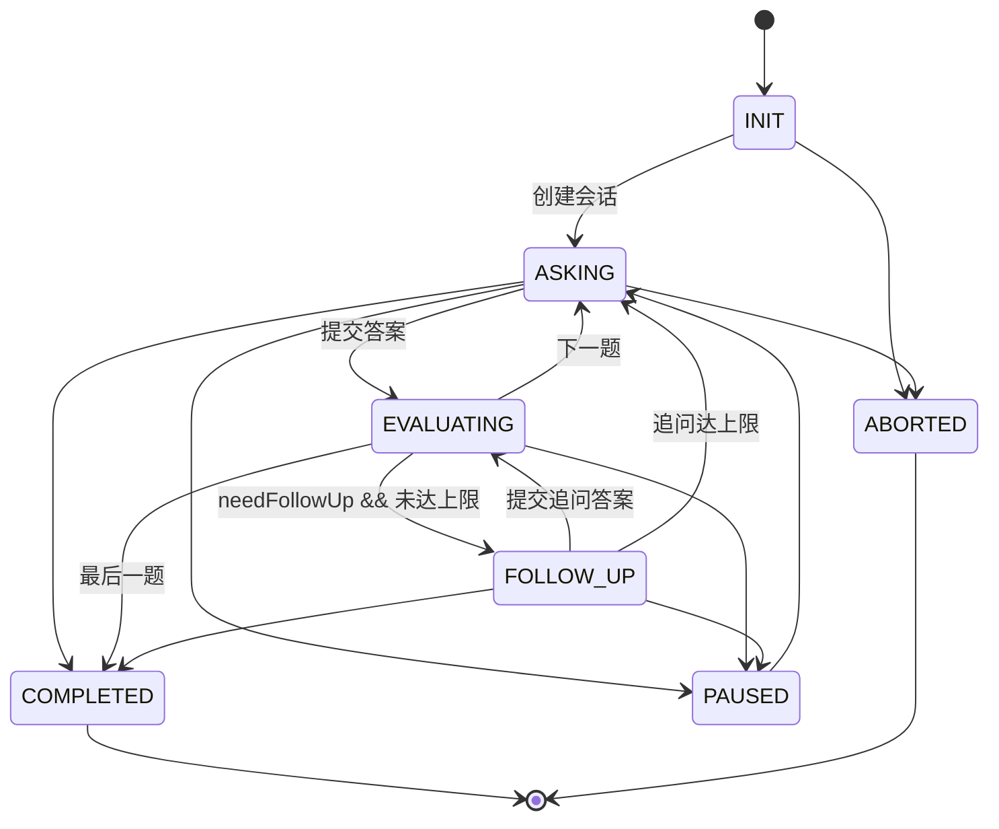
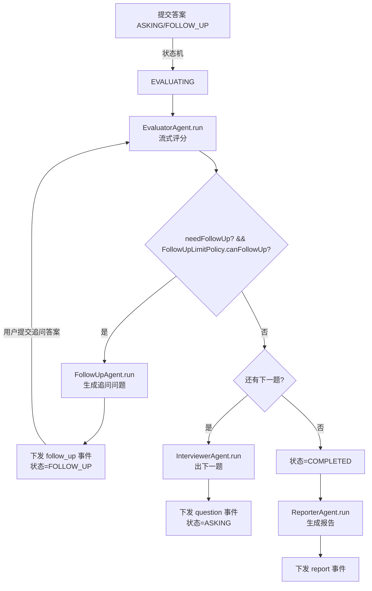
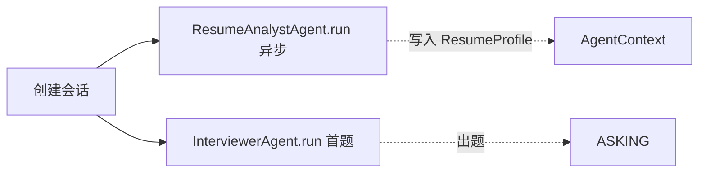

# AI 在线模拟面试平台 · 多 Agent 工作流架构设计

> 文档定位：在 `ai-interview-server`（Java 17 + Spring Boot 3.2.5 + MyBatis-Plus + H2/MySQL，零中间件）现有 AI 层与面试状态机基础上，设计「多 Agent 工作流」架构。
> 阅读前提：已通读 `ai/guard/*`、`ai/provider/OpenAiCompatProvider`、`ai/model/*`、`interview/prompt/InterviewPrompts`、`interview/domain/state/InterviewSessionStateMachine`、`interview/service/impl/*`、`report/service/ReportServiceImpl`。
> 约束：模型 DeepSeek `deepseek-v4-flash`（出题/评分/追问）、`deepseek-chat`（报告，质量优先）；纯 JSON 模式 `response_format=json_object`；零 Redis / MQ；**本文档只设计、不改代码**。

---

## 0. 设计原则（先立规矩，避免堆概念）

1. **Agent ≈ 现有 `AiBizType` 的一次「带技能/带工具的结构化 AI 调用」**，不是新进程、不是新服务。每个 Agent 仍是「一个业务类型 = 一次 HTTP 调用 = 一段 prompt」，但统一挂到 `Agent` 抽象、注入 `Skill`、复用 `AiGuardService` 五道闸。
2. **编排必须是确定性的**，由现有 `InterviewSessionStateMachine` + 新增的 `InterviewWorkflowEngine` 驱动；**不引入 LLM Router / Orchestrator Agent**（参考 Cognix / interview-agent 的结论：对话流应由确定性控制器编排，LLM 只做单点智能）。
3. **能一个 Agent 解决的绝不拆三个**；凡「拆了只增加延迟/成本/不确定性、不提升质量」的角色，明确不做（见第 10 章）。
4. **每个 Agent 必须有降级**（`RuleEvaluator` 已存在），保证任何单 Agent 故障都不阻塞面试主链路。

---

## 1. 现状调研结论（GitHub / 开源项目）

调研了 5 个 AI 模拟面试开源项目，提炼共性架构与可借鉴点。

| # | 项目 | 架构要点 | 对本项目的可借鉴点 |
|---|------|----------|--------------------|
| 1 | **interviewiq-ai**（Google ADK + Gemini） | 3 Agent：Resume Intelligence / Interview Generator / Evaluation；用 MCP 拉官方文档做检索增强 | ① 独立的「简历解析 Agent」值得单拆；② 评估 Agent 与出题 Agent 解耦 |
| 2 | **Multi-Ai-Interview-Coach-Agent**（自研 ADK 风格） | Orchestrator + Interviewer + Evaluator + Memory 四 Agent；a2a 内部总线；SQLite 存弱点 | ① Orchestrator 用确定性控制器而非 LLM；② Memory Agent 跟踪薄弱点（可落地为 `ResumeProfile` 持久化，不必是 LLM） |
| 3 | **Cognix-AI**（FastAPI + AutoGen） | **状态机 + 策略引擎做确定性面试控制**，4 Agent（Topic Extractor / Question Gen / Evaluator / Report）；LLM 调用无状态、状态由后端维护；Token 选择性注入 | ① **确定性控制器编排 LLM Agent** 是最佳实践，与本项目状态机完全一致；② 后端持有状态、LLM 无状态，直接复用 `InterviewSessionStateMachine`；③ 上下文按需注入省 token |
| 4 | **interview-agent / PrepWise AI**（LangGraph） | Interviewer Agent 用「1-次追问规则 + 话题广度」；Evaluator 按 6 维度加权评分；RAG 题库 | ① **追问次数上限 + 话题切换** 规则（本项目已有 `FollowUpLimitPolicy` + `PhasePlanner`，可对齐）；② 多维评分权重；③ 追问 Agent 单独成 Agent（本项目 `FOLLOW_UP` 当前未真正使用，见 §5.3） |
| 5 | **multi-agent-interviewer**（LangChain） | Router/Orchestrator + Interviewer + TopicManager + Evaluator；**按 Agent 调温度**（出题 0.7 / 话题 0.3 / 评估 0.2） | ① **评估 Agent 低温度（0.2）** 是评分一致性的关键杠杆（见 §8）；② Router 用确定性即可，不必上 LLM |

**调研共识（直接指导设计）**：
- 业界普遍把「出题 / 评估 / 追问 / 简历 / 报告」拆成独立 Agent，但**编排层几乎都是确定性状态机**，没有谁用 LLM 做路由。
- 评分一致性靠 **rubric 打分卡 + 低温度 + 多维加权**，而非靠反复重评。
- 追问普遍**单独成 Agent** 且有次数/话题约束——这正暴露了本项目当前短板：`FOLLOW_UP` / `FOLLOW_UP_GEN` 已定义却**未实际使用**，追问问题是从 Evaluator 的 `followUpQuestion` 字段「顺手」返回的（`EvaluationServiceImpl:143`、`AnswerServiceImpl:170`）。

---

## 2. Agent 总览（克制版，共 5 个业务 Agent + 1 个确定性编排器）

| Agent | 对应 `AiBizType` | 对应 `AiStage` | 是否新增 | 职责边界 |
|-------|------------------|----------------|----------|----------|
| `InterviewerAgent` | `QUESTION` | `QUESTION_GEN` | 改造（抽 Agent） | 仅出题：按方向/阶段/难度/简历出题干 + 考察要点，**不评分、不追问** |
| `EvaluatorAgent` | `EVALUATE` | `EVALUATION` | 改造（加 Rubric） | 仅评分：对单条答案打 0-100 + 点评 + 是否需追问，**不生成具体追问问题** |
| `FollowUpAgent` | `FOLLOW_UP` | `FOLLOW_UP_GEN` | **新增**（填缺口） | 仅生成追问问题：基于「题面 + 原答案 + 评分」产出 1 个深探针/换话题问题 |
| `ResumeAnalystAgent` | `RESUME` | `RESUME_PARSE` | 改造（抽 Agent） | 仅解析：简历 → 结构化画像 + 与目标 JD 的技能匹配度，供出题/报告消费 |
| `ReporterAgent` | `REPORT` | `REPORT_GEN` | 改造（抽 Agent） | 仅报告：聚合逐题评分 → 五维报告 + 行动建议（输入是**已落库**的评分，不重评） |
| `InterviewWorkflowEngine`（编排器，**确定性、非 LLM**） | — | — | 新增 | 依状态机把上述 Agent 串成工作流；路由/跳转不调用模型 |

> **为什么是 5 个而不是 8 个**：TopicManager / Router / Memory / CommentWriter 等角色**不单独成 Agent**——TopicManager 由 `PhasePlanner`（确定性）承担；Router 由 `InterviewWorkflowEngine` 承担；Memory 由 `ResumeProfile` 实体持久化承担；Comment 是 Evaluator 输出字段之一。详见第 10 章。

---

## 3. Agent 抽象与接口契约（落地抽象）

在 `com.aimeeting.interview.ai.agent` 新包下，定义统一抽象。**核心目标**：让「Agent = 组装 Skill → 构造 `AiRequest` → 走 `AiGuardService` → 解析 → 降级」成为统一模板，现有 `EvaluationServiceImpl` 等改造为其实作。

```java
// com.aimeeting.interview.ai.agent.InterviewAgent
public interface InterviewAgent<TIn, TOut> {
    AgentId id();                       // 枚举，见下
    AiBizType bizType();                // 复用现有枚举，幂等/日志/模型路由一致
    AiStage stage();                    // 复用现有枚举，超时/单飞分组一致
    TOut run(AgentContext ctx, TIn input, AiStreamSink sink); // sink 仅流式 Agent 用
}

public enum AgentId { INTERVIEWER, EVALUATOR, FOLLOW_UP, RESUME_ANALYST, REPORTER }
```

```java
// Agent 运行上下文：跨 Agent 共享、由 WorkflowEngine 注入
public final class AgentContext {
    private final Long userId;
    private final Long sessionId;
    private final InterviewPhase phase;          // TECHNICAL/PROJECT/BEHAVIORAL
    private final ResumeProfile resumeProfile;    // ResumeAnalystAgent 产物，可为 null
    private final List<ChatTurn> history;         // 本题已发生的 题/答/评 轮次（供 FollowUp 消费）
    private final Supplier<String> jdText;        // 懒加载 JD，避免每次拼装都查库
    // getter ...
}
```

### 3.1 Skill 抽象（Agent 的「技能/工具」统一接口）

设计取舍：**不依赖 DeepSeek 原生 function-calling**（项目已选定纯 JSON 模式，原生工具调用会破坏 `response_format=json_object` 契约）。因此把「工具」建模为**运行前执行的 Java 方法，结果以文本块注入 prompt**——JSON 模式安全、零中间件、可单测。

```java
// com.aimeeting.interview.ai.agent.skill.AgentSkill
public interface AgentSkill {
    String skillId();
    /** 拼进 system prompt 的角色指令片段（纯文本） */
    String systemFragment();
    /** 该 skill 需要的工具，agent.run 前依次执行，结果注入 user prompt 上下文块 */
    default List<AgentTool> tools() { return List.of(); }
    /** 声明本 skill 适用于哪个 Agent（注册表据此归类） */
    boolean supports(AgentId agent);
}

// com.aimeeting.interview.ai.agent.skill.AgentTool
public interface AgentTool {
    String toolId();
    String description();          // 仅用于日志/可观测，不发给模型
    /** 执行工具，返回要注入 prompt 的格式化文本；失败返回 null（不阻断主流程） */
    String execute(AgentContext ctx);
}
```

```java
// 注册表：Spring 收集全部 AgentSkill，按 supports(agent) 归类
@Component
public class SkillRegistry {
    private final Map<AgentId, List<AgentSkill>> byAgent = new EnumMap<>(AgentId.class);
    public SkillRegistry(List<AgentSkill> all) {
        for (AgentId a : AgentId.values()) {
            byAgent.put(a, all.stream().filter(s -> s.supports(a)).collect(toList()));
        }
    }
    public List<AgentSkill> skillsOf(AgentId agent) { return byAgent.get(agent); }
    /** 汇总某 Agent 全部 skill 的 systemFragment，拼成完整 system prompt */
    public String assembleSystem(AgentId agent) { /* Σ fragment + STRICT_JSON_RULE */ }
    /** 依次执行工具，拼接成上下文字段 */
    public String assembleToolContext(AgentId agent, AgentContext ctx) { /* Σ tool.execute */ }
}
```

> 说明：`SkillRegistry` 复用了项目已有的「纯静态、可 100% 单测」风格（参考 `InterviewSessionStateMachine` 的写法），便于在无 Spring 上下文的单测中直接 `new SkillRegistry(List.of(...))`。

---

## 4. 各 Agent 详细设计

### 4.1 InterviewerAgent（出题）

- **输入**：`InterviewQuestionReq{ direction, difficulty, questionNo, totalQuestion, resumeDigest, usedTitles }`
- **输出**：`GeneratedQuestion{ title, referencePoints, analysis, difficulty, generatedBy, degraded }`
- **Skill**：`ResumeAwareSkill`（注入简历画像片段）、`DedupSkill`（注入已用题干去重）、`PhaseToneSkill`（按 `InterviewPhase` 切换语气：技术题重原理 / 项目题重落地 / 行为题重 STAR）
- **Prompt 结构**（复用现有 `InterviewPrompts.questionSystem/User`，改为由 Skill 拼装）：
  - system：`你是有10年经验的{direction}面试官，当前{phase}，难度{difficulty}。` + `STRICT_JSON_RULE` + Σ skill.fragment
  - user：`方向/难度/题号/简历摘要(经 PromptSanitizer)/已用题干` + `输出 JSON: {title, referencePoints[], analysis}`
- **复用**：`aiGuard.execute(AiStage.QUESTION_GEN, ...)`（阻塞，题干无需流式）；降级 `RuleEvaluator.fallbackQuestionTitle` + 题库随机（同现有 `QuestionGenerationServiceImpl.fallback`）。
- **改造点**：现有 `QuestionGenerationServiceImpl` 实现 `InterviewAgent<InterviewQuestionReq, GeneratedQuestion>`，system prompt 改为 `skillRegistry.assembleSystem(INTERVIEWER)`。

### 4.2 EvaluatorAgent（评分，一致性核心）

- **输入**：`EvaluationContext{ sessionId, sessionQuestionId, questionTitle, referencePoints, answer, isFollowUp, phase }`（沿用现有类）
- **输出**：`EvaluationResult{ score, comment, highlights[], gaps[], needFollowUp, improvedAnswer, evaluatedBy, degraded }`
- **Skill**：
  - **`RubricScoringSkill`（评分一致性关键，见 §8）**：注入「打分卡锚点」——把 0-100 切为 5 个锚段（0-20/40/60/80/100），每段给「技术正确性 + 表达 + 结构」的文字锚定描述，强制模型先定位锚段再给分。
  - `PhaseWeightSkill`：按 `InterviewPhase` 给维度权重提示（技术题重正确性、行为题重 STAR 结构）。
  - `ImprovedAnswerSkill`：分数 < 80 时要求输出改进参考答案（现有 `IMPROVE_THRESHOLD` 逻辑上移为 skill）。
- **Prompt 结构**：system = `严谨面试官` + `STRICT_JSON_RULE` + `RubricScoringSkill.fragment` + `PhaseWeightSkill.fragment`；user = `题目/考察要点/答案(经 PromptSanitizer,≤5000)/isFollowUp`。
- **复用**：`aiGuard.executeStream(AiStage.EVALUATION, ...)`（流式，仅聚合 JSON，结束下发 `comment`，同现有）；降级 `RuleEvaluator.fallbackEvaluate`。
- **关键改动**：**删除 `followUpQuestion` 字段的「生成」语义**——Evaluator 只输出 `needFollowUp`（布尔，基于答案深度是否值得深挖），具体追问问题交给 `FollowUpAgent`（§4.3）。这样 Evaluator 专心评分、FollowUp 专心提问，各司其职。

### 4.3 FollowUpAgent（追问，**新增，填补 FOLLOW_UP 缺口**）

- **为什么必须单拆**：现状追问问题是 Evaluator 顺手返回的 `followUpQuestion`（`EvaluationServiceImpl:143`），导致① 评分与追问耦合、追问质量无独立优化空间；② `FOLLOW_UP` / `FOLLOW_UP_GEN` 两个枚举**定义了却从未被调用**，是死代码。独立 Agent 后，追问可注入「本题历史轮次」做**深探针 or 换话题**决策。
- **输入**：`FollowUpReq{ questionTitle, referencePoints, originalAnswer, evaluation(EvaluationResult 上文), history(本题 ChatTurn 列表), followUpCount, maxFollowUp }`
- **输出**：`FollowUpQuestion{ question, probeType(DEEPEN|SHIFT), followUpCount }`
- **Skill**：`DepthProbeSkill`（围绕原答案薄弱点深钻）、`TopicShiftSkill`（参考 interview-agent 的「话题广度」规则，避免连续 2 题同主题——这里指同一题干追问超过 1 次后改问另一子方向）、`LimitGuardSkill`（到达 `maxFollowUp` 时强制返回空 + `probeType=STOP`）。
- **Prompt 结构**：system = `追问教练` + `STRICT_JSON_RULE` + Σ fragment；user = `题面/原答案/上文评分(highlights/gaps)/本题历史轮次/已追问次数`。
- **复用**：`aiGuard.execute(AiStage.FOLLOW_UP_GEN, ...)`（阻塞即可，追问问题短）；降级 `RuleEvaluator` 现有 `followUpQuestion`（"能否就其中一个要点再深入展开？"）。
- **新类**：`com.aimeeting.interview.interview.service.impl.FollowUpAgentServiceImpl implements InterviewAgent<FollowUpReq, FollowUpQuestion>`。

### 4.4 ResumeAnalystAgent（简历分析）

- **输入**：`ResumeParseReq{ rawText, jdText }`
- **输出**：`ResumeProfile{ skills[], summary, projectHighlights[], jdMatchScore, matchedDirections[] }`（新 DTO，持久化到会话/用户画像）
- **Skill**：`SkillExtractSkill`、`JdMatchSkill`（计算与目标方向匹配度，输出 `matchedDirections` 供 Interviewer 选方向）、`SummarySkill`
- **复用**：`aiGuard.execute(AiStage.RESUME_PARSE, ...)`；降级 `RuleEvaluator.fallbackResumeParsed`。
- **编排时机**：会话创建后**异步预跑**（见 §6 并行项），产物 `ResumeProfile` 注入后续所有 Agent 的 `AgentContext`。

### 4.5 ReporterAgent（报告）

- **输入**：`ReportGenReq{ meta, items(逐题已落库评分), totalScore }`（沿用 `ReportServiceImpl.buildItem` 结构）
- **输出**：`ReportDO` 填充（五维 `dimensions` + `highlights` + `improvements` + `actions` + `overallComment`）
- **Skill**：`DimensionAggregateSkill`（五维聚合：PROFESSIONAL/EXPRESSION/LOGIC/PROJECT_DEPTH/POTENTIAL）、`ActionPlanSkill`
- **复用**：`aiGuard.execute(AiStage.REPORT_GEN, ...)`，模型走 `deepseek-chat`（`AiProperties.modelFor(REPORT)` 已配置）；降级 `RuleEvaluator.fallbackReport`。**输入是已落库的逐题评分，不重新调用 Evaluator**——这是评分一致性的重要保障（报告不引入二次评分方差）。
- **改造点**：现有 `ReportServiceImpl.generate` 调用 `reporterAgent.run(...)` 替换内联 `buildReportRequest`。

### 4.6 InterviewWorkflowEngine（确定性编排器，非 LLM）

- 不调用任何模型。职责：① 维护/驱动 `InterviewSessionStateMachine`；② 按状态决定调哪个 Agent；③ 注入 `AgentContext`（resumeProfile / history / jd）；④ 串接 SSE 事件。
- 本质是把现有散落在 `AnswerServiceImpl.doSubmit` 的「评分→追问判定→下一题/完成」编排逻辑抽成独立、可单测的引擎。

---

## 5. 工作流编排：状态机 + DAG（确定性，为什么自研不用框架）

### 5.1 面试主状态机（复用现有 `InterviewSessionStateMachine`，未改动语义）



### 5.2 单次提交的 Agent 流水线（DAG）



### 5.3 会话创建期的并行项



### 5.4 为什么自研、不用 LangGraph / AutoGen / LangChain4j

| 维度 | 现成框架（LangGraph/AutoGen/LangChain4j） | 本项目自研（状态机 + `InterviewWorkflowEngine`） |
|------|-------------------------------------------|--------------------------------------------------|
| 语言生态 | LangGraph/AutoGen 是 Python；Java 侧 LangChain4j 偏重、与「纯 JSON 模式 + 自研五道闸」耦合差 | 全 Java，与现有 `AiGuardService`/`StateMachine` 零摩擦 |
| 中间件 | 多数默认依赖 Redis/MQ 做记忆/消息总线 | **零中间件**，状态已在 `InterviewSessionDO` 持久化，LLM 无状态（与 Cognix 一致） |
| 确定性 | 框架鼓励 LLM 驱动循环，易跑偏/失控 | 面试是强流程业务，确定性控制器更稳、可审计、可单测 |
| 成本 | 额外依赖 + 抽象层 token 损耗 | 无新增依赖，token 可控 |
| 落地风险 | 引入重依赖、学习曲线、版本漂移（项目已吃过 `AiProperties` 配置漂移的亏） | 仅新增薄抽象层，复用成熟守卫 |

**结论**：自研轻量编排（确定性状态机 + Agent 模板方法），**不引入任何 Agent 框架**。若未来需要复杂记忆/检索，再局部引入 LangChain4j 的 Retriever，而非整体换框架。

---

## 6. 与 `AiGuardService` 五道闸的复用（不重复造轮子）

现有 `AiGuardService` 已是 AI 调用唯一入口，五道闸对**所有 Agent 天然生效**，无需改造：

| 现有闸 | Agent 如何复用 | 说明 |
|--------|----------------|------|
| **单飞 SingleFlight** | `execute/executeStream` 的 `singleFlightKey` 由各 Agent 自备 | Evaluator 用 `eva:{sessionId}:{qid}:{answerMd5}`；FollowUp 用 `fu:{sessionId}:{qid}:{parentAnsMd5}:{count}`；保证同输入只调一次模型 |
| **熔断 CircuitBreaker** | 全局共享同一 `CircuitBreaker` 实例 | 任一 Agent 高频失败即开断，保护整体；`health()` 已暴露状态 |
| **舱壁 Bulkhead** | `tryAcquire` 全局并发配额 | 多 Agent 并发（如简历解析 ∥ 首题出题）自然受 20 并发上限约束，不会打爆下游 |
| **超时 Timeout** | `AiStage` 已按 bizType 绑定超时 | `QUESTION_GEN 60s / EVALUATION 90s / FOLLOW_UP_GEN 90s / RESUME_PARSE 90s / REPORT_GEN 120s`，Agent 直接传对应 stage |
| **重试 Retry** | `callWithGuards` 内 `maxRetries=2` + 退避 | 仅 `TIMEOUT/UNAVAILABLE` 重试；`INVALID_RESPONSE` 自动追加「严格按格式」重试一次——Agent 无需关心 |

> Agent 模板方法统一为：
> ```java
> // AgentTemplate.run 伪代码（所有 Agent 共用）
> AiRequest req = AiRequest.builder()
>     .bizType(agent.bizType())
>     .systemPrompt(skillRegistry.assembleSystem(agent.id()))
>     .userPrompt(skillRegistry.assembleToolContext(agent.id(), ctx) + input.toUserPrompt())
>     .temperature(temperatureFor(agent.bizType()))   // §8 新增按 bizType 取温度
>     .maxTokens(...)
>     .model(aiProperties.modelFor(agent.bizType()))
>     .jsonMode(true).build();
> try {
>     TOut out = aiGuard.executeStream(agent.stage(), sfKey, ctx.userId(), req, parser);
>     return out;
> } catch (Exception e) {
>     return fallback(ctx, input);   // 各 Agent 自己的 RuleEvaluator 降级
> }
> ```
> 这样 `AiGuardService` 一行不改，五道闸全复用。

---

## 7. 评分一致性方案（同一答案反复评分波动怎么办）

根因：LLM 对同输入 + 同 prompt 仍有采样方差；现有 `AiProperties.temperature=0.7` 对所有 bizType 一视同仁，放大了波动。

四层对策（按性价比排序）：

1. **Rubric 打分卡（主手段）**——`RubricScoringSkill` 把 0-100 锚定为 5 段文字锚点（例：`80-100=正确且能结合项目踩坑/对比方案/边界；60-79=正确但偏书面无落地；40-59=要点覆盖一半；20-39=明显错误；0-19=未作答`）。模型先「定位锚段」再给分，把连续采样收束到离散锚段，方差显著下降。
2. **按 bizType 降温度**——新增 `AiProperties.temperatureFor(AiBizType)`：`EVALUATE=0.2`、`FOLLOW_UP=0.5`、`QUESTION=0.7`、`RESUME=0.3`、`REPORT=0.5`（对齐调研 #5 的「评估 0.2」经验）。**报告不改评分、只聚合**，从源头消除报告引入的二次方差。
3. **确定性聚合**——沿用 `ScorePolicy`（原答×0.7 + 追问均分×0.3）与 `ScorePolicy.totalScore`，纯函数、可单测、无 LLM 参与。
4. **一致性守护（可选，M2/M3）**——`ScoringConsistencyGuard`：对样本（如每会话第 1 题或 5% 流量）双评取中值；若双评差 > 15 分，记录 `t_ai_call_log` 告警并回退到 rubric 锚段中值。追问后重评**不应**大幅改写原答分（原答已落库），仅以追问分按 `ScorePolicy` 加权，避免「追问把原题分数拉飞」。

> 不做「每次都双评」——成本翻倍且多数题无需；只对样本做一致性监测。

---

## 8. 成本与延迟控制（并行 / 串行 / 降级）

| 环节 | 并行性 | 依据 |
|------|--------|------|
| 简历解析 ∥ 首题出题 | **可并行** | 两者无数据依赖；ResumeAnalyst 异步跑，首题出题不阻塞（出题仅用 `resumeDigest` 摘要，解析完成的 `ResumeProfile` 注入后续题） |
| Evaluator → FollowUp | **必须串行** | 追问问题依赖上文评分（gaps/highlights） |
| 逐题 Evaluator | **串行**（用户逐题作答，无解耦空间） | 天然串行 |
| 报告五维聚合 | **单调用完成** | 现有 `ReportServiceImpl` 已一次调用产出五维，不拆多次 |
| 报告生成 | **可晚调度** | 会话 COMPLETED 后异步生成，不占答题链路延迟 |

- **降级不阻塞**：任一 Agent 失败 → 各自 `RuleEvaluator` 兜底（出题→题库、评分→关键词启发式、简历→关键词抽取、报告→均值模板、追问→模板问题）。主链路永远 200。
- **并发上限**：`Bulkhead(20)` + `AiRateLimiter`（每用户 30/min、300/day）已全局约束，多 Agent 并发不会放大下游压力。
- **模型路由**：仅 `REPORT` 走 `deepseek-chat`（质量优先、最贵但最低频）；其余 `deepseek-v4-flash`（快、便宜、高频）。新增的 FollowUpAgent 走 flash，成本可忽略。
- **token 控制**：`PromptSanitizer` 截断（答案≤5000、简历≤800、JD≤1500）+ rubric 锚段是固定系统词（一次输入、多次复用），上下文按需注入（Cognix 同思路）。

---

## 9. 落地路径（M1 / M2 / M3，文件级）

> 仅规划，本文档不改动任何代码。每阶段均「加新类 + 重构现有类实现 Agent 接口 + 单测」。

### M1 — Agent 抽象 + Skill 注册 + 补齐 FollowUpAgent（无行为回归）

**新增类**：
- `ai/agent/InterviewAgent.java`、`AgentId.java`、`AgentContext.java`、`AgentResult.java`
- `ai/agent/skill/AgentSkill.java`、`AgentTool.java`、`SkillRegistry.java`
- `ai/agent/skill/impl/`：`RubricScoringSkill`、`PhaseWeightSkill`、`ImprovedAnswerSkill`、`ResumeAwareSkill`、`DedupSkill`、`PhaseToneSkill`、`DepthProbeSkill`、`TopicShiftSkill`、`LimitGuardSkill`、`DimensionAggregateSkill`、`ActionPlanSkill`、`JdMatchSkill`（按需）
- `interview/service/impl/FollowUpAgentServiceImpl.java`（**新 Agent，填 FOLLOW_UP 缺口**）
- `interview/service/model/FollowUpReq.java`、`FollowUpQuestion.java`
- `resume/service/model/ResumeProfile.java`

**改造类**：
- `EvaluationServiceImpl` / `QuestionGenerationServiceImpl` / `ReportServiceImpl` 实现 `InterviewAgent`，system prompt 改为 `skillRegistry.assembleSystem(...)`；Evaluator **移除 `followUpQuestion` 生成语义**，仅留 `needFollowUp`。
- `AiProperties` 新增 `temperatureFor(AiBizType)`（评估 0.2 等）。
- `InterviewPrompts` 保留，但系统词改由 Skill 片段组合（原有方法可标记为 `@Deprecated` 逐步下线）。

**验证**：
- 单测：`SkillRegistry` 归类正确；`RubricScoringSkill.fragment` 含 5 锚段；`FollowUpAgentServiceImpl` 在 `followUpCount>=max` 时返回 `probeType=STOP`。
- 回归：现有 `EvaluationServiceImpl` / `QuestionGenerationServiceImpl` 单测仍绿；mock provider 跑通一次完整出题+评分。
- 人工：对比改造前后 Evaluator 输出 JSON 结构一致（`comment/score/highlights/gaps/needFollowUp/improvedAnswer`）。

### M2 — 确定性编排器 + 评分一致性

**新增类**：`interview/service/InterviewWorkflowEngine.java`（抽取 `AnswerServiceImpl.doSubmit` 的编排逻辑）。
**改造类**：`AnswerServiceImpl` 改为调用 `workflowEngine.submit(...)`；`InterviewSessionServiceImpl` 创建会话时异步触发 `ResumeAnalystAgent` 并写 `ResumeProfile`。
**新增（可选）**：`ai/agent/consistency/ScoringConsistencyGuard.java` + 采样双评开关（`AiProperties.consistencySampleRate`）。
**验证**：
- 单测：`InterviewWorkflowEngine` 用内存状态机跑通「提交→评估→追问→再评估→下一题→完成→报告」全链路（mock Agent）。
- 一致性：同一固定答案跑 20 次 Evaluator，开启 rubric+0.2 温度后分数标准差应 < 改造前（记录基线对比）。
- 集成：SSE 事件序 `progress→comment→score→follow_up?→done` 不变。

### M3 — 工具增强 + 报告提质 + 可观测

**新增类**：`AgentTool` 实作，如 `ResumeMatchTool`（注入 JD 匹配片段）、`KnowledgeRetrievalTool`（可选 RAG，仅行为/系统题启用，零中间件可用本地关键词检索先顶上）。
**改造类**：`ReporterAgent` 增加 `ActionPlanSkill` 细化行动建议；`AiCallLogService` 已按 `bizType` 记录，补充 `agent_id` 字段便于按 Agent 维度看成本/时延。
**验证**：
- 压测：用 mock provider + `Bulkhead(20)` 模拟 50 并发会话，确认无线程堆积、日志可区分各 Agent。
- 报告：对照 `REVIEW-RUBRIC.md`（已存在）校验五维评分合理性。

---

## 10. 克制清单：哪些**不值得**上多 Agent

| 角色 | 结论 | 理由 |
|------|------|------|
| TopicManager / 话题控制器 Agent | **不做**，用 `PhasePlanner`（确定性） | 话题分布是确定性策略（50/30/20），LLM 做路由只增延迟与不确定性 |
| Router / Orchestrator（LLM）Agent | **不做**，用 `InterviewWorkflowEngine` | 调研共识：确定性控制器编排 LLM；本项目状态机已成熟 |
| Memory Agent（LLM） | **不做**，用 `ResumeProfile` 实体 + `SessionAnswerDO` 持久化 | 「记忆」本质是数据，不是智能；持久化即可跨题/跨会话复用 |
| CommentWriter Agent | **不做**，Comment 是 Evaluator 输出字段 | 拆出只多一次调用，质量无提升 |
| 按阶段拆 3 个 Interviewer | **不做**，阶段是参数 | `InterviewPhase` 仅影响语气/难度，无需独立 Agent |
| 报告内逐题重评 Agent | **不做**，报告只读已落库评分 | 重评引入二次方差，违背 §7 一致性目标 |

---

## 11. 风险与权衡

- **FollowUpAgent 新增一次调用**：每次追问多 1 次 `FOLLOW_UP_GEN`（90s 超时、flash 模型、短输出），成本可忽略；换来追问质量独立优化空间，值得。
- **Skill 片段膨胀**：rubric + phase 权重 + 注入上下文若过长会吃 prompt token。对策：系统词固定一次输入、工具上下文按需（仅 FollowUp 注入 history），并受 `PromptSanitizer` 截断保护。
- **Evaluator 去 `followUpQuestion` 是破坏性变更**：M1 必须同步改 `AnswerServiceImpl:170` 与前端 `FollowUpPayload`（追问问题改由 FollowUpAgent 产出后经 workflow 下发），需前后端联调。

---

## 附：关键设计对应关系速查

| 需求 | 落点 |
|------|------|
| 多 Agent 各司其职 | §2 五 Agent 表；§4 各自职责/输入输出 |
| Skill 定义与注册 | §3.1 `AgentSkill`/`AgentTool`/`SkillRegistry` |
| 工作流编排 | §5 状态机 + DAG + 自研理由 |
| 复用五道闸 | §6 复用表 + 模板方法 |
| 评分一致性 | §7 rubric + 低温度 + 确定性聚合 + 守护 |
| 成本/延迟 | §8 并行/串行/降级表 |
| 落地路径 | §9 M1/M2/M3 文件级 |
| 克制 | §10 不做清单 |
